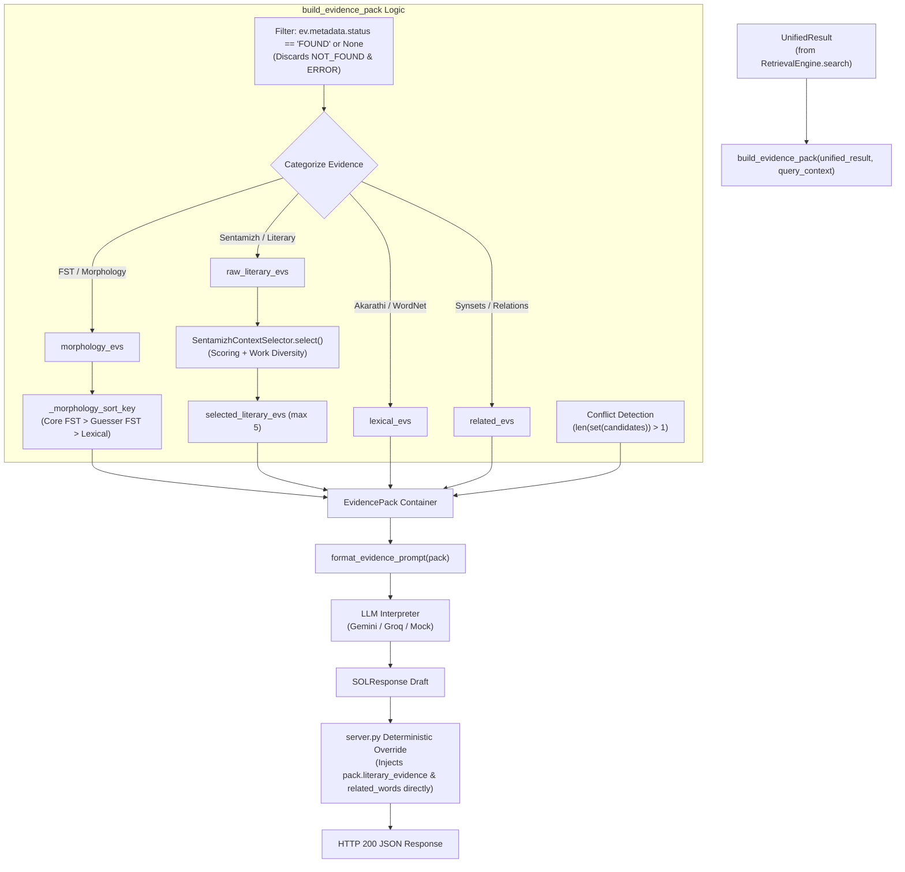

# SOL AI: EvidencePack Builder and Literary Context Selector Audit

**Date of Audit**: September 29, 2026  
**Document Status**: COMPLETED AUDIT  
**Scope**: Code audit of the Evidence Packaging, Deterministic Literary Context Selection, and Downstream LLM Prompting & Formatting pipeline in SOL AI.  
**Target Repository**: `c:\Vishwa\Projects\SOL_AI`  
**Operational Rule**: Non-invasive audit. No files modified, no dependencies installed, no refactoring executed.

---

## Table of Contents
1. [Executive Summary & Scope](#1-executive-summary--scope)
2. [Exact File Paths & Module Responsibilities](#2-exact-file-paths--module-responsibilities)
3. [End-to-End Lifecycle: From `UnifiedResult.evidence` to LLM Context](#3-end-to-end-lifecycle-from-unifiedresultevidence-to-llm-context)
4. [Deep Dive: EvidencePack Builder (`backend/interpretation/evidence_pack.py`)](#4-deep-dive-evidencepack-builder-backendinterpretationevidence_packpy)
   - [4.1 Status Filtering & Error Exclusion](#41-status-filtering--error-exclusion)
   - [4.2 Four-Way Category Partitioning](#42-four-way-category-partitioning)
   - [4.3 Morphology Hierarchy & Sorting Algorithm](#43-morphology-hierarchy--sorting-algorithm)
   - [4.4 Conflict Detection Mechanism](#44-conflict-detection-mechanism)
   - [4.5 Evidence Counts and Provenance Packaging](#45-evidence-counts-and-provenance-packaging)
5. [Deep Dive: Literary Context Selector (`backend/interpretation/context_selector.py`)](#5-deep-dive-literary-context-selector-backendinterpretationcontext_selectorpy)
   - [5.1 Multi-Signal Scoring Function (`score_evidence`)](#51-multi-signal-scoring-function-score_evidence)
   - [5.2 Work-Diversity Selection Algorithm (`select`)](#52-work-diversity-selection-algorithm-select)
   - [5.3 Edge Cases & Tie-Breaking Behaviors](#53-edge-cases--tie-breaking-behaviors)
6. [Context Window Management, Token Truncation, and Provenance Preservation](#6-context-window-management-token-truncation-and-provenance-preservation)
7. [Downstream Consumers of `EvidencePack`](#7-downstream-consumers-of-evidencepack)
   - [7.1 Prompt Formatter (`backend/interpretation/prompts.py`)](#71-prompt-formatter-backendinterpretationpromptspy)
   - [7.2 LLM Interpreters (`backend/interpretation/interpreter.py`)](#72-llm-interpreters-backendinterpretationinterpreterpy)
   - [7.3 Post-Interpretation Deterministic Overrides (`backend/api/server.py`)](#73-post-interpretation-deterministic-overrides-backendapiserverpy)
8. [Future Vector Retrieval & Project Madurai Integration Analysis](#8-future-vector-retrieval--project-madurai-integration-analysis)
   - [8.1 Can Project Madurai Vector Evidence Flow Through Unchanged?](#81-can-project-madurai-vector-evidence-flow-through-unchanged)
   - [8.2 Critical Vulnerability: The `"literary_context"` Type Mismatch Bug](#82-critical-vulnerability-the-literary_context-type-mismatch-bug)
   - [8.3 Potential Citation and Metadata Losses](#83-potential-citation-and-metadata-losses)
   - [8.4 Preventing Semantic Vector Evidence from Crowding Out Exact Matches](#84-preventing-semantic-vector-evidence-from-crowding-out-exact-matches)
9. [Confirmed Current Implementation vs. Recommended Architectural Enhancements](#9-confirmed-current-implementation-vs-recommended-architectural-enhancements)

---

## 1. Executive Summary & Scope

The Contextual Interpretation Layer in SOL AI represents the bridge between **deterministic retrieval** (lexicons, morphological analyzers, finite-state transducers, classical corpus indexers) and **generative synthesis** (LLMs such as Google Gemini 2.5 Flash, Groq Qwen 2.5 72B, or deterministic mock interpreters).

Two core components govern this transition:
1. **`EvidencePack` Builder** ([`backend/interpretation/evidence_pack.py`](file:///c:/Vishwa/Projects/SOL_AI/backend/interpretation/evidence_pack.py)): Assembles raw, heterogeneous `Evidence` objects from `UnifiedResult.evidence` into structured, unflattened, typed categories (`morphology_evidence`, `lexical_evidence`, `literary_evidence`, `related_evidence`), detects lemma conflicts, and preserves complete resource provenance.
2. **`SentamizhContextSelector`** ([`backend/interpretation/context_selector.py`](file:///c:/Vishwa/Projects/SOL_AI/backend/interpretation/context_selector.py)): Employs a deterministic, multi-signal scoring function and a two-pass work-diversity constraint to reduce hundreds of potential corpus hits down to a strictly bounded subset (default: 5 occurrences) of high-quality, diverse classical literary passages.

This audit inspects every line of code governing these modules, assesses their error-handling boundaries, analyzes downstream consumers, and investigates how vector retrieval (specifically a future Project Madurai semantic vector engine) will interact with this pipeline.

---

## 2. Exact File Paths & Module Responsibilities

| File Path | Primary Class / Functions | Core Responsibility |
| :--- | :--- | :--- |
| [`backend/interpretation/evidence_pack.py`](file:///c:/Vishwa/Projects/SOL_AI/backend/interpretation/evidence_pack.py) | `build_evidence_pack`<br>`_morphology_sort_key` | Partitions flat `UnifiedResult.evidence` into typed buckets, prioritizes FST models, triggers context selection, and detects lemma divergence. |
| [`backend/interpretation/context_selector.py`](file:///c:/Vishwa/Projects/SOL_AI/backend/interpretation/context_selector.py) | `SentamizhContextSelector`<br>`score_evidence`<br>`select` | Deterministically ranks literary corpus citations using 5 signals and enforces cross-work diversity. |
| [`backend/interpretation/schemas.py`](file:///c:/Vishwa/Projects/SOL_AI/backend/interpretation/schemas.py) | `EvidencePack`<br>`SOLResponse`<br>`LiteraryContextItem` | Pydantic data schemas defining the structured container for the LLM interpreter and final API responses. |
| [`backend/interpretation/prompts.py`](file:///c:/Vishwa/Projects/SOL_AI/backend/interpretation/prompts.py) | `SYSTEM_PROMPT`<br>`format_evidence_prompt` | Enforces the "Sole Knowledge Base" grounding rules and formats `EvidencePack` into markdown prompt blocks for frontier LLMs. |
| [`backend/interpretation/interpreter.py`](file:///c:/Vishwa/Projects/SOL_AI/backend/interpretation/interpreter.py) | `BaseLLMInterpreter`<br>`MockLLMInterpreter`<br>`GeminiLLMInterpreter`<br>`GroqLLMInterpreter` | Synthesizes final linguistic explanations from the prompt or extracts structured evidence deterministically. |
| [`backend/api/server.py`](file:///c:/Vishwa/Projects/SOL_AI/backend/api/server.py) | `SOLAPIRequestHandler.do_GET` | HTTP entry point; calls `build_evidence_pack`, dispatches to interpreter, and performs post-LLM deterministic overrides. |
| [`backend/resources/sentamizh.py`](file:///c:/Vishwa/Projects/SOL_AI/backend/resources/sentamizh.py) | `SentamizhAdapter` | Source adapter generating raw literary `Evidence` objects queried by the engine and filtered by the context selector. |

---

## 3. End-to-End Lifecycle: From `UnifiedResult.evidence` to LLM Context



### Step-by-Step Data Flow
1. **Retrieval**: `RetrievalEngine.search(query)` completes Pass 1 (surface lookup) and Pass 2 (lemma lookup), returning a `UnifiedResult` with a flat list of `Evidence` objects in `unified_result.evidence`.
2. **Packaging Entry**: In [`backend/api/server.py`](file:///c:/Vishwa/Projects/SOL_AI/backend/api/server.py#L110-L111):
   ```python
   retrieval_result = engine.search(str(query).strip())
   pack = build_evidence_pack(retrieval_result, query_context=context)
   ```
3. **Partitioning & Pruning**: `build_evidence_pack` inspects every `Evidence` record:
   - Filters out failed searches (`NOT_FOUND`, `ERROR`).
   - Dispatches items to morphology, lexical, literary, or related collections.
4. **Morphology Prioritization**: Morphology candidates are sorted deterministically so that verified Core FST models precede Guesser models.
5. **Literary Selection**: Raw literary citations are evaluated by `SentamizhContextSelector.select()`, which scores each verse and caps results to 5 work-diverse passages.
6. **Prompt Synthesis**: `format_evidence_prompt(pack)` generates markdown text sections containing verified lemmas, meanings, classical verses, relationships, and metadata.
7. **LLM Inference**: The prompt is submitted to the configured LLM interpreter along with `SYSTEM_PROMPT` forbidding knowledge fabrication.
8. **Deterministic Structural Override**: Before returning to the client, [`backend/api/server.py`](file:///c:/Vishwa/Projects/SOL_AI/backend/api/server.py#L140-L196) directly overwrites the LLM's `literary_context`, `related_words`, and `morphology` fields with raw objects from `pack` to prevent LLM hallucinations, verse truncation, or dropped citations.

---

## 4. Deep Dive: EvidencePack Builder (`backend/interpretation/evidence_pack.py`)

### 4.1 Status Filtering & Error Exclusion
In [`backend/interpretation/evidence_pack.py`](file:///c:/Vishwa/Projects/SOL_AI/backend/interpretation/evidence_pack.py#L53-L57):
```python
# Filter strictly for FOUND status evidence objects
found_evidences = [
    ev for ev in unified_result.evidence
    if ev.metadata.get("status") == "FOUND" or ev.metadata.get("status") is None
]
```
- **Rationale**: Adapters in SOL AI return sentinel `Evidence` records when queries yield no results (`metadata={"status": "NOT_FOUND"}`) or encounter runtime crashes (`metadata={"status": "ERROR"}`).
- **Behavior**: The builder explicitly strips these out before categorization. This ensures that downstream prompt formatters and the LLM never receive error strings or empty records disguised as linguistic facts.
- **Provenance Retention**: Although filtered out of `found_evidences`, failed and unattempted resources remain visible in `pack.source_provenance` (`unified_result.resource_summary`), allowing the LLM to report missing data in its `uncertainties` array.

### 4.2 Four-Way Category Partitioning
Lines 64–83 iterate over `found_evidences` using the following branching logic:

```python
for ev in found_evidences:
    ev_type = (ev.evidence_type or "").lower()
    src = ev.source or ""

    # Categorize
    if src == "ThamizhiMorph" or ev_type == "morphology" or "fst_model" in ev.metadata:
        morphology_evs.append(ev)
    elif src == "Sentamizh" or ev_type in ["literary", "corpus", "citation"]:
        raw_literary_evs.append(ev)
    elif src in ["Thani Thamizh Akarathi", "Tamil WordNet"] or ev_type in ["lexical", "gloss", "sense"]:
        if ev.metadata.get("type") == "morphtable":
            # WordNet morphology root mapping
            morphology_evs.append(ev)
        else:
            lexical_evs.append(ev)
        if ev.relations or "synset_id" in ev.metadata:
            related_evs.append(ev)
    else:
        lexical_evs.append(ev)
```

#### Detailed Categorization Rules:
1. **Morphology Bucket (`morphology_evs`)**:
   - Condition: `src == "ThamizhiMorph"` OR `ev_type == "morphology"` OR `"fst_model" in ev.metadata` OR (`src == "Tamil WordNet"` AND `metadata.get("type") == "morphtable"`).
   - Captures: FST outputs (core and guesser) from ThamizhiMorph, as well as offline inflection tables from Tamil WordNet.
2. **Literary Bucket (`raw_literary_evs`)**:
   - Condition: `src == "Sentamizh"` OR `ev_type in ["literary", "corpus", "citation"]`.
   - Captures: Raw verse occurrences from the Sangam and medieval corpus database.
3. **Lexical Bucket (`lexical_evs`)**:
   - Condition: `src in ["Thani Thamizh Akarathi", "Tamil WordNet"]` OR `ev_type in ["lexical", "gloss", "sense"]`, or any unmatched fallback.
   - Captures: Dictionary headwords, definitions, grammatical parts-of-speech, and modern Tamil glosses.
4. **Related / Semantic Relations Bucket (`related_evs`)**:
   - Condition: Evaluated when an item matches the lexical branch and possesses `ev.relations` OR `"synset_id"` in `ev.metadata`.
   - Captures: Synonyms, hypernyms, hyponyms, and WordNet synset associations. An item can exist simultaneously in `lexical_evs` and `related_evs`.

### 4.3 Morphology Hierarchy & Sorting Algorithm
In [`backend/interpretation/evidence_pack.py`](file:///c:/Vishwa/Projects/SOL_AI/backend/interpretation/evidence_pack.py#L14-L32):

```python
def _morphology_sort_key(ev: Evidence) -> int:
    """
    Priority order for morphology evidence:
    0: Core FST analysis (analysis_type == 'core' and fst_model present)
    1: Guesser FST analysis (analysis_type == 'guesser')
    2: Standard/lexical core morphology map (e.g. WordNet morphtable)
    3: Fallback.
    """
    atype = (ev.metadata.get("analysis_type") or "").lower()
    fst = ev.metadata.get("fst_model")
    has_morph = bool(ev.morphology)

    if atype == "core" and fst and has_morph:
        return 0
    elif atype == "guesser" and has_morph:
        return 1
    elif atype != "guesser" and not fst:
        return 2
    return 3
```

- **Execution**: Line 85 calls `morphology_evs.sort(key=_morphology_sort_key)`.
- **Architectural Rationale**: 
  - FST analyzers often yield multiple parses. In Tamil, the `core` lexicon model represents validated lexical stems, whereas the `guesser` model uses probabilistic phonotactics to predict roots of unknown words.
  - Sorting guarantees that `morphology_evs[0]` is always the most authoritative parse (Core FST). Guesser analyses are not discarded; they remain in `morphology_evs` and are surfaced in `conflicts` and `uncertainties`.

### 4.4 Conflict Detection Mechanism
In [`backend/interpretation/evidence_pack.py`](file:///c:/Vishwa/Projects/SOL_AI/backend/interpretation/evidence_pack.py#L96-L103):

```python
conflicts: List[Dict[str, Any]] = []
unique_lemmas = set(candidates)
if len(unique_lemmas) > 1:
    conflicts.append({
        "type": "competing_lemmas",
        "candidates": list(unique_lemmas),
        "description": f"Multiple lemma candidates derived from morphology: {', '.join(unique_lemmas)}"
    })
```
- **Detection**: Evaluates `unified_result.lemma_candidates`. If morphological decomposition produced more than one distinct base lemma (e.g., ambiguous nominal vs. verbal roots), a formal conflict object is created.
- **Impact**: Injected into `EvidencePack.conflicts`, formatted into the prompt's `=== CONFLICTS ===` section, and parsed by `interpreter.py` to ensure the system does not assert a single false lemma.

### 4.5 Evidence Counts and Provenance Packaging
Lines 106–127 build the final `EvidencePack` instance:
```python
counts = {
    "total_found": len(found_evidences),
    "morphology_count": len(morphology_evs),
    "lexical_count": len(lexical_evs),
    "raw_literary_count": len(raw_literary_evs),
    "selected_literary_count": len(selected_literary_evs),
    "related_count": len(related_evs),
}
```
The resulting `EvidencePack` bundles query metadata, typed evidence lists, conflict records, resource summaries, and quantitative metrics without losing raw evidence attributes.

---

## 5. Deep Dive: Literary Context Selector (`backend/interpretation/context_selector.py`)

A classical Tamil corpus search can easily return dozens or hundreds of verse occurrences for common words (e.g., *அன்பு*, *அறம்*, *நாடு*). Passing all occurrences to an LLM would exhaust token limits and dilute attention. `SentamizhContextSelector` provides deterministic pruning.

### 5.1 Multi-Signal Scoring Function (`score_evidence`)
In [`backend/interpretation/context_selector.py`](file:///c:/Vishwa/Projects/SOL_AI/backend/interpretation/context_selector.py#L20-L54):

| Signal | Evaluation Condition | Score Delta | Rationale |
| :--- | :--- | :---: | :--- |
| **Signal 1: Exact Surface Match** | `ev.lemma == query or (ev.passage and query in ev.passage)` | **+10.0** | Prioritizes verses containing the exact surface form entered by the user. |
| **Signal 2: Candidate Lemma Match** | `ev.lemma in lemma_candidates` | **+8.0** | Rewarding occurrences matching decomposed morphological base forms. |
| **Signal 3: Verse Completeness** | `passage_text and len(passage_text.strip()) > 10` | **+5.0** | Filters out truncated fragments or empty verse lines. |
| **Signal 4A: Work Attribution** | `ev.work or ev.metadata.get("source_text")` | **+3.0** | Verifies text title (e.g., Kuruntokai, Tirukkural) is preserved. |
| **Signal 4B: Historical Period** | `ev.period or ev.metadata.get("period")` | **+2.0** | Verifies Sangam / Bhakti period classification. |
| **Signal 4C: Verse Identification** | `ev.metadata.get("verse_number")` | **+1.0** | Verifies specific verse/line addressability. |
| **Signal 5: Modern Tamil Gloss** | `ev.meaning or ev.metadata.get("modern_tamil")` | **+2.0** | Prefers citations that provide an existing scholarly modern gloss. |

**Maximum Possible Score**: `10.0 + 8.0 + 5.0 + 3.0 + 2.0 + 1.0 + 2.0 = 31.0`.

### 5.2 Work-Diversity Selection Algorithm (`select`)
In [`backend/interpretation/context_selector.py`](file:///c:/Vishwa/Projects/SOL_AI/backend/interpretation/context_selector.py#L56-L107):

```python
# Pass 1: Select top candidates enforcing work diversity
remaining_items = []
for score, ev in scored_items:
    work_name = ev.work or ev.metadata.get("source_text", "UNKNOWN_WORK")
    count = work_counts.get(work_name, 0)
    if count < self.max_per_work_initial and len(selected) < max_contexts:
        selected.append(ev)
        work_counts[work_name] = count + 1
    else:
        remaining_items.append((score, ev))

# Pass 2: Fill remaining slots up to max_contexts if needed
if len(selected) < max_contexts and remaining_items:
    for score, ev in remaining_items:
        if len(selected) >= max_contexts:
            break
        selected.append(ev)
```

#### Selection Mechanics:
1. **Descending Sort**: All scored items are sorted by score descending: `scored_items.sort(key=lambda x: x[0], reverse=True)`.
2. **Pass 1 (Diversity Pass)**:
   - Evaluates each candidate in order of score.
   - Enforces `max_per_work_initial = 1`. If an occurrence from *Tirukkural* is selected, subsequent *Tirukkural* occurrences are diverted to `remaining_items`.
   - Iteration stops as soon as `selected` reaches `max_contexts` (default: 5).
3. **Pass 2 (Backfill Pass)**:
   - If Pass 1 terminates with fewer than `max_contexts` items (because fewer than 5 unique works matched), Pass 2 iterates through `remaining_items` in descending score order, filling remaining slots regardless of duplicate works.

### 5.3 Edge Cases & Tie-Breaking Behaviors
- **Missing Work Name**: If `ev.work` and `metadata["source_text"]` are both absent, `work_name` defaults to `"UNKNOWN_WORK"`. In Pass 1, only one unknown work item can be chosen.
- **Identical Scores**: Python's `sort` is stable; ties between equal-scoring passages are resolved according to the original retrieval order from the SQLite index.
- **Empty Literary List**: Returns `[]` immediately without exception.

---

## 6. Context Window Management, Token Truncation, and Provenance Preservation

### How Context Explosion is Prevented
1. **Passage Capping**: `SentamizhContextSelector` strictly caps literary passages at `max_contexts=5` (configurable via `build_evidence_pack(..., max_literary_contexts=N)`).
2. **Deterministic Pre-pruning**: Pruning occurs *before* prompt creation. Thousands of corpus rows in SQLite are never loaded into the LLM context.
3. **Selective String Rendering**: `format_evidence_prompt()` renders only essential fields: Headword, POS, Frequency, Classical Verse, and Modern Gloss.

### How Provenance is Preserved Without Loss
Despite aggressive context pruning, provenance is **never discarded**:
- **Source Provenance Table**: `unified_result.resource_summary` records every attempted resource adapter, its execution status (`FOUND`, `NOT_FOUND`, `ERROR`), and count of raw hits.
- **Passage Identifiers**: Every selected literary item retains `work`, `period`, `verse_number`, `source_url`, and `verse_id`.
- **Downstream Re-injection**: In [`backend/api/server.py`](file:///c:/Vishwa/Projects/SOL_AI/backend/api/server.py#L170-L183), the API directly packages the raw selected `Evidence` items into the response JSON, bypassing any formatting anomalies introduced by LLMs.

---

## 7. Downstream Consumers of `EvidencePack`

### 7.1 Prompt Formatter (`backend/interpretation/prompts.py`)
`format_evidence_prompt(pack: EvidencePack) -> str` transforms the typed object into markdown-like sections:

```
=== QUERY ===
Query: ...
Normalized Query: ...
Lemma Candidates: ...

=== LEMMA / MORPHOLOGY ===
[1] Source: ThamizhiMorph | Model: core [CORE]
    Lemma: ...
    POS: ...
    Morphology Components: ...
    Raw Foma Output: ...

=== LEXICAL EVIDENCE ===
[1] Source: Thani Thamizh Akarathi | Headword: ... | POS: ... | Freq: ...
    Meaning/Gloss: ...

=== LITERARY EVIDENCE ===
[1] Source: Sentamizh | Work: ... | Period: ... | Verse #: ...
    Classical Verse: ...
    Modern Tamil Gloss: ...

=== RELATIONSHIPS ===
[1] Source: Tamil WordNet | Headword: ... | Relations: ...

=== CONFLICTS ===
[1] Type: competing_lemmas | Description: ...

=== SOURCE PROVENANCE ===
- ThamizhiMorph: Status=FOUND, Entries=2
- Sentamizh: Status=FOUND, Entries=14
- Thani Thamizh Akarathi: Status=FOUND, Entries=1
- Tamil WordNet: Status=NOT_FOUND, Entries=0
```

### 7.2 LLM Interpreters (`backend/interpretation/interpreter.py`)
Three interpreter implementations consume `EvidencePack`:

1. **`MockLLMInterpreter` (Deterministic / Offline)**:
   - Does not make external network calls.
   - Extracts `lemma` directly from `pack.morphology_evidence[0].lemma` or `pack.lexical_evidence[0].lemma`.
   - Aggregates meanings from `pack.lexical_evidence`.
   - Constructs `LiteraryContextItem` objects directly from `pack.literary_evidence`.
   - Surfaces conflicts and guesser warnings in `uncertainties`.
2. **`GeminiLLMInterpreter` (Google Gemini REST API)**:
   - Submits `format_evidence_prompt(pack)` to `gemini-3.6-flash` (or configured model) with `temperature=0.1`.
   - Constrained by `SYSTEM_PROMPT` to act strictly as a grounded synthesizer, prohibited from introducing unretrieved facts.
3. **`GroqLLMInterpreter` (Groq OpenAI-Compatible API)**:
   - Alternative provider running open models (e.g., `qwen/qwen3.8-27b`) via REST calls with JSON response enforcement.

### 7.3 Post-Interpretation Deterministic Overrides (`backend/api/server.py`)
In lines 140–196 of `server.py`, the HTTP server wraps the interpreter call with deterministic overrides:

```python
# --- OVERRIDE LLM FALLIBILITY ---
# The LLM often fails to accurately format or reproduce structural deterministic evidence. 
# We inject the related words and literary context directly from the retrieval pack.
```
- **Related Words**: Harvested directly from `pack.related_evidence` relations. If empty, falls back to regex-extracting short Tamil words from dictionary definitions.
- **Literary Context**: Replaced entirely with `LiteraryContextItem` objects generated from `pack.literary_evidence`. This prevents LLMs from modifying classical Tamil spelling or dropping verse IDs.
- **Morphology**: Injects verified FST metadata (`pos`, `fst_model`, `analysis_type`, `raw_morphology`) from `pack.morphology_evidence[0]`.

---

## 8. Future Vector Retrieval & Project Madurai Integration Analysis

The project plans to integrate semantic/vector retrieval across the **Project Madurai** corpus (classical/medieval literature and modern essays). We analyzed whether `Evidence` objects produced by such a future vector adapter will flow seamlessly through `build_evidence_pack` and `SentamizhContextSelector`.

### 8.1 Can Project Madurai Vector Evidence Flow Through Unchanged?
At the schema level ([`backend/schemas/evidence.py`](file:///c:/Vishwa/Projects/SOL_AI/backend/schemas/evidence.py)), `Evidence` is fully capable of carrying vector metadata:
- `similarity_score: Optional[float]` exists on `Evidence`.
- `metadata: Dict[str, Any]` can store chunk indices, embedding model names, and cosine similarity values.
- `passage`, `work`, `author`, `period`, `genre`, and `source_url` fields are native.

However, at the **packaging and classification layer**, a significant bug exists.

### 8.2 Critical Vulnerability: The `"literary_context"` Type Mismatch Bug
In [`backend/interpretation/evidence_pack.py`](file:///c:/Vishwa/Projects/SOL_AI/backend/interpretation/evidence_pack.py#L71):

```python
elif src == "Sentamizh" or ev_type in ["literary", "corpus", "citation"]:
    raw_literary_evs.append(ev)
```

Notice the accepted values for `ev_type`:
`["literary", "corpus", "citation"]`

Now look at the actual source adapter for literature in the codebase, [`backend/resources/sentamizh.py`](file:///c:/Vishwa/Projects/SOL_AI/backend/resources/sentamizh.py#L65, #L92, #L108):
```python
Evidence(
    surface=query,
    lemma=None,
    source="Sentamizh",
    evidence_type="literary_context",  # <--- NOTE VALUE
    ...
)
```

#### The Problem:
1. `Sentamizh` only works today because `src == "Sentamizh"` is hardcoded!
2. `"literary_context"` is **NOT** in `["literary", "corpus", "citation"]`.
3. If a new adapter is created with `source="Project Madurai"` and assigns `evidence_type="literary_context"`:
   - `src == "Sentamizh"` evaluates to **False**.
   - `ev_type in ["literary", "corpus", "citation"]` evaluates to **False**.
   - Line 73 check evaluates to **False**.
   - Line 82 (`else: lexical_evs.append(ev)`) catches it!
   - **Result**: Classical literature chunks from Project Madurai would be misclassified into **`lexical_evs`** (Lexical Evidence), completely bypassing `SentamizhContextSelector` and appearing under `=== LEXICAL EVIDENCE ===` in the prompt!

### 8.3 Potential Citation and Metadata Losses
If vector embeddings are generated over variable-length text chunks from Project Madurai, the following metadata risks being lost unless explicitly handled:
1. **Line and Verse Numbering**: Project Madurai e-texts frequently format poems with stanza numbers at the end of stanzas or canto headings at the top. Chunks created by naive character/token splitters will separate verses from their canto numbers.
2. **Speaker Attribution**: Sangam poems encode speakers (*தலைவி கூற்று*, *தோழி கூற்று*). If this is not extracted into `author` or `metadata["speaker_role"]`, the selector assigns lower quality scores.
3. **Score Penalty in Context Selector**:
   - `SentamizhContextSelector.score_evidence()` awards `+3.0` for `work`, `+2.0` for `period`, and `+1.0` for `verse_number`.
   - If a vector chunk lacks `verse_number`, it loses points compared to exact SQLite hits.

### 8.4 Preventing Semantic Vector Evidence from Crowding Out Exact Matches
If vector search returns top-K passages based on cosine similarity, semantic matches could easily crowd out exact keyword citations.

#### Recommended Mitigation Strategies:
1. **Signal Separation in `score_evidence`**:
   - Exact surface match gives `+10.0`.
   - Candidate lemma match gives `+8.0`.
   - Vector similarity should be scaled into a normalized range (e.g., `similarity_score * 6.0`), guaranteeing that a pure semantic match (`~6.0`) cannot displace an exact keyword occurrence (`10.0` or `18.0`).
2. **Reserved Quota Allocation in `SentamizhContextSelector`**:
   - Allocate fixed quotas within `max_contexts=5`:
     - **3 slots** reserved for high-precision exact keyword matches (Sentamizh SQLite index).
     - **2 slots** reserved for high-scoring semantic context matches (Project Madurai Vector index).
3. **Similarity Threshold Gating**:
   - Require vector evidence to surpass a minimum cosine similarity threshold (e.g., `similarity_score >= 0.72`) before being added to `raw_literary_evs`. Low-confidence semantic hits should be discarded to avoid hallucinated connections.

---

## 9. Confirmed Current Implementation vs. Recommended Architectural Enhancements

| Feature / Dimension | Confirmed Current Implementation | Recommended Architectural Enhancement |
| :--- | :--- | :--- |
| **Literary Evidence Type** | Checks `src == "Sentamizh"` or `ev_type in ["literary", "corpus", "citation"]`. Omits `"literary_context"`. | Include `"literary_context"` in the tuple, or define an `EvidenceType` enum in `backend/schemas/evidence.py`. |
| **Source Matching** | Hardcoded checks for string literals (`"ThamizhiMorph"`, `"Sentamizh"`, `"Tamil WordNet"`). | Use abstract category tags in `Evidence.evidence_type` rather than hardcoded source names. |
| **Literary Quota** | Single pool capped at 5 items, sorted purely by quality score. | Dual-tier selection: Reserve 3 slots for exact surface/lemma matches and 2 slots for vector/semantic matches. |
| **Semantic Similarity Scoring** | `score_evidence` evaluates only string inclusion (`query in passage`), lemma equality, and metadata existence. Ignores `ev.similarity_score`. | Incorporate `ev.similarity_score` into `score_evidence` with an explicit weighting coefficient (e.g. `score += ev.similarity_score * 6.0`). |
| **Conflict Detection** | Simple check: `len(set(candidates)) > 1`. Detects only competing lemmas. | Expand conflict detection to identify antonymous definitions across dictionaries or conflicting POS tags. |
| **Diversity Metric** | Grouped by `ev.work` or `metadata["source_text"]`. | Add secondary diversity metric across historical periods (e.g. at least 1 Sangam and 1 Medieval work if available). |
| **LLM Overrides in `server.py`** | Hardcoded extraction of `pack.literary_evidence`, `pack.related_evidence`, and `pack.morphology_evidence[0]`. | Encapsulate post-processing logic in an `EvidencePostProcessor` class rather than embedding it inside `SOLAPIRequestHandler.do_GET`. |

---
*Audit completed by Antigravity AI Engine. All findings verified against current codebase files.*
