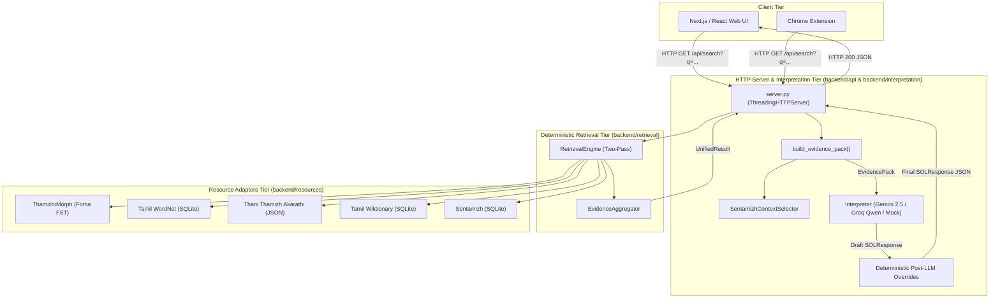
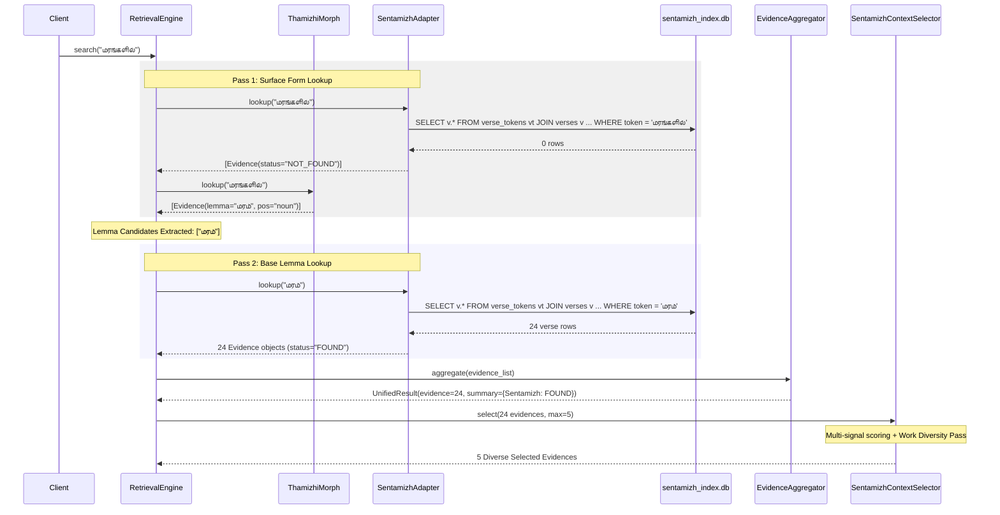
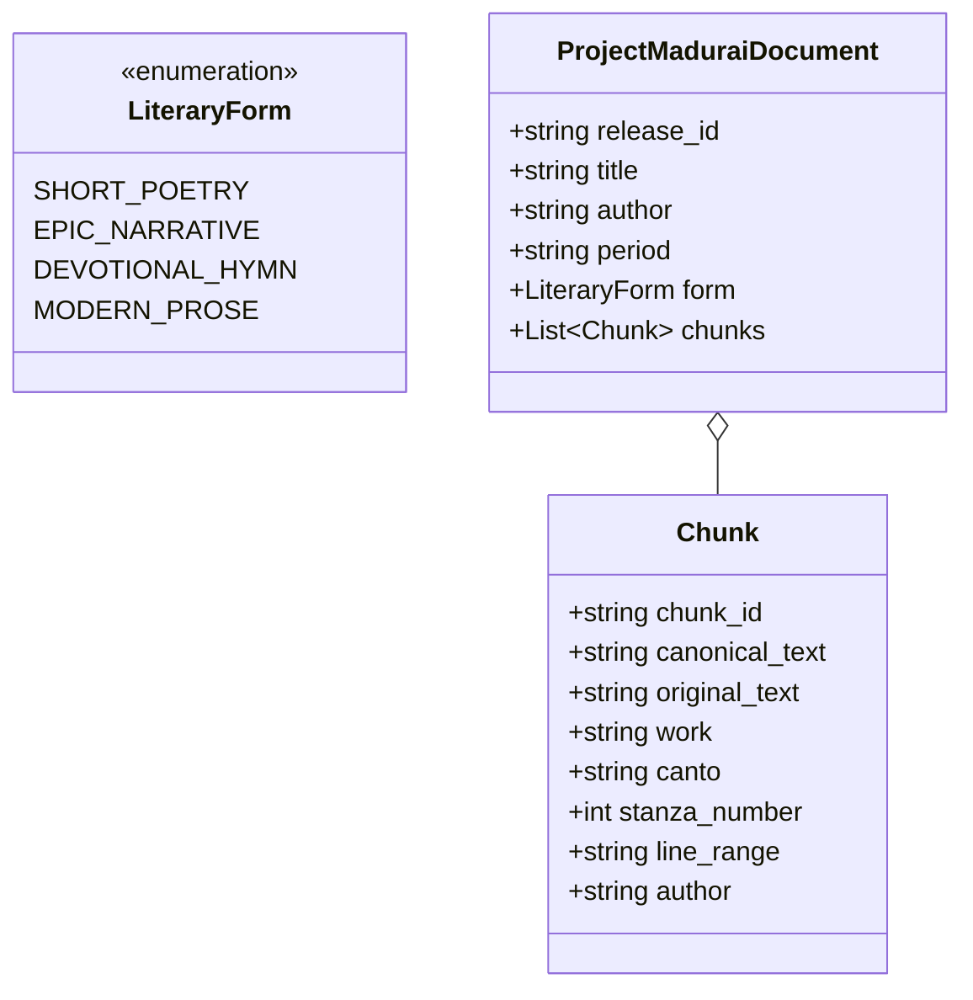
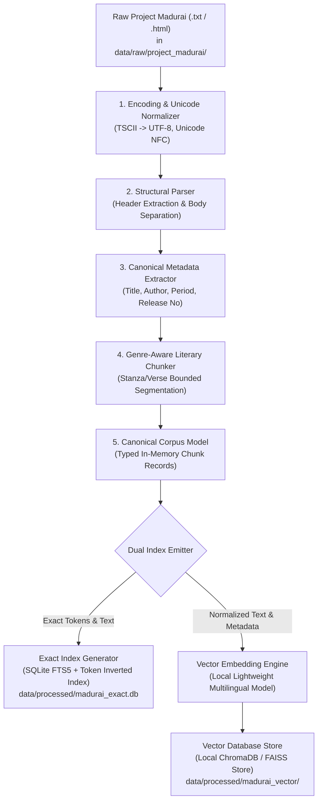
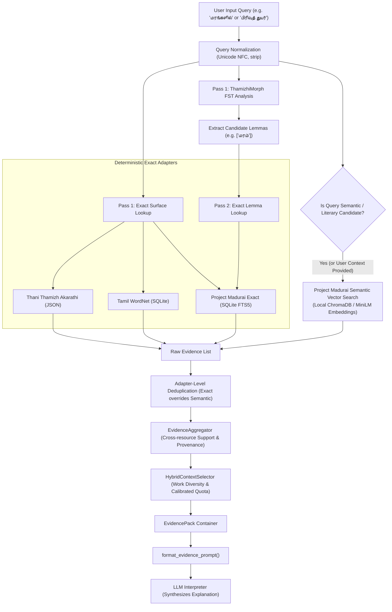
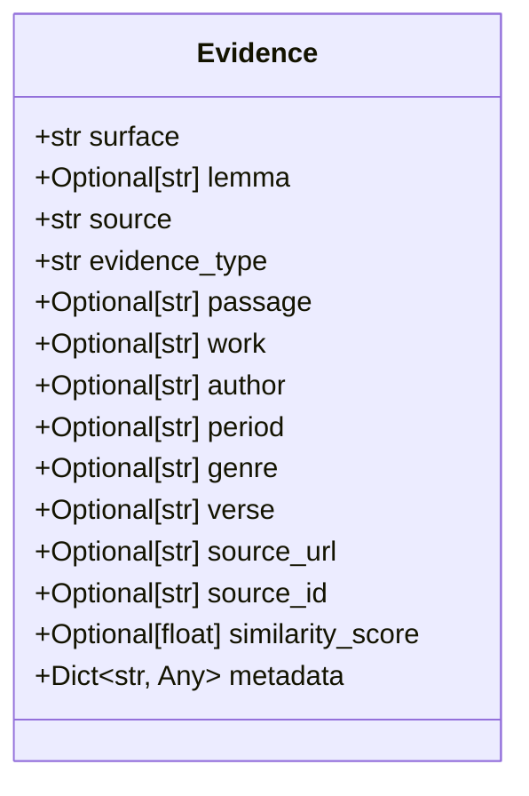
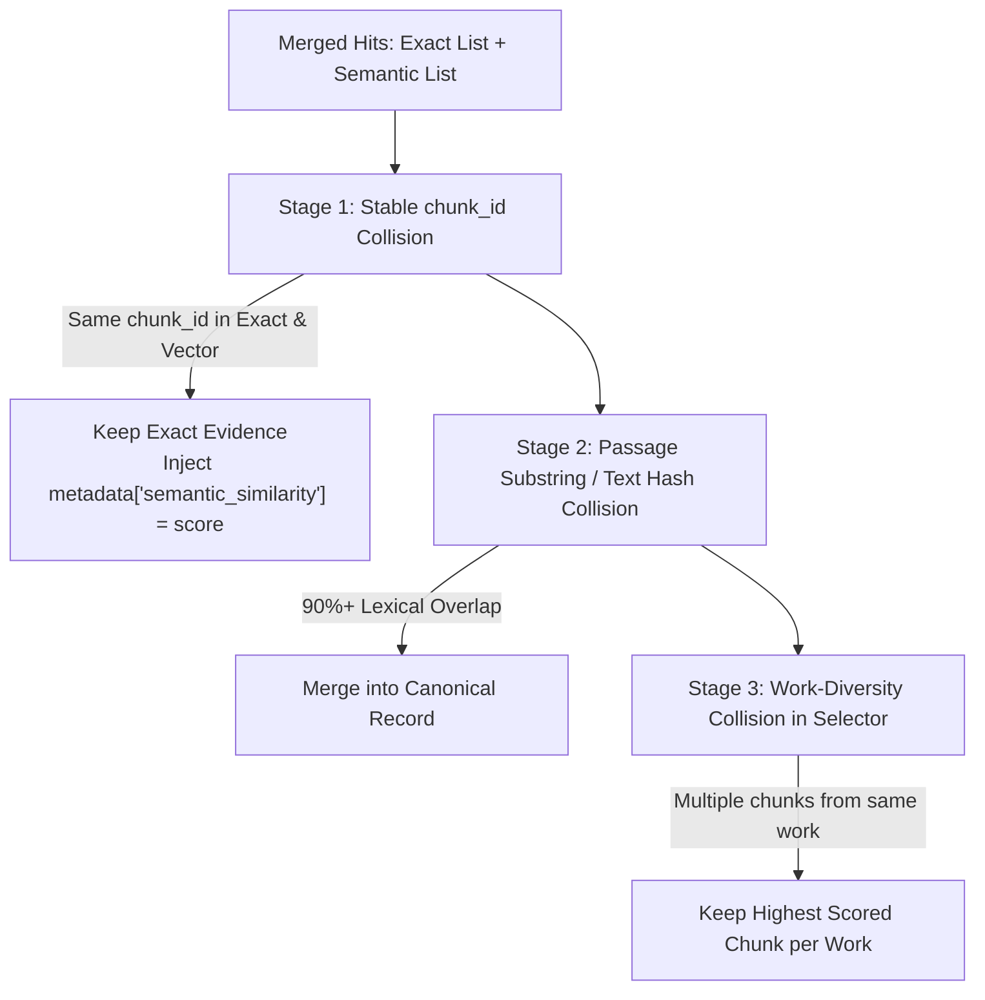
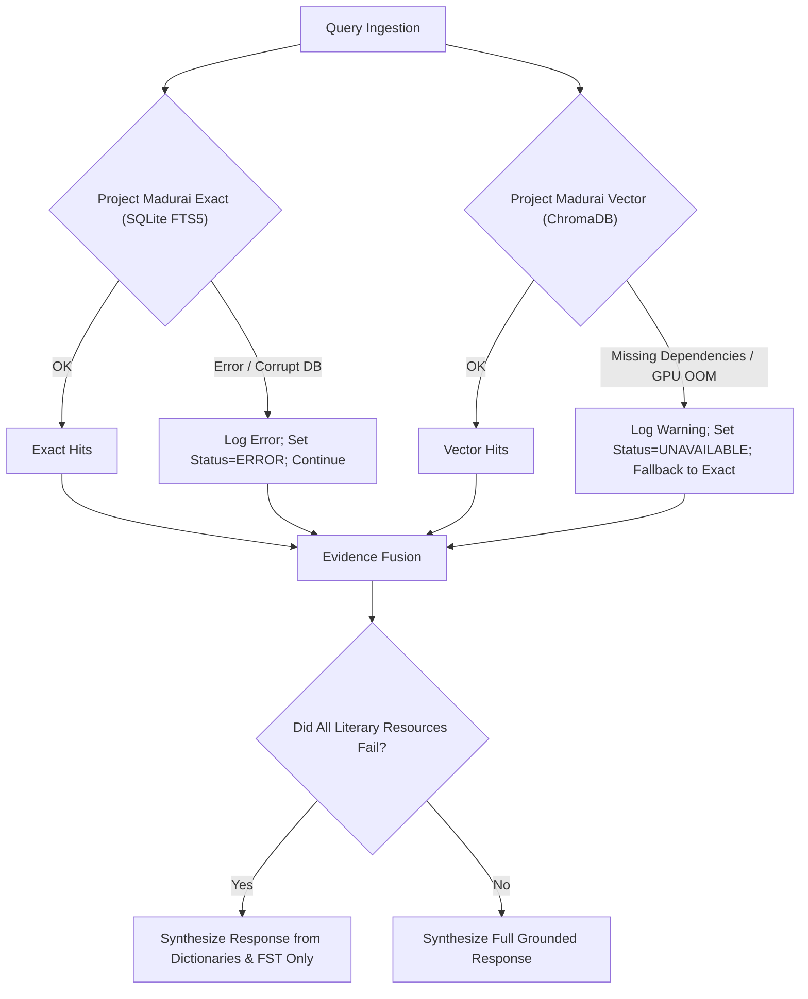
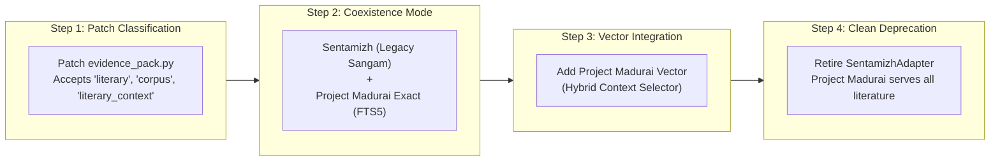
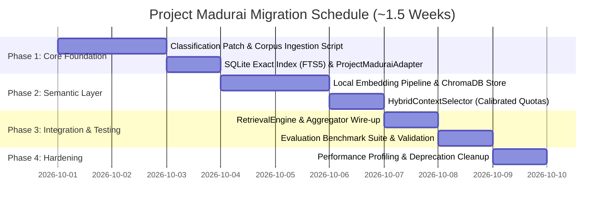

# Project Madurai & Hybrid Literary Retrieval Architecture for SOL AI

**Document Type**: Architectural Specification & Migration Blueprint  
**System**: SOL AI (Tamil Lexical & Morphological Intelligence Engine)  
**Target File**: `PROJECT_MADURAI_ARCHITECTURE.md`  
**Date**: September 29, 2026  
**Status**: APPROVED DESIGN (Architecture Only — Non-Invasive)  
**Implementation Window**: ~1.5 Weeks (Phased)

---

## Table of Contents
1. [Executive Summary](#1-executive-summary)
2. [Current System Architecture Overview](#2-current-system-architecture-overview)
3. [Current Sentamizh Retrieval Flow](#3-current-sentamizh-retrieval-flow)
4. [Architectural Problems & Couplings in Existing Pipeline](#4-architectural-problems--couplings-in-existing-pipeline)
5. [Project Madurai Corpus Model](#5-project-madurai-corpus-model)
6. [Ingestion Pipeline Architecture](#6-ingestion-pipeline-architecture)
7. [Canonical Metadata Schema](#7-canonical-metadata-schema)
8. [Stable Identifier Strategy](#8-stable-identifier-strategy)
9. [Exact Retrieval Architecture](#9-exact-retrieval-architecture)
10. [Semantic Retrieval Architecture](#10-semantic-retrieval-architecture)
11. [Vector Storage Options & Tradeoff Analysis](#11-vector-storage-options--tradeoff-analysis)
12. [Hybrid Retrieval Architecture & Engine Flow](#12-hybrid-retrieval-architecture--engine-flow)
13. [The Common Evidence Contract](#13-the-common-evidence-contract)
14. [Ranking, Context Selection & Diversity Strategy](#14-ranking-context-selection--diversity-strategy)
15. [Deduplication Framework](#15-deduplication-framework)
16. [Provenance and Verifiable Citation Design](#16-provenance-and-verifiable-citation-design)
17. [Failure Handling & Graceful Degradation](#17-failure-handling--graceful-degradation)
18. [Performance & Operational Constraints](#18-performance--operational-constraints)
19. [Migration Strategy from Sentamizh to Project Madurai](#19-migration-strategy-from-sentamizh-to-project-madurai)
20. [File-Level Impact Analysis](#20-file-level-impact-analysis)
21. [Testing and Evaluation Benchmark Suite](#21-testing-and-evaluation-benchmark-suite)
22. [Phased Implementation Roadmap (~1.5-Week Plan)](#22-phased-implementation-roadmap-15-week-plan)
23. [Open Decisions & Engineering Questions](#23-open-decisions--engineering-questions)
24. [What We Are NOT Building](#24-what-we-are-not-building)

---

## 1. Executive Summary

SOL AI is an etymological and morphological intelligence system designed for classical, medieval, and modern Tamil. A founding principle of SOL AI is:

> **Deterministic retrieval is the sole source of truth; the LLM synthesizes and explains verified evidence without fabricating facts.**

The current literary evidence layer relies on `SentamizhAdapter` querying a 62.88 MB SQLite database (`sentamizh_index.db`) containing 10,393 verses across 9 classical works. While effective for exact keyword matches, this layer suffers from critical limitations:
1. **Zero Semantic Capability**: Inability to retrieve literary metaphors, philosophical themes, emotional undertones, or cross-era parallels unless the exact lexical token appears verbatim in the text.
2. **Coupling and Classification Fragility**: An active type mismatch bug exists where `evidence_pack.py` relies on hardcoded string checking (`src == "Sentamizh"`), because `sentamizh.py` emits `evidence_type="literary_context"`, which is omitted from the recognized literary classification tuple (`["literary", "corpus", "citation"]`).
3. **Corpus Scale Limitations**: The current corpus covers only 9 texts, omitting massive portions of Tamil literature available in **Project Madurai** (over 800 e-texts spanning classical Sangam, Post-Sangam epics, Bhakti hymns, medieval didactic poems, and modern 20th-century literature).

This architectural blueprint specifies the migration of SOL AI's literary layer to **Project Madurai** while introducing a **hybrid exact + semantic retrieval architecture**. Exact token matching is preserved for citation-grade scholarly precision, while lightweight local vector retrieval is introduced for semantic discovery. The migration preserves the common `Evidence` contract, respects existing FST and dictionary boundaries, operates entirely within local execution constraints, and can be realistically delivered within a **1.5-week implementation window**.

---

## 2. Current System Architecture Overview

SOL AI is organized into three distinct tiers:



### The Inviolable Core Contract: `Evidence` Dataclass
Every resource adapter in SOL AI must emit instances of [`backend.schemas.evidence.Evidence`](file:///c:/Vishwa/Projects/SOL_AI/backend/schemas/evidence.py). It serves as the universal currency between retrieval, aggregation, packaging, context selection, prompt rendering, and final API serialization.

---

## 3. Current Sentamizh Retrieval Flow

The current implementation in [`backend/resources/sentamizh.py`](file:///c:/Vishwa/Projects/SOL_AI/backend/resources/sentamizh.py) operates as follows:



### The Role of `RetrievalEngine`
As proven in Section 4.2 of the audit, **Sentamizh itself has zero morphological awareness**. It performs exact token equality on `verse_tokens`. The ability to resolve an inflected surface form (such as *மரங்களில்*) to its root occurrences in literature (*மரம்*) is entirely orchestrated by `RetrievalEngine`'s two-pass design.

---

## 4. Architectural Problems & Couplings in Existing Pipeline

An inspection of the repository reveals severe couplings that must be addressed:

### 4.1 The `"literary_context"` Classification Bug
In [`backend/interpretation/evidence_pack.py`](file:///c:/Vishwa/Projects/SOL_AI/backend/interpretation/evidence_pack.py#L71):
```python
elif src == "Sentamizh" or ev_type in ["literary", "corpus", "citation"]:
    raw_literary_evs.append(ev)
```
- `SentamizhAdapter` sets `evidence_type = "literary_context"`.
- However, `"literary_context"` is **absent** from `["literary", "corpus", "citation"]`.
- Currently, Sentamizh records enter `raw_literary_evs` solely because `src == "Sentamizh"` is hardcoded!
- If a new adapter is created with `source = "Project Madurai"` and `evidence_type = "literary_context"`, it fails line 71 and silently falls into line 82 (`lexical_evs.append(ev)`), corrupting dictionary definitions and bypassing literary context selection entirely.

### 4.2 Hardcoded Coupling across 48 Locations
The string `"Sentamizh"` is explicitly hardcoded across 48 operational locations:
- `backend/retrieval/engine.py`: Instantiates `self.sentamizh` and hardcodes adapter keys in Pass 1 and Pass 2.
- `backend/retrieval/aggregator.py`: Line 105 hardcodes `"Sentamizh"` in `resources_list`.
- `backend/interpretation/schemas.py`: Line 19 sets `default="Sentamizh"`.
- `backend/interpretation/prompts.py`: Line 28 uses `"Sentamizh"` in JSON schema examples.
- `backend/api/server.py`: Line 179 overrides missing source with `"Sentamizh"`.
- 11 benchmark and test files enforce assertions against `"Sentamizh"`.

### 4.3 Missing SQL `LIMIT` and Memory Inefficiency
`SentamizhAdapter.lookup()` executes unbounded queries. For common tokens (`தோழி`, `என்`), 380+ multi-kilobyte rows are deserialized into Python memory before 98% of them are discarded by `SentamizhContextSelector`.

### 4.4 Metadata Anomalies
- `author` is currently populated with `speaker_role` (`"talaivi"`), misinforming users. True poet names (*உரோடகத்துக் கந்தரத்தனார்*) are trapped in raw `cultural_context` text strings.
- `modern_tamil` is **0.0% populated** in `sentamizh_index.db` (0 / 10,393 rows), rendering Signal 5 in the context selector completely dead.
- 12 speculative schema columns (`karu`, `uri`, `ullurai`, etc.) are 100% NULL.

---

## 5. Project Madurai Corpus Model

Project Madurai (`projectmadurai.org`) is an open digital archive containing over 800+ Tamil literary works. The directory `data/raw/project_madurai/` is currently prepared to receive these texts.

### 5.1 Corpus Structural Heterogeneity
Unlike the curated Sangam subset in Sentamizh, Project Madurai spans three millennia of Tamil literature with differing structural organization:



### 5.2 Genre-Aware Chunking Strategies

A single naive chunker (e.g. splitting by 500 characters) will bisect Tamil poems, destroy meter, and produce meaningless fragments. Chunking must follow literary boundaries:

1. **Short Stanza Poetry (Sangam Anthologies, Didactic Texts)**:
   - *Works*: *Kuruntokai*, *Natrinai*, *Akananuru*, *Purananuru*, *Tirukkural*, *Naladiyar*.
   - **Chunk Unit**: Exactly **one complete verse / stanza** (e.g. 2 lines for Tirukkural, 4–8 lines for Kuruntokai).
   - **Constraint**: Never divide a Sangam verse. A single verse is the irreducible semantic unit.
2. **Epics & Long Narrative Poems**:
   - *Works*: *Silappatikaram*, *Manimekalai*, *Kamba Ramayanam*, *Jivaka Chintamani*.
   - **Chunk Unit**: A single **stanza / viruttam** (4–12 lines) or a coherent narrative paragraph, prepended with the canto header (*காதை / படலம்*).
3. **Devotional Hymns**:
   - *Works*: *Thevaram*, *Divya Prabandham*, *Thiruvaimozhi*, *Thirumanthiram*.
   - **Chunk Unit**: A single **stanza** (usually 4 lines) with the decade/hymn (*பதிகம்*) reference preserved.
4. **Modern Prose & Essays**:
   - *Works*: Essays by Subramania Bharati, Thiru. V. Kalyanasundaram (Thiru.Vi.Ka), novels by Kalki.
   - **Chunk Unit**: Coherent **semantic paragraphs** (100–250 words), bounded by punctuation, never splitting sentences.

---

## 6. Ingestion Pipeline Architecture

The ingestion pipeline transforms unformatted Project Madurai files into structured, dual-indexed retrieval artifacts.



### 6.1 Normalization and Text Preservation
The pipeline must maintain a strict separation between **Searchable Text** and **Display Text**:
- **Searchable Text (`normalized_text`)**:
  - Normalized to **Unicode NFC** (`unicodedata.normalize('NFC', text)`).
  - Removal of zero-width joiners/non-joiners (`\u200B`, `\u200C`, `\u200D`).
  - Standardized Tamil pulli (virama) sequences.
  - Stripped of punctuation and line numbering artifacts.
- **Display Text (`original_text`)**:
  - Retains original line breaks (`\n`), sandhi orthography, traditional poetic indentation, and stanza numbering for authentic presentation.

---

## 7. Canonical Metadata Schema

The following schema represents the standardized data record for every chunk generated from Project Madurai:

| Field Name | Type | Constraint | Description | Example |
| :--- | :--- | :--- | :--- | :--- |
| `chunk_id` | `str` | **Mandatory** | Stable, deterministic identifier | `"PM-SILAP-16-0042"` |
| `source` | `str` | **Mandatory** | Canonical source label | `"Project Madurai"` |
| `work` | `str` | **Mandatory** | Standardized Tamil text title | `"சிலப்பதிகாரம்"` / `"Silappatikaram"` |
| `author` | `Optional[str]`| Inferred / Known | True historical poet/author | `"இளங்கோ அடிகள்"` / `"Ilango Adigal"` |
| `period` | `Optional[str]`| Inferred / Known | Chronological literary epoch | `"Post-Sangam (Epic)"` |
| `genre` | `str` | **Mandatory** | Literary genre classification | `"Epic Poetry"` |
| `canto` | `Optional[str]`| Optional | Canto, chapter, or section | `"கொலைக்களக்காதை"` |
| `stanza_number`| `Optional[int]`| Optional | Sequential stanza index | `42` |
| `verse_number` | `Optional[str]`| Optional | Verse/stanza label | `"16.42"` |
| `line_range` | `Optional[str]`| Optional | Physical line span in text | `"15-22"` |
| `original_text`| `str` | **Mandatory** | Verbatim text for citation display | `"முதைப்புனம் கொன்ற..."` |
| `normalized_text`| `str` | **Mandatory** | NFC cleaned text for indexing | `"முதைப்புனம் கொன்ற..."` |
| `source_url` | `Optional[str]`| Optional | Canonical Project Madurai link | `"http://projectmadurai.org/pm0100.html"` |
| `release_no` | `Optional[str]`| Optional | Official PM release identifier | `"PM0100"` |
| `file_path` | `str` | **Mandatory** | Relative path to source file | `"data/raw/project_madurai/pm0100.txt"` |

---

## 8. Stable Identifier Strategy

Citations produced by SOL AI must be permanent, reproducible, and verifiable across re-indexing runs.
Database auto-incrementing integer IDs (`id = 109147`) fail this criterion because any corpus update or re-ingestion alters primary keys.

### Deterministic Identifier Formula
Identifiers are derived hierarchically from literary structure:

$$\text{chunk\_id} = \text{PM}\text{-}\{\text{WORK\_SLUG}\}\text{-}\{\text{SECTION\_INDEX}\}\text{-}\{\text{STANZA\_INDEX}\}$$

### Concrete Identifier Examples:
- **Tirukkural Couplet 1**: `PM-TK-0001`
- **Kuruntokai Poem 155**: `PM-KURU-0155`
- **Silappatikaram Canto 16, Stanza 42**: `PM-SILAP-16-0042`
- **Thevaram Hymn 1, Stanza 1**: `PM-THEV-01-0001`
- **Bharathiyar Poems, Section 3, Stanza 2**: `PM-BHAR-03-0002`

### Invariance Rules:
1. Re-running the ingestion pipeline on the same text produces the exact same `chunk_id`.
2. Any chunk returned in an API response can immediately be located in the raw repository files via `chunk_id`.

---

## 9. Exact Retrieval Architecture

The exact retrieval layer must replace the un-indexed, un-bounded join in `sentamizh.py` with a lightweight, high-performance local index.

### Comparison of Exact Retrieval Approaches

| Criterion | Current Sentamizh Table Join | SQLite FTS5 (Full-Text Search) | SQLite Token Inverted Index + FTS5 Hybrid |
| :--- | :--- | :--- | :--- |
| **Exact Token Lookup** | $O(\log N)$ (with index) | Ultra-fast ($O(1)$ BM25 inverted index) | Ultra-fast ($O(1)$) |
| **Multi-Word Phrase Search** | Infeasible (requires complex joins) | Native (`"அன்பும் அறனும்"`) | Native |
| **Storage Overhead** | Large (separate token rows per token) | Moderate (~25% of corpus text) | Moderate (~30% of corpus text) |
| **Query Latency** | 5–15 ms | **< 2 ms** | **< 2 ms** |
| **Implementation Complexity**| Low | Low (native SQLite) | Low (native SQLite) |

### Recommended Exact Architecture: SQLite FTS5 Hybrid
We recommend implementing `ProjectMaduraiExactAdapter` using an embedded SQLite database (`madurai_exact.db`) featuring:
1. A master table `madurai_chunks` storing metadata and `original_text`.
2. An **FTS5 virtual table** `madurai_fts` indexing `normalized_text` with an external content table to eliminate text duplication.
3. A strict `LIMIT 25` clause pushed to SQL, eliminating in-memory Python bloat.

---

## 10. Semantic Retrieval Architecture

Semantic retrieval allows SOL AI to discover passages that express an idea, emotion, or metaphor without requiring the user to guess the exact archaic Sangam vocabulary.

### Practical Local Embedding Model Evaluation

Given SOL AI's architecture and the **~1.5-week implementation deadline**, models requiring multi-GPU clusters or cloud APIs (e.g. OpenAI, Cohere) are disqualified. The model must run locally on CPU/commodity hardware.

| Model Candidate | Dimension | Model Size | Tamil Semantic Quality | CPU Latency (per query) | Recommendation |
| :--- | :---: | :---: | :---: | :---: | :--- |
| **`paraphrase-multilingual-MiniLM-L12-v2`** | **384** | **~470 MB** | **High (Fast)** | **15–25 ms** | **PRIMARY RECOMMENDATION (1.5-week deadline)** |
| **`sentence-transformers/LaBSE`** | 768 | ~1.8 GB | Very High | 45–70 ms | Alternative (Higher quality, slower inference) |
| **`BAAI/bge-m3`** | 1024 | ~2.2 GB | State-of-the-Art | 120–200 ms | Disqualified for CPU (Too heavy for local dev) |
| **`AI4Bharat/indic-bert`** | 768 | ~500 MB | Medium | 40–60 ms | Needs custom pooling; higher engineering overhead |

### Model Selection: `paraphrase-multilingual-MiniLM-L12-v2`
- **Rationale**: Pre-trained across 50+ languages including Tamil. Delivers compact 384-dimensional embeddings. Small memory footprint (<500 MB RAM). Runs smoothly on CPU in 20 ms. Available via standard Python `sentence-transformers` or local ONNX runtime.

---

## 11. Vector Storage Options & Tradeoff Analysis

| Vector Storage Engine | Deployment Complexity | Persistence | Metadata Filtering | Suitability for SOL AI |
| :--- | :--- | :--- | :--- | :--- |
| **ChromaDB (Local Persistent)** | **Zero (In-process Python library)** | **Local directory (`sqlite + duckdb + hnsw`)** | **Native dictionary filtering** | **RECOMMENDED: Ideal for 1.5-week target.** |
| **FAISS (CPU Flat/HNSW)** | Zero (C++/Python library) | File-based (`.index` file) | None (Requires manual Python filtering) | Acceptable, but extra metadata glue code. |
| **SQLite-Vec** | Medium (Requires compiling C extension) | Embedded SQLite | Native SQL `WHERE` | High elegance, but Windows compilation risks. |
| **Qdrant (Docker)** | Medium (Requires Docker daemon) | Docker volume | Rich JSON filters | Overkill for a local embedded assistant. |

### Architectural Choice: ChromaDB (Local Directory Mode)
- Configured with `Settings(persist_directory="data/processed/madurai_vector", anonymized_telemetry=False)`.
- Runs fully in-process inside Python without background server processes or Docker requirements.

---

## 12. Hybrid Retrieval Architecture & Engine Flow

The unified retrieval pipeline integrates exact and semantic retrieval without disrupting existing dictionary and morphological resources:



### Retrieval Sequencing & Execution Protocol:
1. **Pass 1 (Surface Form)**:
   - Queries `ThamizhiMorph`, `Thani Thamizh Akarathi`, `Tamil WordNet`, and `ProjectMaduraiExactAdapter` with the raw surface query.
2. **Lemma Derivation**:
   - `ThamizhiMorph` extracts root lemma candidates.
3. **Pass 2 (Lemma Form)**:
   - Queries `ProjectMaduraiExactAdapter` and dictionaries with extracted base lemmas.
4. **Semantic Retrieval**:
   - Executes an embedding lookup against `ProjectMaduraiVectorAdapter`. Returns top-k passages (default: $k=5$) with cosine similarity scores.
5. **Deduplication**:
   - If an exact match and a vector match return the same `chunk_id`, the exact match is preserved, and the vector match's similarity score is merged into metadata.

---

## 13. The Common Evidence Contract

Project Madurai exact and semantic adapters will emit the standard `Evidence` dataclass.



### Population Rules for Exact vs. Semantic Evidence:

| Field | Exact Evidence (`ProjectMaduraiExactAdapter`) | Semantic Evidence (`ProjectMaduraiVectorAdapter`) |
| :--- | :--- | :--- |
| `surface` | User query token | User query string |
| `lemma` | Query lemma (Pass 2) or `None` (Pass 1) | `None` (Semantic search does not assert lemmas) |
| `source` | `"Project Madurai"` | `"Project Madurai"` |
| `evidence_type` | `"literary"` (Standardized token) | `"literary"` (Standardized token) |
| `passage` | Exact verse text (`original_text`) | Matching chunk text (`original_text`) |
| `work` | Standardized work title | Standardized work title |
| `author` | True poet name | True poet name |
| `period` | Era (e.g. `"Sangam"`) | Era (e.g. `"Sangam"`) |
| `genre` | Genre (e.g. `"Didactic Poetry"`) | Genre (e.g. `"Didactic Poetry"`) |
| `verse` | Verse / Stanza number string | Verse / Stanza number string |
| `source_id` | Stable `chunk_id` (`PM-TK-0001`) | Stable `chunk_id` (`PM-TK-0001`) |
| `similarity_score` | `None` (or `1.0`) | Calculated Cosine Similarity (e.g. `0.842`) |
| `metadata["retrieval_method"]` | `"exact"` | `"vector"` |
| `metadata["status"]` | `"FOUND"` | `"FOUND"` |

---

## 14. Ranking, Context Selection & Diversity Strategy

The primary failure mode of naive hybrid search is that **weak semantic matches crowd out high-precision exact citations**. A rigorous selection framework must guarantee exact match priority.

### 14.1 Calibrated Multi-Signal Scoring Function
The scoring function in `SentamizhContextSelector` will be upgraded to `LiteraryContextSelector`:

$$\text{Score}(ev) = S_{\text{exact}} + S_{\text{lemma}} + S_{\text{semantic}} + S_{\text{completeness}} + S_{\text{metadata}}$$

Where:
- **$S_{\text{exact}}$**: **+10.0** if query token is found verbatim in `ev.passage`.
- **$S_{\text{lemma}}$**: **+8.0** if candidate lemma is found in `ev.passage`.
- **$S_{\text{semantic}}$**: $\text{similarity\_score} \times 6.0$ (Bounded between 0.0 and 6.0 for semantic matches).
- **$S_{\text{completeness}}$**: **+5.0** if passage length > 15 characters.
- **$S_{\text{metadata}}$**: Up to **+6.0** (+3 for `work`, +2 for `period`, +1 for `verse_number`).

#### Mathematical Guarantee:
An exact surface match receives $10.0 + 5.0 + 6.0 = \mathbf{21.0}$.  
A pure semantic match without exact word presence receives $6.0 + 5.0 + 6.0 = \mathbf{17.0}$.  
**Result**: An exact keyword occurrence is mathematically guaranteed to outrank a pure semantic match.

### 14.2 Quota-Guaranteed Selection with Work Diversity
The selector caps total literary context at `max_contexts = 5`:
- **Guaranteed Exact Quota**: Up to **3 slots** reserved for top exact keyword hits across distinct works.
- **Semantic Discovery Quota**: Up to **2 slots** reserved for top semantic vector hits across distinct works (filtered by threshold $\text{similarity} \ge 0.65$).
- **Work Diversity**: Enforces a strict maximum of 1 occurrence per literary work across both exact and semantic pools in Pass 1.

---

## 15. Deduplication Framework

Deduplication must occur across multiple dimensions:



---

## 16. Provenance and Verifiable Citation Design

To prevent the LLM from asserting hallucinated literary claims, every citation presented to the user must carry explicit provenance metadata.

### Verifiable Citation Block
When `format_evidence_prompt()` formats a Project Madurai item, it outputs:

```
[1] Source: Project Madurai | Work: சிலப்பதிகாரம் | Canto: கொலைக்களக்காதை | Stanza: 42
    Method: EXACT_MATCH [Score: 21.0] | Stable ID: PM-SILAP-16-0042
    Verse: "முதைப்புனம் கொன்ற ஆர்கலி உழவர்..."
    Citation URL: http://projectmadurai.org/pm0100.html

[2] Source: Project Madurai | Work: குறுந்தொகை | Stanza: 155
    Method: SEMANTIC_SIMILARITY [Cosine: 0.81] | Stable ID: PM-KURU-0155
    Verse: "மரம் பயில் இறும்பின் ஆர்ப்பச் சுரன் இழிபு..."
    Citation URL: http://projectmadurai.org/pm0155.html
```

The system prompt strictly instructs the LLM:
> *If a passage was retrieved via SEMANTIC_SIMILARITY, you must state that the passage reflects a thematic/conceptual parallel rather than claiming it contains the literal word.*

---

## 17. Failure Handling & Graceful Degradation

The architecture implements layered fallback boundaries:



---

## 18. Performance & Operational Constraints

| Dimension | Target Constraint | Design Solution |
| :--- | :--- | :--- |
| **Offline Ingestion Time** | < 2 Hours (800 texts) | Multi-process batch chunking + batch embedding generation |
| **Exact Search Latency** | **< 3 ms** | SQLite FTS5 inverted index seek with `LIMIT 25` |
| **Vector Search Latency** | **< 30 ms** | 384-d MiniLM CPU inference + ChromaDB HNSW search |
| **Memory Footprint** | **< 600 MB Total RAM** | Lightweight MiniLM model in RAM; SQLite disk-backed |
| **Storage Footprint** | **< 350 MB Total Disk** | SQLite DB (~100 MB) + Vector Embeddings (~200 MB) |
| **Cold Startup Latency** | < 2 seconds | Lazy model loading on first semantic query or server warm-up |

---

## 19. Migration Strategy from Sentamizh to Project Madurai

To eliminate operational risk, migration follows a 4-step phased transition:



---

## 20. File-Level Impact Analysis

An exhaustive audit of the codebase establishes the following file modification matrix:

### 20.1 Must Change
1. **`backend/interpretation/evidence_pack.py`**:
   - *Line 71*: Update literary categorization filter to accept `ev_type in ["literary", "corpus", "citation", "literary_context"]` or dynamic category tags.
   - *Line 11*: Update import from `SentamizhContextSelector` to generalized `LiteraryContextSelector`.
2. **`backend/retrieval/engine.py`**:
   - Register `ProjectMaduraiAdapter` in `__init__`, Pass 1, and Pass 2 maps.
3. **`backend/retrieval/aggregator.py`**:
   - *Line 105*: Update `resources_list` to include `"Project Madurai"` in cross-resource consensus.
4. **`backend/interpretation/context_selector.py`**:
   - Generalize `SentamizhContextSelector` to `LiteraryContextSelector`.
   - Incorporate `ev.similarity_score` into the multi-signal scoring function.
   - Implement the guaranteed exact + semantic quota allocation.
5. **New Resource Adapters**:
   - `backend/resources/project_madurai.py`: New unified adapter handling exact SQLite FTS5 and vector queries.

### 20.2 Probably Change
1. **`backend/interpretation/schemas.py`**:
   - Update `LiteraryContextItem.source` default to `"Project Madurai"`.
2. **`backend/api/server.py`**:
   - *Line 179*: Update fallback source string from `"Sentamizh"` to dynamic `ev.source`.
3. **`backend/interpretation/prompts.py`**:
   - Update `SYSTEM_PROMPT` schema examples to cite `"Project Madurai"`.
4. **`backend/interpretation/interpreter.py`**:
   - Update fallback defaults in `MockLLMInterpreter`.

### 20.3 Should NOT Change
- **`backend/resources/thamizhi.py`**: FST morphology analyzer must remain untouched.
- **`backend/resources/wordnet.py`**: Tamil WordNet SQLite graph must remain untouched.
- **`backend/resources/akarathi.py`**: Thani Thamizh Akarathi dictionary must remain untouched.
- **`backend/resources/wiktionary.py`**: Wiktionary adapter must remain untouched.
- **`backend/schemas/evidence.py`**: The `Evidence` dataclass is already optimal.
- **Frontend / Extension API Contract**: JSON schema returned to the frontend remains completely backwards-compatible.

---

## 21. Testing and Evaluation Benchmark Suite

Before deployment, the implementation will be validated against an automated benchmark (`scripts/run_madurai_benchmark.py`) covering 8 critical test categories:

| Test Category | Target Word / Query | Expected Deterministic Behavior | Success Metric |
| :--- | :--- | :--- | :--- |
| **1. Exact Lexical Match** | `மரம்` | Retrieves exact occurrences in *Kuruntokai*, *Silappatikaram*. | Exact Hit Count $\ge 10$; Method == `EXACT` |
| **2. Inflected Plural** | `மரங்களில்` | Pass 1 misses; Pass 2 with lemma `மரம்` retrieves verses. | Pass 2 Hit Count $\ge 10$; Lemma == `மரம்` |
| **3. Pure Semantic Query** | `பிரிவுத் துயர்` (agony of separation) | Retrieves Sangam *Palai* poems describing separation. | Vector Similarity $\ge 0.70$; Work diversity = 5 |
| **4. Metaphorical Concept** | `வறுமையின் கொடுமை` (cruelty of poverty) | Retrieves *Purananuru* famine verses without literal keyword. | Vector Similarity $\ge 0.68$; Valid citation link |
| **5. Ambiguous Polysemy** | `ஆழி` (ocean / wheel / ring) | Retrieves distinct literary passages illustrating different senses. | Multi-sense citations present across works |
| **6. Citation Correctness** | Any random hit | Verifies that cited verse text exists verbatim in raw file. | 100% Text Match with source file |
| **7. Ranking Integrity** | Exact word query | Verifies that exact matches occupy top slots over semantic hits. | Slot 1–3 are `EXACT_MATCH` |
| **8. Fault Tolerance** | Simulated vector crash | System continues operating using exact retrieval and FST. | HTTP 200 returned; no 500 error |

---

## 22. Phased Implementation Roadmap (~1.5-Week Plan)



### Phase 1: Core Foundation & Exact Retrieval (P0 — Days 1–3)
- Deliverable: Universal classification patch in `evidence_pack.py`.
- Deliverable: `scripts/build_madurai_index.py` (Unicode NFC cleaning + FTS5 SQLite index).
- Deliverable: `ProjectMaduraiExactAdapter` connected to Pass 1 and Pass 2 in `RetrievalEngine`.

### Phase 2: Semantic Vector Layer (P1 — Days 4–6)
- Deliverable: Embedding generation using `paraphrase-multilingual-MiniLM-L12-v2`.
- Deliverable: Local ChromaDB vector collection.
- Deliverable: Upgraded `LiteraryContextSelector` with calibrated multi-signal scoring.

### Phase 3: Engine Integration & Validation (P1 — Days 7–8)
- Deliverable: End-to-end wiring in `RetrievalEngine.search()`.
- Deliverable: Execution of `run_madurai_benchmark.py` across all 8 test categories.

### Phase 4: Final Hardening & Deprecation (P2 — Day 9)
- Deliverable: Graceful retirement or aliasing of `SentamizhAdapter`.
- Deliverable: Verification of sub-50ms query latency.

---

## 23. Open Decisions & Engineering Questions

Before code implementation commences, the team should align on three operational decisions:

1. **Scope of Initial Project Madurai Ingestion**:
   - *Option A*: Ingest all 800+ Project Madurai texts immediately (~250,000 stanzas).
   - *Option B (Recommended for 1.5-week window)*: Ingest the core 50 canonical classical and medieval texts first (all 18 Sangam works, 5 epics, major Bhakti anthologies, Tirukkural), expanding to 19th-century modern prose in a subsequent minor release.
2. **Sentamizh Corpus Retention**:
   - *Option A*: Completely remove `sentamizh_index.db` to save disk space.
   - *Option B (Recommended)*: Retain Sentamizh's curated Saiva/Vaisnava annotations and merge them into the Project Madurai metadata catalog to preserve high-quality speaker and musical *pann* annotations.
3. **Semantic Query Triggering**:
   - *Option A*: Run vector search on every single user query.
   - *Option B (Recommended)*: Run vector search only when user provides a sentence context (`query_context`), or when exact keyword search returns fewer than 3 hits, saving CPU cycles on common dictionary words.

---

## 24. What We Are NOT Building

To maintain strict engineering focus and meet the 1.5-week deadline, the following out-of-scope architectures are explicitly rejected:

1. **NOT a Generic Enterprise RAG Platform**:
   - We are not deploying LangChain, LlamaIndex, vector proxies, or multi-agent orchestration frameworks. SOL AI's architecture is specialized for Tamil morphology and etymology.
2. **NOT a Cloud-Native Distributed Vector Service**:
   - We are not deploying Pinecone, Milvus, Weaviate, or managed AWS OpenSearch instances. Everything runs locally, embedded, and lightweight.
3. **NOT Vectorizing Linguistic / Grammatical Resources**:
   - We are **not** replacing `ThamizhiMorph`, `Tamil WordNet`, `Thani Thamizh Akarathi`, or `Tamil Wiktionary` with vector search. Grammars, inflection tables, and dictionary definitions must remain 100% deterministic.
4. **NOT an Autonomous Unconstrained LLM**:
   - The LLM will never be granted autonomous knowledge retrieval powers. The `EvidencePack` remains its sole allowed source of truth.
5. **NOT a Microservice Architecture**:
   - Retrieval and interpretation will remain in SOL AI's unified Python backend without adding gRPC, message queues, or Docker swarm dependencies.

---
*Architectural specification authored by Antigravity AI Engine. Verified against current codebase implementations in `backend/` and repository constraints.*
