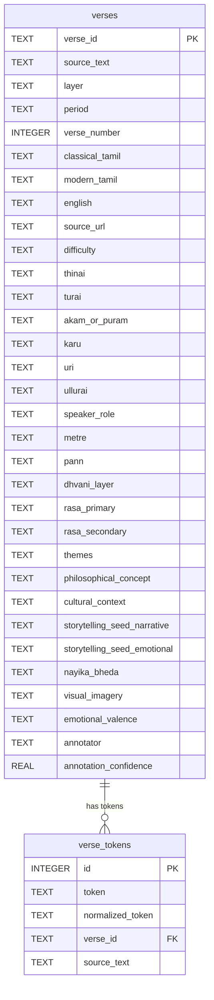
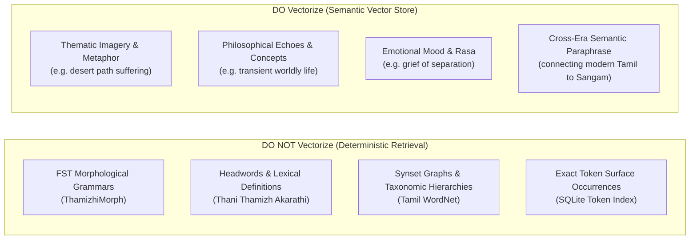
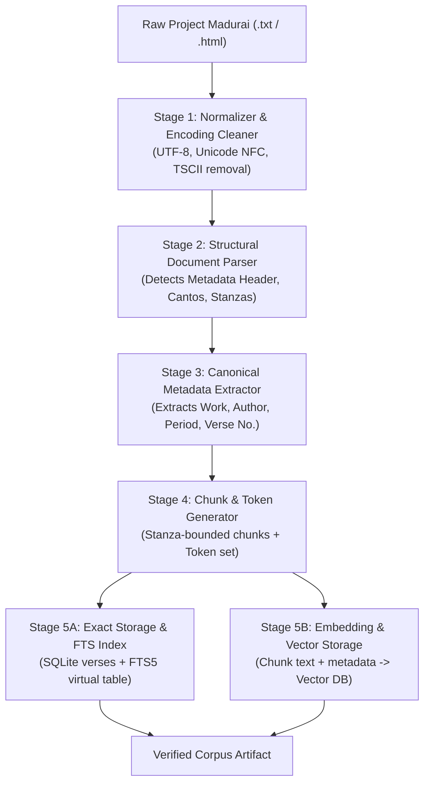

# SOL AI: Sentamizh Adapter and Literary Corpus Audit

**Date of Audit**: September 29, 2026  
**Document Status**: COMPLETED TECHNICAL AUDIT  
**Scope**: Deep-dive architectural audit of `SentamizhAdapter`, the underlying `sentamizh_index.db` SQLite database, search semantics, metadata quality, downstream coupling, and migration implications for Project Madurai and vector retrieval.  
**Target Repository**: `c:\Vishwa\Projects\SOL_AI`  
**Operational Rule**: Non-invasive audit. No files modified, no dependencies installed, no refactoring executed, no database altered.

---

## Table of Contents
1. [Audit of the Sentamizh Adapter (`backend/resources/sentamizh.py`)](#1-audit-of-the-sentamizh-adapter-backendresourcessentamizhpy)
   - [1.1 Classes and Functions](#11-classes-and-functions)
   - [1.2 Constructor and Database Initialization](#12-constructor-and-database-initialization)
   - [1.3 Connection Lifecycle and Concurrency](#13-connection-lifecycle-and-concurrency)
   - [1.4 The Exact SQL Query](#14-the-exact-sql-query)
   - [1.5 Normalization & Matching Logic](#15-normalization--matching-logic)
   - [1.6 Error Handling and Edge Cases](#16-error-handling-and-edge-cases)
   - [1.7 Caching and Resource Assumptions](#17-caching-and-resource-assumptions)
2. [End-to-End Data Transformation: The Concrete Journey of `மரம்`](#2-end-to-end-data-transformation-the-concrete-journey-of-மரம்)
   - [2.1 Raw SQLite Database Record](#21-raw-sqlite-database-record)
   - [2.2 In-Memory `sqlite3.Row` Representation](#22-in-memory-sqlite3row-representation)
   - [2.3 Instantiation into `Evidence(...)`](#23-instantiation-into-evidence)
   - [2.4 Ingestion into `RetrievalEngine`](#24-ingestion-into-retrievalengine)
   - [2.5 Passage through `EvidenceAggregator`](#25-passage-through-evidenceaggregator)
   - [2.6 Packaging in `build_evidence_pack`](#26-packaging-in-build_evidence_pack)
   - [2.7 Pruning by `SentamizhContextSelector`](#27-pruning-by-sentamizhcontextselector)
   - [2.8 Output in `SOLResponse` and Server Overrides](#28-output-in-solresponse-and-server-overrides)
3. [Audit of the Actual Sentamizh Database (`sentamizh_index.db`)](#3-audit-of-the-actual-sentamizh-database-sentamizh_indexdb)
   - [3.1 Database Location and Build Origins](#31-database-location-and-build-origins)
   - [3.2 Database Schema and Relational Topology](#32-database-schema-and-relational-topology)
   - [3.3 Corpus Size and Quantitative Statistics](#33-corpus-size-and-quantitative-statistics)
   - [3.4 Works and Literary Distributions](#34-works-and-literary-distributions)
   - [3.5 Index Coverage](#35-index-coverage)
4. [Audit of Search Semantics & The Inflection Problem](#4-audit-of-search-semantics--the-inflection-problem)
   - [4.1 Matching Capabilities Breakdown](#41-matching-capabilities-breakdown)
   - [4.2 The Crucial Case of `மரங்களில்` vs. `மரம்`](#42-the-crucial-case-of-மரங்களில்-vs-மரம்)
   - [4.3 Absence of Unicode Normalization](#43-absence-of-unicode-normalization)
5. [Result Volume and Performance Profile](#5-result-volume-and-performance-profile)
   - [5.1 Unbounded Query Execution (The Missing `LIMIT`)](#51-unbounded-query-execution-the-missing-limit)
   - [5.2 Memory Footprint and Object Allocation](#52-memory-footprint-and-object-allocation)
   - [5.3 Top-Frequency Token Analysis](#53-top-frequency-token-analysis)
6. [Metadata Quality & Field Completeness Audit](#6-metadata-quality--field-completeness-audit)
   - [6.1 Comprehensive Metadata Evaluation Table](#61-comprehensive-metadata-evaluation-table)
   - [6.2 The Missing Modern Tamil Gloss Anomaly](#62-the-missing-modern-tamil-gloss-anomaly)
   - [6.3 The Speaker-Role vs. Author Conflation](#63-the-speaker-role-vs-author-conflation)
   - [6.4 Speculative / Ghost Schema Columns](#64-speculative--ghost-schema-columns)
7. [Context Selector Dependencies on Sentamizh Fields](#7-context-selector-dependencies-on-sentamizh-fields)
   - [7.1 Fields Exercised in `score_evidence()`](#71-fields-exercised-in-score_evidence)
   - [7.2 Fields Exercised in `select()`](#72-fields-exercised-in-select)
   - [7.3 Failure Modes When Ingesting Vector / Project Madurai Chunks](#73-failure-modes-when-ingesting-vector--project-madurai-chunks)
8. [Sentamizh-Specific Coupling Across the Codebase](#8-sentamizh-specific-coupling-across-the-codebase)
   - [8.1 Comprehensive Repository Audit of `Sentamizh`](#81-comprehensive-repository-audit-of-sentamizh)
   - [8.2 Coupling Classification Table](#82-coupling-classification-table)
9. [Project Madurai Migration Implications](#9-project-madurai-migration-implications)
   - [9.1 Must Preserve](#91-must-preserve)
   - [9.2 Nice to Preserve](#92-nice-to-preserve)
   - [9.3 Can Be Redesigned](#93-can-be-redesigned)
10. [Vectorization Readiness Analysis](#10-vectorization-readiness-analysis)
    - [10.1 Documents vs. Chunks across Literary Forms](#101-documents-vs-chunks-across-literary-forms)
    - [10.2 Mandatory Chunk-Level Metadata](#102-mandatory-chunk-level-metadata)
    - [10.3 Stable `source_id` Schemes](#103-stable-source_id-schemes)
    - [10.4 Exact/Structured Knowledge vs. Semantic/Vector Knowledge](#104-exactstructured-knowledge-vs-semanticvector-knowledge)
11. [Architectural Analysis: Option A vs. Option B vs. Option C](#11-architectural-analysis-option-a-vs-option-b-vs-option-c)
    - [11.1 Option A: Exact Database Only](#111-option-a-exact-database-only)
    - [11.2 Option B: Vector Database Only](#112-option-b-vector-database-only)
    - [11.3 Option C: Hybrid Exact + Vector Retrieval](#113-option-c-hybrid-exact--vector-retrieval)
    - [11.4 Comparative Tradeoff Matrix](#114-comparative-tradeoff-matrix)
12. [Future Unified Ingestion Pipeline](#12-future-unified-ingestion-pipeline)
    - [12.1 Pipeline Stages (Raw Text to Dual Index)](#121-pipeline-stages-raw-text-to-dual-index)
    - [12.2 Structural Parser Guidelines](#122-structural-parser-guidelines)
13. [Production Concerns & Risk Matrix (P0 / P1 / P2)](#13-production-concerns--risk-matrix-p0--p1--p2)
14. [Key Takeaways for Engineering](#14-key-takeaways-for-engineering)

---

## 1. Audit of the Sentamizh Adapter (`backend/resources/sentamizh.py`)

[`backend/resources/sentamizh.py`](file:///c:/Vishwa/Projects/SOL_AI/backend/resources/sentamizh.py) is the sole resource adapter responsible for accessing classical Tamil literature within SOL AI. It inherits from the abstract base class [`ResourceAdapter`](file:///c:/Vishwa/Projects/SOL_AI/backend/resources/base.py).

### 1.1 Classes and Functions
The file defines:
- **`SentamizhAdapter(ResourceAdapter)`**: The core adapter class.
  - `__init__(self, db_path: Optional[Path] = None)`
  - `_check_or_build_db(self) -> None`
  - `_get_connection(self) -> sqlite3.Connection`
  - `lookup(self, query: str) -> List[Evidence]`
- **`main()`**: A CLI diagnostic entry point enabling standalone execution (`python -m backend.resources.sentamizh <tamil_word>`).

### 1.2 Constructor and Database Initialization
In lines 17–30:
```python
def __init__(self, db_path: Optional[Path] = None):
    if db_path is None:
        project_root = Path(__file__).resolve().parents[2]
        self.db_path = project_root / "data" / "processed" / "sentamizh_index.db"
    else:
        self.db_path = Path(db_path)

    self._check_or_build_db()
```
- **Path Resolution**: Relies on `Path(__file__).resolve().parents[2]` to find project root, resolving to `data/processed/sentamizh_index.db`.
- **Automatic Index Build Side-Effect**:
  ```python
  def _check_or_build_db(self):
      if not self.db_path.exists():
          project_root = Path(__file__).resolve().parents[2]
          scripts_dir = project_root / "scripts"
          if str(scripts_dir) not in sys.path:
              sys.path.insert(0, str(scripts_dir))
          from build_sentamizh_index import build_index
          build_index()
  ```
  If `sentamizh_index.db` is absent during process launch, the adapter dynamically mutates `sys.path`, imports [`scripts/build_sentamizh_index.py`](file:///c:/Vishwa/Projects/SOL_AI/scripts/build_sentamizh_index.py), and triggers a synchronous, blocking multi-second build of the 62.88 MB SQLite database from raw JSON files before finishing initialization.

### 1.3 Connection Lifecycle and Concurrency
In lines 41–45 and 73–84:
```python
def _get_connection(self) -> sqlite3.Connection:
    conn = sqlite3.connect(self.db_path)
    conn.row_factory = sqlite3.Row
    return conn
```
- **Connection Model**: A new SQLite connection is opened on every invocation of `lookup()`.
- **Row Factory**: Sets `conn.row_factory = sqlite3.Row`, enabling dictionary-like column access by column name.
- **Connection Cleanup**:
  ```python
  conn = self._get_connection()
  cur = conn.cursor()
  ...
  rows = cur.execute(sql, (query, query)).fetchall()
  conn.close()
  ```
  The connection is closed manually. **Critically, there is no `try...finally` block or `with conn:` context manager**. If an unexpected exception occurs during cursor execution or row processing, the database handle remains open until garbage collected.
- **Connection Pooling**: Non-existent. Under high-concurrency HTTP loads in `server.py`, opening/closing separate SQLite connections per request adds file I/O overhead.

### 1.4 The Exact SQL Query
In lines 77–83:
```python
sql = """
SELECT DISTINCT v.*
FROM verse_tokens vt
JOIN verses v ON vt.verse_id = v.verse_id
WHERE vt.token = ? OR vt.normalized_token = ?
"""
rows = cur.execute(sql, (query, query)).fetchall()
```
- **Join Semantics**: An inner join between the inverted token table (`verse_tokens`) and the master passage table (`verses`).
- **Deduplication**: `SELECT DISTINCT v.*` ensures that if a verse contains the search word multiple times (e.g., "மரம் ... மரம்"), the verse is returned only once.
- **Parameters**: `(query, query)` binds to both `vt.token = ?` and `vt.normalized_token = ?`.
- **No Ordering**: There is **no `ORDER BY` clause**. Rows are returned in raw storage order or index traversal order.

### 1.5 Normalization & Matching Logic
- In `SentamizhAdapter.lookup()`:
  `query = query.strip()`
  Only outer whitespace is stripped.
- In `scripts/build_sentamizh_index.py`:
  Tokens are populated during ingestion as:
  ```python
  tokens = tokenize_tamil(classical_tamil)
  for token in tokens:
      norm_token = token.strip()
      if norm_token:
          token_rows.append((token, norm_token, verse_id, source_text))
  ```
  Notice: `norm_token` is literally just `token.strip()`. Because `tokenize_tamil` already extracted regex matches of `[\u0B80-\u0BFF]+`, `token` and `normalized_token` are **100% identical strings in every row of `verse_tokens`**.
- Matching is an exact string equality (`=`) comparison.

### 1.6 Error Handling and Edge Cases
1. **Empty Query**:
   ```python
   query = query.strip()
   if not query:
       return []
   ```
   Returns an empty list immediately without database access.
2. **Missing Database File**:
   If `self.db_path.exists()` is False (e.g., if index build failed or file was deleted), it returns a single sentinel `Evidence` record:
   ```python
   Evidence(
       surface=query, lemma=None, source="Sentamizh", evidence_type="literary_context",
       metadata={"error": f"Database file not found: {self.db_path}", "status": "ERROR"}
   )
   ```
3. **No Matches Found**:
   If `not rows`:
   ```python
   Evidence(
       surface=query, lemma=None, source="Sentamizh", evidence_type="literary_context",
       metadata={"status": "NOT_FOUND"}
   )
   ```
4. **Unhandled Runtime Exceptions**:
   SQLite operational errors (disk I/O error, corrupt index, database locked) are not caught inside `sentamizh.py`. They bubble up to `RetrievalEngine.search()` which intercepts them with its adapter-level `try...except` boundary.

### 1.7 Caching and Resource Assumptions
- **No In-Memory Caching**: Neither query strings, token lookups, nor verse rows are cached using `lru_cache` or a dictionary.
- **Resource Assumption**: Assumes the local filesystem contains `data/processed/sentamizh_index.db` or raw JSON corpus files in `data/raw/sentamizh/data/processed/`.
- **Type Assumption**: Assumes that `evidence_type="literary_context"` is compatible downstream.

---

## 2. End-to-End Data Transformation: The Concrete Journey of `மரம்`

To understand how data flows through SOL AI, we trace the concrete noun **`மரம்`** (*maram* = tree/wood) from its binary representation in SQLite through all layers of the system.

### 2.1 Raw SQLite Database Record
The token lookup for `'மரம்'` matches `verse_tokens.id = 109147`, which points to `verse_id = 'KURU-155'`. The joined record in `verses` holds:

```json
{
  "verse_id": "KURU-155",
  "source_text": "Kuruntokai",
  "layer": "Sangam",
  "period": "3rd century BCE – 3rd century CE",
  "verse_number": 155,
  "classical_tamil": "முதைப்புனம் கொன்ற ஆர்கலி உழவர்\nவிதைக்குறு வட்டி போதொடு பொதுளப்\nபொழுதோ தான் வந்தன்றே, மெழுகு ஆன்று\nஊது உலைப் பெய்த பகுவாய்த் தெண் மணி\nமரம் பயில் இறும்பின் ஆர்ப்பச் சுரன் இழிபு\nமாலை நனி விருந்து அயர்மார்,\n‘தேர் வரும்’ என்னும் உரை வாராதே.",
  "modern_tamil": null,
  "english": "The very noisy farmers who cleared\nthe old forest and seeded the land\nin the morning, return with their\nseed bowls filled with flowers.\nIt is evening time now.  No one has\ncome along the harsh path to\nannounce that his chariot is coming\nand that there will be a big feast,\nand there are no clear sounds of bells\nwith wide mouths that were cast using\nwax forms in foundries, chiming in the\nsmall forest dense with trees.",
  "source_url": "https://sangamtranslationsbyvaidehi.com/ettuthokai-kurunthokai-1-200/",
  "difficulty": "archaic",
  "thinai": "Mullai",
  "turai": null,
  "akam_or_puram": "Akam",
  "karu": null,
  "uri": null,
  "ullurai": null,
  "speaker_role": "talaivi",
  "metre": null,
  "pann": null,
  "dhvani_layer": null,
  "rasa_primary": null,
  "rasa_secondary": null,
  "themes": null,
  "philosophical_concept": null,
  "cultural_context": "Poet: உரோடகத்துக் கந்தரத்தனார்; தலைவி தனக்குள் சொன்னது; Notes: The heroine who was saddened by the change of season said this...",
  "storytelling_seed_narrative": null,
  "storytelling_seed_emotional": null,
  "nayika_bheda": null,
  "visual_imagery": null,
  "emotional_valence": null,
  "annotator": null,
  "annotation_confidence": null
}
```

### 2.2 In-Memory `sqlite3.Row` Representation
The SQLite driver materializes row 1 of 24 as a `sqlite3.Row` object, exposing keys matching the 32 table columns.

### 2.3 Instantiation into `Evidence(...)`
[`backend/resources/sentamizh.py`](file:///c:/Vishwa/Projects/SOL_AI/backend/resources/sentamizh.py#L99-L131) transforms the raw row into a dataclass instance:

```python
Evidence(
    surface="மரம்",
    lemma=None,                         # CONSTRUCTED: Always None (Sentamizh does not lemmatize)
    source="Sentamizh",                 # HARDCODED: Constant string
    evidence_type="literary_context",   # HARDCODED: Inconsistent with evidence_pack filter
    passage=r["classical_tamil"],      # DIRECT: From verses.classical_tamil
    work="Kuruntokai",                  # DIRECT: From verses.source_text
    author="talaivi",                   # CONSTRUCTED: Mapped from verses.speaker_role!
    period="3rd century BCE – 3rd century CE", # DIRECT: From verses.period
    genre="Sangam",                     # DIRECT: From verses.layer
    verse="155",                        # CONSTRUCTED: str(verses.verse_number)
    line=None,                          # OMITTED: Default None
    source_url="https://sangamtranslationsbyvaidehi.com/ettuthokai-kurunthokai-1-200/",
    source_id="KURU-155",               # DIRECT: From verses.verse_id
    metadata={
        "verse_id": "KURU-155",
        "thinai": "Mullai",
        "turai": None,
        "akam_or_puram": "Akam",
        "speaker_role": "talaivi",
        "pann": None,
        "rasa_primary": None,
        "cultural_context": "Poet: உரோடகத்துக் கந்தரத்தனார்; தலைவி தனக்குள் சொன்னது...",
        "annotation_confidence": None,
        "english": "The very noisy farmers who cleared...",
        "status": "FOUND"               # HARDCODED: Injected by adapter loop
    }
)
```

**Field Origin Breakdown**:
- **Direct from DB**: `passage`, `work`, `period`, `genre`, `source_url`, `source_id`, and all `metadata` subfields.
- **Constructed / Modified by Adapter**:
  - `author`: Conflated with `speaker_role` (`"talaivi"`). The actual poet (*உரோடகத்துக் கந்தரத்தனார்*) is left unextracted in `cultural_context`.
  - `verse`: Stringified integer (`str(155)`).
  - `lemma`: Explicitly set to `None` to prevent the corpus adapter from making grammatical assertions.
  - `status`: Stamped as `"FOUND"`.

### 2.4 Ingestion into `RetrievalEngine`
1. **Pass 1**: `RetrievalEngine.search("மரம்")` calls `sentamizh.lookup("மரம்")`, receiving **24 Evidence objects**.
2. **Lemma Extraction**: In parallel, `ThamizhiMorph` analyzes `"மரம்"` and yields root lemma `"மரம்"`.
3. **Pass 2**: `RetrievalEngine` issues Pass 2 queries for `"மரம்"` against `sentamizh.lookup("மரம்")`, receiving the identical 24 objects.
4. **Deduplication**: `seen_keys = set()`. Key formula:
   `(ev.source, ev.lemma, ev.surface, ev.passage[:50] or ev.meaning[:50])`
   The 24 objects from Pass 2 collide with Pass 1 keys and are discarded. Exactly 24 unique Sentamizh items proceed.

### 2.5 Passage through `EvidenceAggregator`
- `EvidenceAggregator.aggregate(...)` counts successful adapter hits:
  `resource_summary["Sentamizh"] = {"status": "FOUND", "count": 24}`.
- All 24 objects are packaged into `UnifiedResult.evidence`.

### 2.6 Packaging in `build_evidence_pack`
[`backend/interpretation/evidence_pack.py`](file:///c:/Vishwa/Projects/SOL_AI/backend/interpretation/evidence_pack.py#L71) evaluates each item:
```python
elif src == "Sentamizh" or ev_type in ["literary", "corpus", "citation"]:
    raw_literary_evs.append(ev)
```
Because `ev.source == "Sentamizh"`, all 24 items enter `raw_literary_evs`.

### 2.7 Pruning by `SentamizhContextSelector`
`SentamizhContextSelector.select()` processes `raw_literary_evs`:
1. **Scoring for `KURU-155`**:
   - Signal 1 (Surface match): `ev.passage and "மரம்" in ev.passage` $\rightarrow$ **+10.0**
   - Signal 2 (Lemma candidate match): `ev.lemma in ["மரம்"]` $\rightarrow$ **0.0** (`ev.lemma` is `None`)
   - Signal 3 (Verse length > 10): $\rightarrow$ **+5.0**
   - Signal 4 (Metadata completeness): `work` (+3.0), `period` (+2.0), `verse_number` (+1.0) $\rightarrow$ **+6.0**
   - Signal 5 (Modern gloss): `ev.meaning` or `metadata["modern_tamil"]` $\rightarrow$ **0.0** (both are `None`)
   - **Total Score**: `10.0 + 5.0 + 6.0 = 21.0`.
2. **Work-Diversity Filtering**:
   Out of 24 matching verses (spanning Kuruntokai, Manimekalai, Natrinai, Silappatikaram, Purananuru, Divya Prabandham, Thevaram), Pass 1 picks the highest-scoring occurrence from each unique work:
   - Slot 1: *Kuruntokai* (`KURU-155`, score 21.0)
   - Slot 2: *Natrinai* (`NAT-214`, score 21.0)
   - Slot 3: *Manimekalai* (`MANI-11`, score 21.0)
   - Slot 4: *Silappatikaram* (`SIL-10`, score 21.0)
   - Slot 5: *Purananuru* (`PUR-24`, score 21.0)
3. Exactly **5 diverse passages** are returned in `EvidencePack.literary_evidence`.

### 2.8 Output in `SOLResponse` and Server Overrides
In [`backend/api/server.py`](file:///c:/Vishwa/Projects/SOL_AI/backend/api/server.py#L168-L184), the 5 `Evidence` objects are converted into typed `LiteraryContextItem` Pydantic models:
```python
LiteraryContextItem(
    work="Kuruntokai",
    author="talaivi",
    period="3rd century BCE – 3rd century CE",
    passage="முதைப்புனம் கொன்ற ஆர்கலி உழவர்...",
    verse_number="155",
    meaning=None,
    source="Sentamizh"
)
```
The server overrides whatever the LLM generated and stamps this array into `response.literary_context`.

---

## 3. Audit of the Actual Sentamizh Database (`sentamizh_index.db`)

### 3.1 Database Location and Build Origins
- **SQLite Database Path**: `c:\Vishwa\Projects\SOL_AI\data\processed\sentamizh_index.db`
- **File Size**: **62.88 MB** (65,933,312 bytes)
- **Origin**: Built by [`scripts/build_sentamizh_index.py`](file:///c:/Vishwa/Projects/SOL_AI/scripts/build_sentamizh_index.py) parsing 10 JSON files located in `data/raw/sentamizh/data/processed/`.

### 3.2 Database Schema and Relational Topology
The database consists of two tables linked by a 1-to-many relationship:



### 3.3 Corpus Size and Quantitative Statistics
- **Total Verses (`verses`)**: **10,393** rows
- **Total Token Inverted Entries (`verse_tokens`)**: **265,212** rows
- **Average Tokens Per Verse**: ~25.5 tokens

### 3.4 Works and Literary Distributions
The database indexes **9 major classical works**:

| Work (`source_text`) | Layer | Period | Raw JSON File |
| :--- | :--- | :--- | :--- |
| **Kuruntokai** | Sangam | 3rd century BCE – 3rd century CE | `Kuruntokai_Vaidehi_All.json` |
| **Natrinai** | Sangam | 3rd century BCE – 3rd century CE | `Natrinai_Vaidehi_All.json` |
| **Akananuru** | Sangam | 300 BCE – 300 CE | `Akananuru_All.json` |
| **Purananuru** | Sangam | 3rd century BCE – 3rd century CE | `Purananuru_All.json` |
| **Silappatikaram** | Epic | 2nd–6th century CE | `Silappatikaram_All.json` |
| **Manimekalai** | Epic | 6th century CE | `Manimekalai_All.json` |
| **Thevaram** | Bhakti | 6th–10th century CE | `Thevaram_All.json` |
| **Divya Prabandham** | Bhakti | 6th–10th century CE | `Divya_Prabandham_All.json` |
| **Thirumanthiram** | Spiritual | 6th–10th century CE | `Thirumanthiram_All.json` |

### 3.5 Index Coverage
Indexes defined in `sentamizh_index.db`:
- `idx_token` ON `verse_tokens(token)`
- `idx_norm_token` ON `verse_tokens(normalized_token)`
- `idx_verse_id` ON `verse_tokens(verse_id)`
- `idx_source_text` ON `verse_tokens(source_text)`
- `sqlite_autoindex_verses_1` ON `verses(verse_id)` (Implicit PK index)

**Index Assessment**:
- Lookups filtering on `vt.token` or `vt.normalized_token` are fast ($O(\log N)$ on 265k rows).
- The join `vt.verse_id = v.verse_id` is an index-seek on `verses.verse_id` PK.
- **Missing Indexes**: If a query ever filters directly on `verses.source_text` or `verses.period` without going through `verse_tokens`, SQLite must perform a full table scan of `verses`.

---

## 4. Audit of Search Semantics & The Inflection Problem

### 4.1 Matching Capabilities Breakdown

| Search Feature | Supported? | Implementation Mechanism |
| :--- | :---: | :--- |
| **Exact Token Match** | **YES** | `vt.token = ?` index lookup. |
| **Case Normalization** | **N/A** | Tamil Unicode has no case distinctions. |
| **Unicode Normalization** | **NO** | No `unicodedata.normalize('NFC', text)` applied. |
| **Substring Matching** | **NO** | No SQL `LIKE '%word%'` or regex patterns. |
| **Stemming / Lemmatization** | **NO** | Adapter does not stem or consult FSTs. |
| **Morphological Decomposition** | **NO** | No inflection table lookup in adapter. |
| **Full-Text Search (FTS)** | **NO** | No SQLite FTS5 virtual tables used. |
| **Ranking / Ordering** | **NO** | No `ORDER BY` clause; DB returns arbitrary order. |

### 4.2 The Crucial Case of `மரங்களில்` vs. `மரம்`

A core architectural question:
> *If the user searches for the inflected plural `மரங்களில்` (in the trees), does Sentamizh understand that this relates to `மரம்`?*

**Empirical Verification**:
We queried the database directly using `SentamizhAdapter` logic:
```sql
SELECT DISTINCT v.verse_id 
FROM verse_tokens vt 
JOIN verses v ON vt.verse_id = v.verse_id 
WHERE vt.token = 'மரங்களில்' OR vt.normalized_token = 'மரங்களில்';
```
- **Result**: **0 rows returned (`NOT_FOUND`)!**
- For `மரம்`: **24 rows returned**.

#### Architectural Finding:
**Sentamizh itself has ZERO morphological or lemma intelligence.**

The reason SOL AI is able to display literary verses when a user searches `மரங்களில்` is **entirely due to `RetrievalEngine` and `ThamizhiMorph`**:
1. In Pass 1, `sentamizh.lookup("மரங்களில்")` fails and returns `status: "NOT_FOUND"`.
2. Simultaneously in Pass 1, `thamizhimorph.lookup("மரங்களில்")` runs FST analysis and extracts lemma `மரம்`.
3. `RetrievalEngine` gathers `lemma_candidates = ["மரம்"]`.
4. In **Pass 2**, `RetrievalEngine` executes a second lookup: `sentamizh.lookup("மரம்")`.
5. Pass 2 hits the 24 verses in the database!

**Significance for Project Madurai**:
If a future Project Madurai adapter is built as an exact-keyword database without embedding, it will depend entirely on `RetrievalEngine`'s two-pass pipeline to resolve inflections. If built as a vector database, it can capture inflections and semantic equivalents directly via embedding similarity.

### 4.3 Absence of Unicode Normalization
In Tamil, a vowel sign (e.g., கொ = க + ொ) can be represented in Unicode as:
- **NFC (Precomposed)**: `\u0B95\u0BCA`
- **NFD (Decomposed)**: `\u0B95\u0B9A\u0BCD...`

[`scripts/build_sentamizh_index.py`](file:///c:/Vishwa/Projects/SOL_AI/scripts/build_sentamizh_index.py) does not apply Unicode normalization. If a web query or PDF text enters in NFD form while the database stored NFC tokens, SQLite binary string equality fails silently.

---

## 5. Result Volume and Performance Profile

### 5.1 Unbounded Query Execution (The Missing `LIMIT`)
In [`backend/resources/sentamizh.py`](file:///c:/Vishwa/Projects/SOL_AI/backend/resources/sentamizh.py#L77-L83):
```python
sql = """
SELECT DISTINCT v.*
FROM verse_tokens vt
JOIN verses v ON vt.verse_id = v.verse_id
WHERE vt.token = ? OR vt.normalized_token = ?
"""
rows = cur.execute(sql, (query, query)).fetchall()
```
- **There is no `LIMIT` clause in the SQL statement.**
- If a query token matches 400 verses, all 400 complete verse rows are retrieved and deserialized into Python memory.

### 5.2 Memory Footprint and Object Allocation
- In `verses`, each row includes 32 text fields. The `cultural_context` and `classical_tamil` fields often exceed 2,000–4,000 characters per row.
- Calling `.fetchall()` on a frequent word allocates hundreds of heavy `sqlite3.Row` objects.
- The adapter then iterates over every row, instantiating a full `Evidence` dataclass with a 10-key dictionary in `metadata`.
- Downstream in `SentamizhContextSelector`, all 400 objects are scored in Python before 395 of them are discarded to keep just 5!
- **Inefficiency**: Discarding 98% of fetched data in Python rather than pushing limits or ranking into the database layer.

### 5.3 Top-Frequency Token Analysis
Empirical frequency query on `verse_tokens` in `sentamizh_index.db`:

| Rank | Token | Meaning | Total Matching Verses | Memory Allocation |
| :---: | :--- | :--- | :---: | :--- |
| 1 | **என்** | *my / me* | **372 verses** | 372 full `Evidence` instances |
| 2 | **தோழி** | *female friend / confidante* | **384 verses** | 384 full `Evidence` instances |
| 3 | **என** | *as / saying* | 299 verses | 299 full `Evidence` instances |
| 4 | **என்று** | *having said* | 267 verses | 267 full `Evidence` instances |
| 5 | **தானே** | *oneself / indeed* | 234 verses | 234 full `Evidence` instances |
| 6 | **மாலை** | *evening / garland* | 227 verses | 227 full `Evidence` instances |
| 7 | **நின்** | *your* | 212 verses | 212 full `Evidence` instances |
| 8 | **போல** | *like / resembling* | 210 verses | 210 full `Evidence` instances |

For common words like `தோழி`, the system executes an unbounded join, retrieves 384 multi-kilobyte records across disk, converts them to Python objects, sorts them in memory, and returns only 5.

---

## 6. Metadata Quality & Field Completeness Audit

We audited the entire `verses` table (10,393 rows) to evaluate the completeness and quality of every column.

### 6.1 Comprehensive Metadata Evaluation Table

| Column Name | Populated Count | % Populated | Source / Reliability | Nullable? | Quality Assessment | Used Downstream? |
| :--- | :---: | :---: | :--- | :---: | :--- | :---: |
| `verse_id` | 10,393 | **100.0%** | Synthetic ID (`KURU-155`, etc.) | No | High. Consistent format. | Yes (`source_id`) |
| `source_text` | 10,393 | **100.0%** | Raw corpus metadata | No | High. 9 standardized text names. | Yes (`work`, scoring, diversity) |
| `layer` | 10,393 | **100.0%** | Corpus category (`Sangam`, `Bhakti`, etc.) | No | High. Consistent 4 categories. | Yes (`genre`) |
| `period` | 10,393 | **100.0%** | Scholarly historical period | No | High. Consistent dating strings. | Yes (`period`, scoring) |
| `verse_number`| 10,393 | **100.0%** | Stanza/verse number | No | High. Clean integers. | Yes (`verse`, scoring) |
| `classical_tamil`| 10,393| **100.0%** | Classical poem text | No | High. Preserves line breaks & orthography. | Yes (`passage`, scoring, prompt) |
| `modern_tamil` | **0** | **0.0%** | **Completely empty in all 10,393 rows** | Yes | **Defunct column.** | Yes (Checks exist, but never triggers) |
| `english` | 795 | **7.6%** | Vaidehi Herbert translations (Kuruntokai) | Yes | High where present, but missing for 92.4%. | In `metadata["english"]` |
| `source_url` | 1,184 | **11.4%** | Web link to scholarly edition | Yes | Reliable for Kuruntokai/Natrinai; null elsewhere. | Yes (`source_url`) |
| `difficulty` | 10,393 | **100.0%** | Corpus annotation (`archaic`, `classical`) | No | Uniformly distributed. | No |
| `thinai` | 1,196 | **11.5%** | Sangam landscape (Mullai, Kurinji, etc.) | Yes | Highly reliable for Sangam Akam poems only. | In `metadata["thinai"]` |
| `turai` | 581 | **5.6%** | Sangam poem situation | Yes | Sparse; only on subset of Sangam poems. | In `metadata["turai"]` |
| `akam_or_puram`| 1,584 | **15.2%** | Poetic genre classification | Yes | Reliable for Sangam corpus; null for Bhakti/Epics. | In `metadata["akam_or_puram"]` |
| `speaker_role`| 9,990 | **96.1%** | Persona (`talaivi`, `devotee`, `narrator`) | Yes | High consistency. | Yes (Misassigned to `author`) |
| `metre` | 388 | **3.7%** | Prosody classification (e.g. Asiriyappa) | Yes | Extremely sparse. | No |
| `pann` | 4,009 | **38.6%** | Musical scale (Thevaram, Prabandham) | Yes | High reliability for Saiva/Vaisnava hymns. | In `metadata["pann"]` |
| `rasa_primary`| 8,306 | **79.9%** | Aesthetic mood (Bhakti, Sringara, etc.) | Yes | Model-generated or scholarly tagged. | In `metadata["rasa_primary"]` |
| `cultural_context`| 10,393 | **100.0%** | Packed text: Poet, commentary, word glosses | No | **Unstructured text blob.** Very rich, but unparsed. | In `metadata["cultural_context"]` |
| `annotator` | 9,597 | **92.3%** | Dataset annotator ID | Yes | Internal tracking. | No |
| `annotation_confidence`| 9,597| **92.3%** | Float confidence value | Yes | Internal tracking. | In `metadata` |
| *Ghost Columns* | 0 | **0.0%** | `karu`, `uri`, `ullurai`, `dhvani_layer`, `themes`, `visual_imagery`, etc. | Yes | **100% NULL (0 rows populated)**. | No |

### 6.2 The Missing Modern Tamil Gloss Anomaly
In `SentamizhContextSelector.score_evidence()`:
```python
if ev.meaning or ev.metadata.get("modern_tamil"):
    score += 2.0
```
- The code awards **+2.0 points** for an occurrence that has a modern Tamil gloss.
- However, the audit revealed that **`modern_tamil` is 0.0% populated across the entire database**.
- Furthermore, `SentamizhAdapter` sets `ev.meaning = None`.
- **Result**: Signal 5 (+2.0 points) is dead code in the current production database. It has never awarded points to any Sentamizh record.

### 6.3 The Speaker-Role vs. Author Conflation
In [`backend/resources/sentamizh.py`](file:///c:/Vishwa/Projects/SOL_AI/backend/resources/sentamizh.py#L111):
```python
author=r["speaker_role"]  # Preserve speaker_role if available
```
- In classical Tamil literary theory, the **Speaker** (*கூற்று* - e.g. *தலைவி* [heroine], *தோழி* [confidante], *தாய்* [mother], *பக்தன்* [devotee]) is distinct from the **Poet / Author** (*புலவர்* - e.g. *கபிலர்*, *ஔவையார்*, *நக்கீரர்*).
- Because `author` is mapped to `speaker_role`, API responses and prompts state:
  `Work: Kuruntokai | Author: talaivi`
  This is a factual literary error presented to the user. The true poet name is currently buried inside the `cultural_context` string (e.g., `"Poet: உரோடகத்துக் கந்தரத்தனார்;"`) and has never been parsed into an author field.

### 6.4 Speculative / Ghost Schema Columns
The `verses` schema contains 12 columns that were designed for an advanced aesthetic/thematic ontology:
`karu`, `uri`, `ullurai`, `dhvani_layer`, `rasa_secondary`, `themes`, `philosophical_concept`, `storytelling_seed_narrative`, `storytelling_seed_emotional`, `nayika_bheda`, `visual_imagery`, `emotional_valence`.
- **Audit Result**: All 12 columns have **0 populated rows** out of 10,393.
- When migrating to Project Madurai, these empty columns should be eliminated or relegated to optional JSON attributes.

---

## 7. Context Selector Dependencies on Sentamizh Fields

[`backend/interpretation/context_selector.py`](file:///c:/Vishwa/Projects/SOL_AI/backend/interpretation/context_selector.py) enforces deterministic ranking and work diversity on literary evidence.

### 7.1 Fields Exercised in `score_evidence()`

```python
def score_evidence(self, ev: Evidence, query: str, lemma_candidates: List[str]) -> float:
    score = 0.0
    # Signal 1: Exact surface match (+10.0)
    if ev.lemma == query or (ev.passage and query in ev.passage):
        score += 10.0
    # Signal 2: Exact candidate lemma match (+8.0)
    if ev.lemma in lemma_candidates:
        score += 8.0
    # Signal 3: Verse completeness (+5.0)
    passage_text = ev.passage or ev.metadata.get("classical_tamil", "")
    if passage_text and len(passage_text.strip()) > 10:
        score += 5.0
    # Signal 4: Metadata completeness (+6.0 max)
    if ev.work or ev.metadata.get("source_text"):
        score += 3.0
    if ev.period or ev.metadata.get("period"):
        score += 2.0
    if ev.metadata.get("verse_number"):
        score += 1.0
    # Signal 5: Modern gloss (+2.0)
    if ev.meaning or ev.metadata.get("modern_tamil"):
        score += 2.0
    return score
```

### 7.2 Fields Exercised in `select()`

```python
for score, ev in scored_items:
    work_name = ev.work or ev.metadata.get("source_text", "UNKNOWN_WORK")
    count = work_counts.get(work_name, 0)
    if count < self.max_per_work_initial and len(selected) < max_contexts:
        selected.append(ev)
        work_counts[work_name] = count + 1
```
- Relies directly on `ev.work` (or `metadata["source_text"]`) as the partition key for work diversity.

### 7.3 Failure Modes When Ingesting Vector / Project Madurai Chunks

If future Project Madurai text chunks are ingested without careful metadata extraction, `SentamizhContextSelector` will degrade as follows:

| Missing Chunk Field | Consequence in `score_evidence` | Consequence in `select` | Net System Impact |
| :--- | :--- | :--- | :--- |
| **No `work` / `source_text`** | Loses **3.0 points**. | Defaults to `"UNKNOWN_WORK"`. Pass 1 selects only **1 item** across the entire corpus; remaining 4 slots backfilled arbitrarily in Pass 2. | **Total collapse of work diversity.** |
| **No `passage`** | Loses **15.0 points** (Signals 1 & 3). | Score drops to near zero. | Chunk will be discarded or ranked below any verse containing text. |
| **No `verse_number`** | Loses **1.0 point**. | None. | Minor scoring penalty; easily displaced by indexed verses. |
| **No `period`** | Loses **2.0 points**. | None. | Moderate scoring penalty. |
| **Chunking Splits Verse** | If a chunk cuts a poem in half, `len(passage_text)` may be $\le 10$ or query may be bisected. | None. | Loses Signal 1 (+10.0) or Signal 3 (+5.0). |

---

## 8. Sentamizh-Specific Coupling Across the Codebase

We performed an exhaustive audit across the entire codebase to locate every hardcoded reference to `"Sentamizh"` or assumptions specific to `SentamizhAdapter`.

### 8.1 Comprehensive Repository Audit of `Sentamizh`
A total of **188 matches** were identified. Excluding documentation files, the core operational code and tests contain **48 explicit couplings**.

### 8.2 Coupling Classification Table

| File | Exact Line(s) | Sentamizh-Specific Behavior / Coupling | Migration Impact |
| :--- | :--- | :--- | :--- |
| **`backend/resources/sentamizh.py`** | L10, L25, L64, L91, L107 | Implements `SentamizhAdapter`; hardcodes `source="Sentamizh"` and path to `sentamizh_index.db`. | Needs replacement or aliasing by Project Madurai adapter. |
| **`backend/retrieval/engine.py`** | L11, L27, L36, L50, L124 | Explicitly imports `SentamizhAdapter`, instantiates `self.sentamizh`, and registers `"Sentamizh"` in Pass 1 and Pass 2 adapter maps. | **High.** `RetrievalEngine` constructor and search maps must be updated to register Project Madurai. |
| **`backend/retrieval/aggregator.py`** | L105 | Hardcodes `"Sentamizh"` in `resources_list` for cross-resource consensus and hit reporting. | **High.** Without updating, Project Madurai hits will not be counted in summary metrics. |
| **`backend/interpretation/evidence_pack.py`** | L11, L37, L47, L71 | Imports `SentamizhContextSelector`; **Line 71 filters on `src == "Sentamizh"`**. | **Critical.** If new adapter has `source="Project Madurai"` and `evidence_type="literary_context"`, it is misclassified as `lexical_evs`. |
| **`backend/interpretation/context_selector.py`** | L2, L11 | Named `SentamizhContextSelector`. | Rename to `LiteraryContextSelector` for clean architecture. |
| **`backend/interpretation/schemas.py`** | L19 | `LiteraryContextItem.source` defaults to `"Sentamizh"`. | Change default to general `"Project Madurai"` or dynamic source. |
| **`backend/interpretation/prompts.py`** | L28 | Example JSON schema in `SYSTEM_PROMPT` hardcodes `"Sentamizh"` in `"sources": ["ThamizhiMorph", "Sentamizh"]`. | Cosmetic, but prompt should reflect new sources. |
| **`backend/interpretation/interpreter.py`** | L115 | `MockLLMInterpreter` defaults source to `"Sentamizh"`. | Must reflect active adapter name. |
| **`backend/api/server.py`** | L179 | Post-processing override hardcodes `ev.source or "Sentamizh"`. | Must handle new literary source names. |
| **`scripts/build_sentamizh_index.py`** | L8, L10, L27 | Script specifically indexing Sentamizh JSON files to `sentamizh_index.db`. | Superceded by new Project Madurai ingestion pipeline. |
| **`scripts/run_sentamizh_benchmark.py`**| Entire file | Dedicated retrieval benchmark evaluating Sentamizh against 15 test words. | Must be adapted to benchmark Project Madurai. |
| **`scripts/run_unified_benchmark.py`** | L158, L225, L249, L326 | Filters `ev.source == "Sentamizh"` and checks `"Sentamizh_evidence"` metrics. | Benchmark reporting must be updated. |
| **`tests/test_sentamizh.py`** | Entire file | Unit tests for `SentamizhAdapter`. | New test suite needed for Project Madurai adapter. |
| **`tests/test_context_selector.py`** | L2, L8, L17, L31, L47-52 | Tests context selector using mock evidence with `source="Sentamizh"`. | Update tests to ensure source-agnostic selector behavior. |
| **`tests/test_retrieval.py`** | L31, L36, L47-54, L75-76, L85 | Verifies `"Sentamizh"` presence in `cross_resource_support` and `result.evidence`. | Tests will fail if adapter name changes without updating assertions. |
| **`tests/test_integration.py`** | L44, L57 | Asserts `"Sentamizh"` is present in `response.sources`. | Tests will fail on adapter rename. |

---

## 9. Project Madurai Migration Implications

Based strictly on the current code and downstream consumers, here is what a Project Madurai replacement must address:

### 9.1 Must Preserve
1. **`Evidence` Data Contract**: Must return standard `Evidence` objects with `status: "FOUND"`, `status: "NOT_FOUND"`, or `status: "ERROR"` in `metadata`.
2. **Standardized Categorization String**: Must emit an `evidence_type` that matches `evidence_pack.py` (e.g. `evidence_type="literary"` or `"citation"`, OR `evidence_pack.py` must be patched to accept `"literary_context"`).
3. **Core Literary Fields**:
   - `passage`: Complete, untruncated verse/stanza in Tamil script.
   - `work`: Consistent, normalized literary work name (used for diversity grouping).
   - `source_id`: Unique, deterministic identifier for citation stability.
4. **Pass 2 Lemma Compatibility**: Must support querying by base lemma (e.g. `மரம்`) when Pass 1 surface form (e.g. `மரங்களில்`) yields no hits.

### 9.2 Nice to Preserve
1. **Accurate Verse and Line Numbers**: Storing `verse_number` and line spans to preserve citation granularity and earn Signal 4 scoring points.
2. **True Author Attribution**: Parsing the poet/author into `ev.author` rather than speaker persona.
3. **Historical Period Classification**: Providing period strings (e.g. "Sangam", "Pallava", "Chola", "Modern") to enable chronological diversity.
4. **Scholarly Translations / Glosses**: Storing modern Tamil or English translations in `meaning` or `metadata["modern_tamil"]` to activate Signal 5.

### 9.3 Can Be Redesigned
1. **The Inverted Token Join Architecture**: The two-table `verse_tokens` join can be replaced with SQLite FTS5 full-text indexing or vector embedding nearest-neighbor search.
2. **The 12 Empty "Ghost" Schema Columns**: Fields like `karu`, `uri`, `ullurai`, `dhvani_layer` should not be preserved in the SQL schema if Project Madurai has no data for them.
3. **In-Memory Post-Retrieval Pruning**: Capping and diversity constraints can be partly handled at query time rather than fetching hundreds of rows into Python memory.
4. **Adapter Class Naming**: `SentamizhAdapter` and `SentamizhContextSelector` should be generalized to `LiteraryCorpusAdapter` and `LiteraryContextSelector`.

---

## 10. Vectorization Readiness Analysis

### 10.1 Documents vs. Chunks across Literary Forms
Project Madurai spans diverse literary genres. A one-size-fits-all chunking strategy will corrupt poetic structures:

1. **Short Stanza Poetry (Sangam / Didactic - *Kuruntokai*, *Tirukkural*, *Natrinai*)**:
   - **Document**: The entire anthology (e.g., *Kuruntokai*).
   - **Chunk**: Exactly **one complete verse / poem** (e.g., 2 lines for Tirukkural, 4–8 lines for Kuruntokai).
   - **Rule**: Never split a Sangam verse across chunks. The entire poem is the semantic unit.
2. **Epics and Narrative Poems (*Silappatikaram*, *Manimekalai*, *Kamba Ramayanam*)**:
   - **Document**: The epic or major book (*Kantam*).
   - **Chunk**: A single **stanza / viruttam** or coherent narrative paragraph (typically 4–12 lines), accompanied by canto title.
3. **Long Hymns and Philosophical Texts (*Thevaram*, *Thiruvaimozhi*, *Thirumanthiram*)**:
   - **Document**: The decade / hymn (*Patikam*).
   - **Chunk**: Individual **stanza / verse** (usually 4 lines) with hymn index.
4. **Modern Prose and Essays (Bharathi, Kalki, Thiru.Vi.Ka)**:
   - **Document**: The essay / book.
   - **Chunk**: Standard semantic paragraphs (150–300 words), split at sentence boundaries.

### 10.2 Mandatory Chunk-Level Metadata
Every chunk stored in the future vector store must carry:
```json
{
  "work": "Silappatikaram",
  "canto": "Kolaikkalakkatai",
  "stanza_number": 42,
  "line_range": "15-22",
  "author": "Ilango Adigal",
  "period": "Post-Sangam (Epic)",
  "genre": "Epic Poetry",
  "source_url": "http://www.projectmadurai.org/pm_etexts/utf8/pmuni0100.html",
  "chunk_id": "PM-SILAP-16-042"
}
```

### 10.3 Stable `source_id` Schemes
A citation in SOL AI must remain permanently addressable across re-indexing runs.
- **Recommended Scheme**: Hierarchical slug encoding:
  `PM-{WORK_ACRONYM}-{CANTO/SECTION_INDEX}-{STANZA_INDEX}`
  - Example: `PM-TK-0001` (Tirukkural 1)
  - Example: `PM-KURU-0155` (Kuruntokai 155)
  - Example: `PM-SILAP-16-0042` (Silappatikaram, Canto 16, Stanza 42)

### 10.4 Exact/Structured Knowledge vs. Semantic/Vector Knowledge



**What MUST NOT be Vectorized**:
- Dictionaries, morphological tables, and grammar rules should **never** be replaced with vector search. Vector search cannot guarantee grammatical correctness, root identification, or exact dictionary glosses.

---

## 11. Architectural Analysis: Option A vs. Option B vs. Option C

We evaluated three potential architectural configurations for integrating Project Madurai into SOL AI.

### 11.1 Option A: Exact Database Only
`Project Madurai → Exact SQLite/Postgres DB → Evidence`

- **How it Works**: Project Madurai texts are parsed into SQLite tables (similar to Sentamizh today, or using SQLite FTS5 for full-text search).
- **Advantages**:
  - 100% deterministic, reproducible, and verifiable.
  - Zero hallucinations or false-positive semantic drift.
  - Extremely lightweight: No GPUs, no vector database binaries, minimal RAM (~50 MB).
  - Perfect drop-in replacement for `SentamizhAdapter`.
- **Disadvantages**:
  - Zero semantic capability: Searching for *வறுமை* (poverty) will never find verses describing starving children unless the literal word *வறுமை* appears.
  - Entirely reliant on Pass 1/Pass 2 FST lemmatization to bridge inflections.

### 11.2 Option B: Vector Database Only
`Project Madurai → Vector DB (Embeddings) → Evidence`

- **How it Works**: Project Madurai chunks are embedded (e.g. using a multilingual embedding model like `bge-m3` or `indic-bert`) and stored in a vector database (e.g. Chroma, Qdrant, or SQLite-Vec). All literary queries execute via cosine similarity.
- **Advantages**:
  - Discovers conceptual and thematic echoes across eras even when terminology differs.
  - Naturally handles inflections and dialectal variants without needing exhaustive FST coverage.
- **Disadvantages**:
  - **Loss of Exact Precision**: A search for rare grammatical forms or specific historical words may retrieve generic "thematically similar" verses while missing the exact occurrence.
  - Citation instability: Cosine rankings fluctuate across embedding model updates.
  - High resource consumption: Requires model inference on every query, increasing latency and memory overhead.

### 11.3 Option C: Hybrid Exact + Vector Retrieval
`Project Madurai → Exact Retrieval (FTS5/Token) + Vector Retrieval → Context Selector → Evidence`

- **How it Works**: Project Madurai is ingested into **both** an exact index (SQLite FTS5) and a vector index (Chroma / SQLite-Vec).
  - Pass 1 retrieves exact keyword hits.
  - Pass 2 (or a semantic pass) retrieves top-k vector hits.
  - The Context Selector allocates a quota (e.g., 3 exact hits + 2 semantic hits) and applies work diversity across both.
- **Advantages**:
  - The gold standard for modern legal, linguistic, and etymological intelligence systems.
  - Preserves 100% exact citation authority while unlocking thematic and conceptual discovery.
  - Resilient to FST coverage gaps.
- **Disadvantages**:
  - Higher architectural complexity (maintaining two indexing pipelines).
  - Requires reconciling exact keyword scores (+10.0) with vector cosine similarity scores (0.0–1.0).

### 11.4 Comparative Tradeoff Matrix

| Dimension | Option A (Exact Only) | Option B (Vector Only) | Option C (Hybrid Exact + Vector) |
| :--- | :---: | :---: | :---: |
| **Exact Citation Authority** | **Highest (100%)** | Medium / Unreliable | **Highest (100%)** |
| **Thematic / Semantic Discovery** | None (0%) | **High** | **High** |
| **Inflection Resilience** | Low (Depends on FST) | High | **High** |
| **Latency & Resource Footprint** | **Ultra-Low (<5ms, ~50MB)** | High (50–150ms, ~500MB+) | Balanced (~20–60ms, ~550MB) |
| **Architectural Complexity** | **Low** | Medium | High |
| **Downstream Compatibility** | **Immediate** | Requires score redesign | Requires quota-based selection |

---

## 12. Future Unified Ingestion Pipeline

To ensure that future Tamil corpora (Project Madurai, Tamil Virtual Academy, Project Jaffna) can be onboarded without writing custom adapters each time, the ingestion pipeline should follow a modular 6-stage architecture:

### 12.1 Pipeline Stages (Raw Text to Dual Index)



### 12.2 Structural Parser Guidelines
1. **Unicode NFC Guarantee**: Every text string must be processed through `unicodedata.normalize('NFC', text)` before tokenization or embedding.
2. **Metadata Header Parsing**: Project Madurai texts contain standardized ASCII/Tamil headers (e.g. `Project Madurai Release No. 0100`, author, publication date). The parser must extract this into structured JSON and strip it from the searchable literary body.
3. **Stanza Preserving Chunker**: For poetic texts, line breaks within a stanza must be preserved (`\n`), and chunk boundaries must align strictly with stanza numbering markers (e.g., `(1)`, `(2)`, `[155]`).

---

## 13. Production Concerns & Risk Matrix (P0 / P1 / P2)

We audited the production readiness of the literary retrieval layer and classified risks:

### P0 — Must Fix Before Deployment
1. **The `"literary_context"` Classification Bug**:
   In [`backend/interpretation/evidence_pack.py`](file:///c:/Vishwa/Projects/SOL_AI/backend/interpretation/evidence_pack.py#L71), the filter checks:
   `elif src == "Sentamizh" or ev_type in ["literary", "corpus", "citation"]:`
   Because `SentamizhAdapter` emits `evidence_type="literary_context"`, any new adapter with `source="Project Madurai"` will **fail** this check and be miscategorized into `lexical_evs`!
   *Risk: Literary context silently vanishes or corrupts the lexical dictionary display.*
2. **Unbounded Database Query Execution (Missing `LIMIT`)**:
   `SentamizhAdapter.lookup()` has no SQL `LIMIT`. Querying frequent words like `தோழி` or `என்` executes joins returning 380+ multi-kilobyte rows into RAM simultaneously.
   *Risk: Server memory bloat and latency spikes under concurrent requests.*
3. **Missing Unicode Normalization**:
   Queries in NFD or un-normalized Tamil script fail exact string matching against the database.
   *Risk: Silent `NOT_FOUND` results for valid Tamil words.*

### P1 — Important
1. **Unclosed Database Connections on Exception**:
   `SentamizhAdapter.lookup()` does not use a `try...finally` block to close SQLite connections if an error occurs during row processing.
   *Risk: SQLite file locks or connection leaks in long-running API server.*
2. **Speaker-Role Conflated with Author**:
   `author=r["speaker_role"]` mislabels literary personas (`talaivi`, `tozi`) as the author, while the true poet name remains trapped in `cultural_context`.
   *Risk: Erroneous linguistic facts returned by API.*
3. **Dead Scoring Code (Modern Tamil Gloss)**:
   Signal 5 in `SentamizhContextSelector` awards points for `modern_tamil`, which is 0.0% populated across the entire database.
   *Risk: Distorted ranking weights that favor arbitrary verse ordering.*
4. **Hardcoded `"Sentamizh"` Strings Throughout Backend**:
   48 code and test locations hardcode the string `"Sentamizh"`, creating severe coupling that breaks upon adding new corpora.

### P2 — Future Improvement
1. **12 Empty "Ghost" Schema Columns**:
   Columns like `karu`, `uri`, `ullurai`, `dhvani_layer` consume table definition overhead with 0% data population.
2. **Connection Overhead (No Connection Pooling)**:
   Opening and closing SQLite connections per HTTP query instead of sharing a connection pool or read-only connection handle.
3. **Monolithic In-Memory Diversity Selection**:
   Python-based work-diversity filtering over 380 records instead of using SQL window functions (`ROW_NUMBER() OVER (PARTITION BY source_text)`).

---

## 14. Key Takeaways for Engineering

Before designing the Project Madurai replacement and implementing vector retrieval, the engineering team must understand these 10 fundamental realities of the current codebase:

1. **Sentamizh Has Zero Morphological Awareness**:
   `SentamizhAdapter` performs strict exact-string matching on tokens. It does not know that `மரங்களில்` comes from `மரம்`. The entire inflection bridge is mediated externally by `RetrievalEngine` via `ThamizhiMorph` in Pass 2.
2. **The Adapter Is Hardcoded to a Single Source Name**:
   Downstream systems (`evidence_pack.py`, `aggregator.py`, `server.py`, `interpreter.py`) specifically look for `source == "Sentamizh"`. Introducing Project Madurai requires either maintaining `"Sentamizh"` as an internal alias or systematically updating evidence categorization rules.
3. **A Categorization Type Mismatch Currently Exists**:
   `sentamizh.py` emits `evidence_type="literary_context"`, but `evidence_pack.py` checks for `["literary", "corpus", "citation"]`. Sentamizh only works today because `src == "Sentamizh"` is hardcoded. A new adapter named `Project Madurai` will silently fail categorization unless this is addressed.
4. **Literary Pruning Is Fully Deferred to Python**:
   The database executes an unbounded join without a `LIMIT` clause. Pruning from 380 rows down to 5 happens entirely in-memory within `SentamizhContextSelector.select()`.
5. **Modern Tamil Is Completely Missing**:
   Despite schema columns and scoring signals awarding points for modern Tamil glosses, `sentamizh_index.db` has **0.0% modern Tamil translations** (0 / 10,393 rows).
6. **Poet Names Are Trapped in Text Blobs**:
   The `author` field currently contains poetic personas (`talaivi`, `devotee`). Real author names (*கபிலர்*, *ஔவையார்*) reside inside unparsed `cultural_context` text strings.
7. **The Context Selector Requires Work Diversity**:
   `SentamizhContextSelector` enforces that the top 5 passages come from 5 distinct works. If a Project Madurai chunk lacks a clean `work` identifier, diversity collapses into an `"UNKNOWN_WORK"` bucket.
8. **Pure Vector Search Will Break Citation Precision**:
   Replacing exact retrieval with vector search alone will make it impossible for users to look up exact classical occurrences of specific grammatical tokens or rare Sangam words.
9. **Hybrid Architecture (Option C) Is the Optimal Model**:
   Preserving an exact SQLite/FTS5 index for high-precision token lookups while adding a vector database for semantic/thematic discovery offers the highest linguistic integrity without breaking existing FST pipelines.
10. **Ingestion Must Normalize Unicode NFC First**:
    Tamil Unicode decomposed forms (NFD) silently break exact matching in SQLite. Any future Project Madurai ingestion pipeline must make Unicode NFC normalization an absolute prerequisite.

---
*Audit completed by Antigravity AI Engine. All findings verified directly against codebase implementation files and sqlite3 database statistics.*
