# SOL AI — Comprehensive Codebase & Technical Architecture Audit

> **Document Version**: 1.0.0  
> **Date**: 2026-09-29  
> **System Status**: Pre-Production Architectural Audit  
> **System Name**: சொல் AI (SOL AI) — Scholarly Tamil Literary Knowledge & Etymological Intelligence System

---

## Table of Contents
1. [Repository Structure](#1-repository-structure)
2. [Complete Request Lifecycle Trace](#2-complete-request-lifecycle-trace)
3. [Backend Architecture & Component Audit](#3-backend-architecture--component-audit)
4. [Retrieval Layer Audit](#4-retrieval-layer-audit)
5. [Linguistic & Literary Resource Audit](#5-linguistic--literary-resource-audit)
6. [Frontend Web Application Audit](#6-frontend-web-application-audit)
7. [Chrome Extension Audit](#7-chrome-extension-audit)
8. [AI & LLM Interpretation Layer Audit](#8-aillm-interpretation-layer-audit)
9. [End-to-End Data Flow Architecture](#9-end-to-end-data-flow-architecture)
10. [Production Readiness & Deployment Audit](#10-production-readiness--deployment-audit)
11. [Architecture Assessment (Keep, Must Fix, Should Improve, Later)](#11-architecture-assessment)
12. [Final Deliverable Summary (Sections A through N)](#12-final-deliverable-summary)

---

## 1. Repository Structure

SOL AI is structured as a decoupled, multi-client, retrieval-augmented intelligence system. The root contains configuration files, scripts, benchmarks, documentation, and three client/server modules (`backend`, `frontend`, and `extension`).

```
SOL_AI/
├── .env                              # Active environment configuration (loaded dynamically by server)
├── .env.example                      # Configuration template
├── .gitignore                        # Git exclusion rules (ignores raw data, .env, .next, node_modules)
├── architecture_overview.md          # Architectural high-level overview
├── README.md                         # Product philosophy, setup instructions, screen specifications
├── test_api.py                       # Root script for testing localhost:8000/api/query via urllib
├── test_output.json                  # Output artifact from running test_api.py
│
├── backend/                          # Python backend (Zero-framework, Python standard library http.server)
│   ├── api/
│   │   └── server.py                 # REST API server (ThreadingHTTPServer, /api/health, /api/query)
│   ├── interpretation/
│   │   ├── context_selector.py       # Literary context scoring and work-diversity filter
│   │   ├── evidence_pack.py          # Groups UnifiedResult into typed EvidencePack
│   │   ├── interpreter.py            # BaseLLMInterpreter, MockLLMInterpreter, Gemini & Groq REST callers
│   │   ├── prompts.py                # System prompt, strict grounding rules, text serialization
│   │   ├── schemas.py                # Pydantic schemas (SOLResponse, LiteraryContextItem, EvidencePack)
│   │   └── translator.py             # Singleton OfflineTranslator using HuggingFace NLLB model
│   ├── query/
│   │   └── normalizer.py             # Unicode NFC normalization & whitespace trimming
│   ├── resources/
│   │   ├── base.py                   # Abstract ResourceAdapter base class
│   │   ├── akarathi.py               # Thani Thamizh Akarathi JSON index adapter
│   │   ├── sentamizh.py              # Sentamizh Sangam literature SQLite index adapter
│   │   ├── thamizhimorph.py          # ThamizhiMorph FST adapter (flookup via native or WSL)
│   │   ├── wiktionary.py             # Tamil Wiktionary SQLite definitions adapter
│   │   └── wordnet.py                # Tamil WordNet SQLite adapter (TWN, Sense, Morphtable, Frequency)
│   ├── retrieval/
│   │   ├── aggregator.py             # Deduplication, priority ranking, cross-resource support mapping
│   │   └── engine.py                 # Multi-pass unified retrieval coordinator (surface pass & lemma pass)
│   └── schemas/
│       ├── evidence.py               # Canonical Evidence dataclass
│       └── result.py                 # UnifiedResult dataclass
│
├── frontend/                         # Next.js web application (App Router, Tailwind CSS v4, Lucide icons)
│   ├── app/
│   │   ├── layout.js                 # Global HTML shell, fonts (Noto Sans/Serif Tamil, Inter)
│   │   ├── page.js                   # Landing & query page wrapper (Suspense boundary)
│   │   ├── HomeClient.jsx            # Word exploration client, hero state, local history caching
│   │   ├── about/page.js             # Philosophy, academic citations, licensing documentation
│   │   ├── extension-demo/page.js    # In-browser interactive mockup of Chrome extension states
│   │   ├── read/page.js              # Dedicated classical passage reading view with highlight glosses
│   │   ├── recent/RecentClient.jsx   # Search history listing view (localStorage: sol_recent_words)
│   │   ├── saved/SavedClient.jsx     # Saved word collection view (localStorage: sol_saved_words)
│   │   └── sources/page.js           # Provenance transparency dashboard for linguistic resources
│   ├── components/
│   │   ├── layout/                   # AppShell, Header, Footer, Sidebar, SidebarContext
│   │   ├── search/                   # SearchBar, KeymanInitializer (Tamil virtual keyboard)
│   │   ├── states/                   # ErrorState, UnknownWordState, LemmaSuggestionState
│   │   └── word/                     # WordExplorer, WordHeader, MorphologyCard, MeaningCard,
│   │                                 # LiteraryContextCard, RelatedWordsCard, EvidencePanel,
│   │                                 # UncertaintyCard, EtymologyCard, InterpretationCard
│   ├── lib/
│   │   └── api.js                    # Frontend API client (fetch wrapper with AbortController)
│   └── package.json                  # Next.js 16.3.5, React 19.2.8, Tailwind CSS v4
│
├── extension/                        # Google Chrome Extension (Manifest V3)
│   ├── manifest.json                 # Manifest V3 configuration, permissions, host rules
│   ├── config/config.js              # Storage helpers and API endpoint defaults (localhost:8000)
│   ├── background/service-worker.js  # Context menu listener, API fetch dispatcher, tab messaging
│   ├── content/                      # In-page UI (Shadow DOM: #sol-ai-extension-root)
│   │   ├── content.js                # Selection listener, DOM context sentence extractor, drawer UI
│   │   └── content.css               # Content drawer styling
│   ├── popup/                        # Extension browser action toolbar popup
│   │   ├── popup.html                # Standalone query input & card markup
│   │   ├── popup.js                  # Lookup dispatcher and card renderer
│   │   └── popup.css                 # Toolbar popup dark theme styling
│   └── test-page.html                # Local test page with Sangam verses for extension testing
│
├── data/                             # Data layer
│   ├── raw/                          # Raw upstream repositories and source archives
│   │   ├── thani_thamizh_akarathi/   # Cloned dictionary repo (search/ MD files, plain_text_dicts/)
│   │   ├── thamizhimorph/            # Cloned morphological engine (FST-Models/*.fst, flookup)
│   │   ├── sentamizh/                # Cloned Sentamizh corpus (JSON files of Sangam & Bhakti poetry)
│   │   ├── tamil_wordnet/            # TamilWordnet.tgz (containing tvudump.sql)
│   │   ├── tamil_wiktionary/         # tawiktionary-latest.xml.bz2 dump
│   │   ├── madras_tamil_lexicon/     # Empty directory (scaffolded for future ingestion)
│   │   ├── project_madurai/          # Empty directory (scaffolded for future ingestion)
│   │   └── tamil_virtual_academy/    # Empty directory (scaffolded for future ingestion)
│   ├── processed/                    # Compiled and indexed databases used at runtime
│   │   ├── akarathi_index.json       # 140.8 MB precompiled JSON dictionary index
│   │   ├── sentamizh_index.db        # 65.9 MB SQLite database (verses & token occurrences)
│   │   ├── wordnet_index.db          # 109.0 MB SQLite database (TWN, senses, morphtable, frequency)
│   │   └── wiktionary_index.db       # 75.8 MB SQLite database (headwords & meanings)
│   └── evaluation/                   # Saved benchmark evaluation datasets
│       ├── akarathi_results.json     # Dictionary benchmark run output
│       ├── sentamizh_results.json    # Literary corpus benchmark run output
│       ├── thamizhimorph_results.json# Morphology benchmark run output
│       ├── wordnet_results.json      # WordNet benchmark run output
│       └── unified_results.json      # Unified cross-resource benchmark run output
│
├── scripts/                          # ETL, index compilation, CLI runners, and benchmarks
│   ├── build_akarathi_index.py       # Parses Markdown & TXT files into akarathi_index.json
│   ├── build_sentamizh_index.py      # Parses Sentamizh JSON files into sentamizh_index.db
│   ├── build_wiktionary_index.py     # Parses Wiktionary XML dump into wiktionary_index.db
│   ├── build_wordnet_index.py        # Extracts tvudump.sql, transliterates, builds wordnet_index.db
│   ├── query_sol.py                  # CLI tool to run deterministic retrieval on a word
│   ├── interpret_query.py            # CLI tool to run end-to-end interpretation (mock or gemini)
│   ├── download_translator.py        # Downloads HuggingFace NLLB model for offline translation
│   ├── inspect_thok.py               # Inspects unindexed ThokKappiyam.db
│   ├── test_db.py                    # Test query script for wiktionary_index.db
│   └── run_*_benchmark.py            # Diagnostic benchmark evaluation harnesses
│
├── tests/                            # Unit and integration test suite (Pytest / Unittest)
│   ├── test_akarathi.py              # Tests Thani Thamizh Akarathi adapter lookup
│   ├── test_api.py                   # Starts ephemeral HTTPServer, tests /api/health and /api/query
│   ├── test_context_selector.py      # Tests literary context scoring & diversity
│   ├── test_integration.py           # End-to-end integration tests on known words
│   ├── test_interpreter.py           # Tests Mock and Gemini interpreters, schema outputs
│   ├── test_retrieval.py             # Tests multi-pass retrieval, candidate extraction, cross-support
│   ├── test_sentamizh.py             # Tests Sentamizh SQLite queries and metadata
│   ├── test_thamizhimorph.py         # Tests FST flookup execution and Foma line parsing
│   ├── test_unified_benchmark.py     # Tests benchmark dataset consistency against retrieval engine
│   └── test_wordnet.py               # Tests Tamil WordNet SQLite queries and transliteration
│
├── docs/                             # Technical documentation
│   ├── IMPLEMENTATION.md             # Detailed implementation log of adapters, schemas, and benchmarks
│   ├── GEMINI_SETUP.md               # Guide for activating Google Gemini API integration
│   ├── THAMIZHIMORPH_DIAGNOSTIC_PROMPT.md
│   └── THAMIZHIMORPH_IMPLEMENTATION_PROMPT.md
│
├── research/                         # Academic and linguistic research audits
│   ├── RESOURCE_AUDIT.md             # 37KB exhaustive audit of all Tamil linguistic resources
│   ├── BENCHMARK.md                  # Test word lists (common, literary, polysemous, inflected)
│   ├── BENCHMARK_RESULTS.md          # Benchmark results log
│   └── run_benchmark.py              # Research benchmark evaluation script
│
└── assets/                           # Image assets (home_bg.png, explore_bg.png, logos)
```

---

## 2. Complete Request Lifecycle Trace

Below is the verified end-to-end trace of a user query (e.g., `"மரங்களில்"` with context `"மரங்களில் பழங்கள் பழுத்தன"`) through the live code paths.

```mermaid
sequenceDiagram
    autonumber
    actor User
    participant Ext as Chrome Ext / Frontend
    participant Server as backend/api/server.py
    participant Normalizer as backend/query/normalizer.py
    participant Engine as backend/retrieval/engine.py
    participant Adapters as backend/resources/*
    participant Aggregator as backend/retrieval/aggregator.py
    participant PackBuilder as backend/interpretation/evidence_pack.py
    participant Selector as backend/interpretation/context_selector.py
    participant Interpreter as backend/interpretation/interpreter.py
    participant LLM as Google Gemini / Groq API

    User->>Ext: Selects or types "மரங்களில்"
    Ext->>Server: POST http://localhost:8000/api/query<br/>{"query": "மரங்களில்", "context": "...", "provider": "mock"}
    Server->>Engine: engine.search("மரங்களில்")
    Engine->>Normalizer: QueryNormalizer.normalize("மரங்களில்")
    Normalizer-->>Engine: NormalizedQuery(normalized_query="மரங்களில்")
    
    rect rgb(20, 30, 45)
        note over Engine,Adapters: Pass 1: Surface Lookup across 5 Adapters
        Engine->>Adapters: ThamizhiMorph.lookup("மரங்களில்") -> FST flookup
        Engine->>Adapters: TamilWordNet.lookup("மரங்களில்") -> SQLite morphtable/twn
        Engine->>Adapters: ThaniThamizhAkarathi.lookup("மரங்களில்") -> In-memory JSON
        Engine->>Adapters: TamilWiktionary.lookup("மரங்களில்") -> SQLite definitions
        Engine->>Adapters: Sentamizh.lookup("மரங்களில்") -> SQLite verse_tokens
        Adapters-->>Engine: Evidence objects (discovers root lemma "மரம்")
    end

    rect rgb(20, 30, 45)
        note over Engine,Adapters: Pass 2: Secondary Candidate Lemma Lookup ("மரம்")
        Engine->>Adapters: Lookup candidate lemma "மரம்" in Wiktionary, Akarathi, WordNet, Sentamizh
        Adapters-->>Engine: Additional FOUND Evidence objects for "மரம்"
    end

    Engine->>Aggregator: EvidenceAggregator.aggregate(...)
    Aggregator-->>Engine: UnifiedResult (sorted evidence, cross-support, resource summaries)
    Engine-->>Server: UnifiedResult
    
    Server->>PackBuilder: build_evidence_pack(UnifiedResult, query_context)
    PackBuilder->>Selector: SentamizhContextSelector.select(raw_literary_evs)
    Selector-->>PackBuilder: Up to 5 work-diverse literary contexts
    PackBuilder-->>Server: EvidencePack
    
    Server->>Interpreter: get_interpreter(provider).interpret(EvidencePack)
    alt provider is Gemini or Groq
        Interpreter->>LLM: HTTP REST POST (JSON prompt & grounding instructions)
        LLM-->>Interpreter: Structured JSON string
        Interpreter-->>Server: SOLResponse (Pydantic validated)
    else provider is mock (or LLM fails)
        Interpreter-->>Server: MockLLMInterpreter deterministic SOLResponse
    end
    
    note over Server: Server overrides related_words, literary_context,<br/>and morphology directly from EvidencePack
    Server-->>Ext: HTTP 200 JSON (SOLResponse.model_dump())
    Ext-->>User: Renders WordHeader, MorphologyCard, MeaningCard, LiteraryContextCard
```



### Detailed Trace of Every Stage

#### Stage 1: Client Query Dispatch
- **File**: `frontend/app/HomeClient.jsx` (lines 32–80) or `extension/content/content.js` (lines 52–105)
- **Functions**: `fetchResult(word)` in `HomeClient.jsx` / `GET_CONTEXT` listener in `content.js` / `QUERY_API` handler in `extension/background/service-worker.js`.
- **What it does**:
  - In the browser extension, `content.js` takes `window.getSelection()`, walks up the DOM tree to the nearest block-level container (`P`, `DIV`, etc.), isolates the surrounding sentence containing the word via regex sentence splitting, and sends `query` + `context` to `service-worker.js`.
  - In the Next.js web app, `HomeClient.jsx` reads `?q=` from URL params, checks `localStorage` cache (`sol_recent_words`), and if not cached, calls `querySolApi(word, "mock")`.
- **Data In**: Word string `"மரங்களில்"`, optional context `"மரங்களில் பழங்கள் பழுத்தன"`.
- **Data Out**: JSON POST body: `{"query": "மரங்களில்", "context": "...", "provider": "mock"}`.
- **Calls**: `frontend/lib/api.js::querySolApi()` or `fetchWithTimeout()` in `service-worker.js`.

#### Stage 2: Server Entry Point & Routing
- **File**: `backend/api/server.py` (lines 79–113)
- **Function/Class**: `SOLAPIRequestHandler.do_POST()`
- **What it does**: Reads incoming bytes matching `Content-Length`, decodes JSON, extracts `query`, `provider`, and `context`. Invokes singleton engine `self.get_engine()`.
- **Data In**: HTTP request stream from socket `self.rfile`.
- **Data Out**: Extracted string parameters `query`, `provider`, `context`.
- **Calls**: `backend/retrieval/engine.py::RetrievalEngine.search()`.

#### Stage 3: Query Normalization
- **File**: `backend/query/normalizer.py` (lines 24–56)
- **Function/Class**: `QueryNormalizer.normalize(query: str) -> NormalizedQuery`
- **What it does**: Preserves original string, strips surrounding whitespace, and applies Unicode Normalization Form C (`unicodedata.normalize("NFC", stripped)`). Preserves exact surface form without heuristic stemming.
- **Data In**: Raw string `"மரங்களில்"`.
- **Data Out**: `NormalizedQuery(raw_query="மரங்களில்", normalized_query="மரங்களில்", candidate_lemmas=[])`.
- **Called by**: `RetrievalEngine.search()`.

#### Stage 4: Multi-Stage Unified Retrieval
- **File**: `backend/retrieval/engine.py` (lines 55–150)
- **Function/Class**: `RetrievalEngine.search(query: str) -> UnifiedResult`
- **What it does**:
  1. **Pass 1 (Surface Lookup)**: Concurrently/sequentially calls `.lookup("மரங்களில்")` on 5 adapters: `ThamizhiMorphAdapter`, `TamilWiktionaryAdapter`, `ThaniThamizhAkarathiAdapter`, `TamilWordNetAdapter`, `SentamizhAdapter`. Captures errors into `errors` dictionary.
  2. **Candidate Lemma Extraction**: Collects discovered roots from Pass 1 `FOUND` evidence (`ev.lemma` or `ev.metadata["root_word"]`). For `"மரங்களில்"`, `ThamizhiMorph` produces `lemma="மரம்"` and `TamilWordNet` produces `root_word="மரம்"`.
  3. **Pass 2 (Lemma Secondary Lookup)**: For each discovered candidate lemma (`"மரம்"`), queries secondary lexical and literary adapters (`Wiktionary`, `Akarathi`, `WordNet`, `Sentamizh`). Appends only `FOUND` evidence. This retrieves lexical definitions for `"மரம்"` and 24 classical literary verses containing `"மரம்"` from Sentamizh.
- **Data In**: Normalized string `"மரங்களில்"`.
- **Data Out**: Raw list of `Evidence` objects across all passes.
- **Calls**: All adapter `.lookup()` methods, then `EvidenceAggregator.aggregate()`.

#### Stage 5: Evidence Aggregation & Deterministic Ranking
- **File**: `backend/retrieval/aggregator.py` (lines 13–133)
- **Function/Class**: `EvidenceAggregator.aggregate(...) -> UnifiedResult`
- **What it does**:
  1. Filters evidence for `metadata["status"] == "FOUND"`.
  2. Computes strict cross-resource support mapping: determines which candidate lemmas are corroborated by 2 or more independent resources.
  3. Sorts evidence deterministically using a 3-tuple priority score `(analysis_score, match_score, type_score)`: Core FST (10) > Guesser FST (5); Exact surface match (8) > Discovered lemma match (6); Direct evidence (8) > Frequency-only (2).
  4. Generates per-resource summary statistics.
- **Data In**: `all_evidence: List[Evidence]`, `errors: Dict[str, str]`.
- **Data Out**: `UnifiedResult` dataclass instance.
- **Called by**: `RetrievalEngine.search()`.

#### Stage 6: Evidence Pack Construction & Context Selection
- **File**: `backend/interpretation/evidence_pack.py` (lines 34–128) & `backend/interpretation/context_selector.py` (lines 11–107)
- **Function/Class**: `build_evidence_pack()` & `SentamizhContextSelector.select()`
- **What it does**:
  1. Categorizes raw `Evidence` objects into typed buckets: `morphology_evidence`, `lexical_evidence`, `raw_literary_evs`, and `related_evidence`.
  2. Sorts morphology evidence (`Core FST` > `WordNet Morphtable` > `Guesser FST`).
  3. Invokes `SentamizhContextSelector.select()` on literary occurrences: scores each verse based on exact surface match (+10), root match (+8), complete passage length (+5), metadata completeness (+6), and modern translation (+2). It enforces a **work-diversity constraint** (max 1 verse per literary work initially) so the top 5 selected verses represent different classical works (e.g., Kuruntokai, Purananuru, Manimekalai) rather than repeats from a single text.
  4. Detects competing candidate lemma conflicts.
- **Data In**: `UnifiedResult`, optional `query_context`.
- **Data Out**: `EvidencePack` Pydantic model instance.
- **Called by**: `SOLAPIRequestHandler.do_POST()`.

#### Stage 7: Prompt Serialization & LLM Interpretation
- **File**: `backend/interpretation/prompts.py` (lines 35–125) & `backend/interpretation/interpreter.py` (lines 204–302)
- **Function/Class**: `format_evidence_prompt(pack)` & `BaseLLMInterpreter.interpret()`
- **What it does**:
  - `format_evidence_prompt()` serializes the `EvidencePack` into structured markdown sections (`=== QUERY ===`, `=== LEMMA / MORPHOLOGY ===`, `=== LEXICAL EVIDENCE ===`, `=== LITERARY EVIDENCE ===`, etc.).
  - In `GeminiLLMInterpreter`: Sends HTTPS POST request to `https://generativelanguage.googleapis.com/v1beta/models/{model}:generateContent?key={api_key}` with `SYSTEM_PROMPT` (enforcing zero fabrication and Tamil-only responses for meaning/interpretation) and `generationConfig: {responseMimeType: "application/json", temperature: 0.1}`.
  - In `GroqLLMInterpreter`: Sends HTTPS POST to `https://api.groq.com/openai/v1/chat/completions` with `response_format: {"type": "json_object"}`.
  - In `MockLLMInterpreter`: Bypasses external network calls entirely. Synthesizes definitions directly from `pack.lexical_evidence`, root lemmas from `pack.morphology_evidence`, and classical works summary deterministically.
- **Data In**: `EvidencePack`.
- **Data Out**: Validated `SOLResponse` Pydantic object.
- **Called by**: `SOLAPIRequestHandler.do_POST()`.

#### Stage 8: Server-Side Fallback Handling & Structural Data Override
- **File**: `backend/api/server.py` (lines 117–196)
- **Function/Class**: `SOLAPIRequestHandler.do_POST()` (post-interpretation logic)
- **What it does**:
  1. **Fallback cascade**: If primary LLM fails, server catches error. If provider is not Groq and `GROQ_API_KEY` is present, attempts Groq. If Groq fails or no key is present, falls back to `MockLLMInterpreter`, sets `contextual_meaning = None`, and appends uncertainty note: `"AI Contextual Interpretation is currently unavailable due to high server load."`.
  2. **LLM override**: To protect against LLM hallucination, truncation, or schema errors, the server manually extracts:
     - `related_words`: Pulled directly from `pack.related_evidence` relations (with regex fallbacks on dictionary glosses).
     - `literary_context`: Injects validated `LiteraryContextItem` records directly from `pack.literary_evidence`.
     - `morphology`: Replaces morphology with exact FST metadata (`pos`, `fst_model`, `analysis_type`, `raw_morphology`) from `pack.morphology_evidence[0]`.
- **Data In**: `response: SOLResponse`, `pack: EvidencePack`.
- **Data Out**: Guaranteed, schema-compliant `SOLResponse` object.

#### Stage 9: HTTP JSON Response Serialization
- **File**: `backend/api/server.py` (lines 47–60, 197)
- **Function/Class**: `SOLAPIRequestHandler._send_json(200, response.model_dump())`
- **What it does**: Serializes `SOLResponse` to JSON via `response.model_dump()`, sets headers (`Content-Type: application/json; charset=utf-8`, `Access-Control-Allow-Origin: *`), and writes bytes to socket `self.wfile`.
- **Data Out**: UTF-8 encoded JSON response payload over HTTP.

#### Stage 10: Frontend UI Rendering
- **File**: `frontend/app/HomeClient.jsx` (lines 61–80) & `frontend/components/word/WordExplorer.jsx` (lines 32–93)
- **Components**: `WordHeader`, `MeaningCard`, `MorphologyCard`, `LiteraryContextCard`, `EvidencePanel`, `UncertaintyCard`.
- **What it does**: `HomeClient.jsx` receives `data`, persists it into `localStorage.getItem("sol_recent_words")`, and passes `data` to `WordExplorer`. `WordExplorer` conditionally displays an inflected word alert (`Showing details for inflected word "மரங்களில்". Look for root word "மரம்"`), parses morpheme pills (`noun + pl + loc`), displays numbered dictionary definitions, renders Sangam verses with interactive inline expansion, and displays the source provenance audit.

---

## 3. Backend Architecture & Component Audit

### Server Entry Point & HTTP Plumbing
- **Entry script**: `backend/api/server.py` (lines 211–230).
- **Execution**: `python backend/api/server.py --host 0.0.0.0 --port 8000`.
- **Server class**: Standard library `http.server.ThreadingHTTPServer` paired with `SOLAPIRequestHandler(BaseHTTPRequestHandler)`.
- **Dependencies**: Zero external web frameworks (no FastAPI, Starlette, Flask, or Uvicorn). Uses native Python stdlib threading and socket handling.
- **Pre-warming**: On line 215, calls `SOLAPIRequestHandler.get_engine()` before listening, ensuring indices and adapters are pre-warmed in memory prior to accepting connections.

### API Endpoints
1. **`OPTIONS *`**:
   - Responds with HTTP 204 No Content.
   - Headers: `Access-Control-Allow-Origin: *`, `Access-Control-Allow-Methods: GET, POST, OPTIONS, HEAD`, `Access-Control-Allow-Headers: Content-Type, Authorization`.
2. **`GET /api/health`** (and `/health`):
   - Returns HTTP 200: `{"status": "ok"}`.
3. **`POST /api/query`** (and `/query`):
   - Accepts JSON: `{"query": "<tamil_word>", "provider": "mock" | "gemini" | "groq", "context": "<sentence>"}`.
   - Returns HTTP 200 with complete `SOLResponse` JSON schema.
   - Returns HTTP 400 for empty queries, missing JSON body, or configuration errors (e.g., missing API key).
   - Returns HTTP 500 for unhandled exceptions.

### Request & Response Schemas
- **Request**: Plain JSON parsed from request body. Validated via manual checks (`content_length == 0`, `not query or not str(query).strip()`).
- **Intermediate Retrieval Model**: Defined in `backend/schemas/result.py` (`UnifiedResult`) and `backend/schemas/evidence.py` (`Evidence`).
- **Response Model**: Defined in `backend/interpretation/schemas.py` (lines 22–57) as Pydantic V2 `SOLResponse`:
  ```python
  class SOLResponse(BaseModel):
      query: str
      normalized_query: str
      lemma: Optional[str] = None
      meaning: Optional[str] = None
      english_meaning: Optional[str] = None
      morphology: Optional[Dict[str, Any]] = None
      contextual_meaning: Optional[str] = None
      contextual_interpretation: Optional[str] = None
      literary_context: List[LiteraryContextItem] = Field(default_factory=list)
      related_words: List[str] = Field(default_factory=list)
      sources: List[str] = Field(default_factory=list)
      uncertainties: List[str] = Field(default_factory=list)
      evidence_summary: Dict[str, Any] = Field(default_factory=dict)
  ```

### Query Processing Logic
- Implemented in `backend/query/normalizer.py`.
- Normalizes raw user input with `unicodedata.normalize("NFC", stripped)` and strips surrounding whitespace.
- Does **not** apply heuristic stemming or destructive vowel modifications at the query level, ensuring the exact surface word is preserved for FST and corpus matching.

### Resource Adapters Implementation

#### 1. Thani Thamizh Akarathi (`backend/resources/akarathi.py`)
- Reads `data/processed/akarathi_index.json` (140.8 MB).
- Performs exact dictionary lookup against in-memory dictionary `self.index_data[query]`.
- Preserves distinct entries across source dictionaries without merging. If missing, automatically invokes `build_akarathi_index.build_index()`.

#### 2. Tamil WordNet (`backend/resources/wordnet.py`)
- Connects to SQLite database `data/processed/wordnet_index.db` (109.0 MB).
- Queries 4 tables per request:
  - `twn_index WHERE unicode_label = ? OR raw_label = ?` (50,497 rows)
  - `sense_index WHERE unicode_label = ? OR raw_label = ?` (41,013 rows)
  - `morphtable_index WHERE inflated_unicode = ? OR inflated_raw = ?` (434,849 rows)
  - `frequency_index WHERE word_unicode = ? OR word_raw = ?` (6,914 rows)
- Preserves `gloss=None` (original AU-KBC dump glosses are 100% NULL) and preserves numeric `relation_code` and `feature_code`.

#### 3. Sentamizh Literary Corpus (`backend/resources/sentamizh.py`)
- Connects to SQLite database `data/processed/sentamizh_index.db` (65.9 MB).
- Queries:
  ```sql
  SELECT DISTINCT v.*
  FROM verse_tokens vt
  JOIN verses v ON vt.verse_id = v.verse_id
  WHERE vt.token = ? OR vt.normalized_token = ?
  ```
- Maps metadata: `thinai`, `turai`, `akam_or_puram`, `speaker_role`, `pann`, `rasa_primary`, `cultural_context`, `annotation_confidence`, `english`.

#### 4. ThamizhiMorph (`backend/resources/thamizhimorph.py`)
- Interacts with Foma `flookup` binary directly or through WSL (`wsl flookup <wsl_path>`).
- Iterates over 16 compiled `.fst` models located in `data/raw/thamizhimorph/FST-Models/`.
- Executes Core models first (`noun.fst`, `verb-*.fst`, `pronoun.fst`, `adj.fst`), followed by Guesser fallback models (`noun-guess.fst`, `verb-guess.fst`, etc.).
- Parses raw tab-delimited Foma output `வந்தார்கள்\tவா+verb+fin+sim+strong+past=த்+3sghe=ஆர்கள்` into `(lemma, pos, morphology)`.

#### 5. Tamil Wiktionary (`backend/resources/wiktionary.py`)
- Connects to SQLite database `data/processed/wiktionary_index.db` (75.8 MB).
- Queries: `SELECT * FROM definitions WHERE headword = ?`.
- Returns definitions extracted from Wiktionary dump wikitext bullet points.

### LLM Interpreters & Fallbacks (`backend/interpretation/interpreter.py`)
- Abstract interface: `BaseLLMInterpreter.interpret(pack: EvidencePack) -> SOLResponse`.
- **`GeminiLLMInterpreter`**: Calls Google Gemini REST API using `urllib.request` (zero SDK dependencies). Sets `temperature: 0.1`, `responseMimeType: "application/json"`.
- **`GroqLLMInterpreter`**: Calls Groq OpenAI-compatible chat completions endpoint via `urllib.request`. Sets `temperature: 0.1`, `response_format: {"type": "json_object"}`.
- **`MockLLMInterpreter`**: Offline deterministic synthesizer. Extracts lemma, definitions, morpheme structure, and literary summaries directly from evidence without external API calls or network access.
- **Server fallback cascade**: Catches primary LLM failures -> attempts Groq fallback -> falls back to `MockLLMInterpreter` while attaching explicit user-facing uncertainty notifications.

### Error Handling & Logging
- Resource-level error isolation: Individual adapter failures do not abort execution; errors are captured in `UnifiedResult.errors[adapter_name]` and logged into the evidence trail.
- API server suppresses default noisy `BaseHTTPRequestHandler.log_message()` logging to avoid stdout pollution.
- Catches client disconnections (`ConnectionResetError`, `BrokenPipeError`) cleanly during JSON transmission.

### Configuration & API Key Handling
- Minimal `.env` parser in `backend/api/server.py` (lines 18–27) directly populates `os.environ` on boot.
- Keys handled:
  - `SOL_LLM_PROVIDER`: `"gemini"`, `"groq"`, or `"mock"` (default: `"mock"`).
  - `SOL_GEMINI_MODEL`: default `"gemini-3.6-flash"` (or `"gemini-2.5-flash"`).
  - `SOL_GROQ_MODEL`: default `"qwen/qwen3.8-27b"`.
  - `GEMINI_API_KEY`: Read exclusively from `os.environ`. Never passed to client or extension.
  - `GROQ_API_KEY`: Read exclusively from `os.environ`.

---

## 4. Retrieval Layer Audit

The retrieval layer in SOL AI is **100% deterministic, relational, and exact-string based**.

> [!IMPORTANT]
> **Explicit Finding on Vector/Semantic Retrieval:**  
> There is **ZERO** semantic, embedding-based, or vector retrieval in SOL AI today. Every lookup is performed using exact string equality, SQL exact matches (`token = ?` or `headword = ?`), or Foma Finite-State Transducer state transitions.

| Retrieval System | Resource Searched | Exact Search Method | Exact Files / DB Used | Search Type | Ranking Method | Preserved Metadata | Max Count Returned | How Evidence Enters EvidencePack |
|---|---|---|---|---|---|---|---|---|
| **ThamizhiMorph** | ThamizhiMorph FST | Subprocess execution of `flookup <fst_file>` passing input word on stdin | `data/raw/thamizhimorph/FST-Models/*.fst` (16 FST models) | **Structured / Finite State Transducer** (Exact morphological parsing) | Core models evaluated first; Guesser models evaluated second | `fst_model`, `analysis_type` (`core` vs `guesser`), `raw_foma_output`, `pos`, `morphology` | All valid transducer parses returned | Categorized into `pack.morphology_evidence` |
| **Tamil WordNet (TWN)** | Tamil WordNet Synsets | SQL exact match on `unicode_label` or `raw_label` | `data/processed/wordnet_index.db` (`twn_index`, `sense_index`) | **Structured / Relational SQL exact match** | Natural SQLite B-Tree index order | `nodeindex`, `pos`, `relation_code`, `feature_code`, `hypernym`, `hypercount`, `corpus_frequency` | All matching nodeindex rows | Categorized into `pack.lexical_evidence` |
| **Tamil WordNet (Morph)** | WordNet Morphtable | SQL exact match on `inflated_unicode` or `inflated_raw` | `data/processed/wordnet_index.db` (`morphtable_index`) | **Structured / Relational SQL exact match** | Natural B-Tree index order | `inflated_word`, `inflated_raw`, `root_word`, `root_raw`, `corpus_frequency` | All matching inflated mappings | Categorized into `pack.morphology_evidence` |
| **Tamil WordNet (Freq)** | WordNet Frequency Table | SQL exact match on `word_unicode` or `word_raw` | `data/processed/wordnet_index.db` (`frequency_index`) | **Structured / Relational SQL exact match** | 1 row | `corpus_frequency`, `raw_word` | 1 record | Categorized into `pack.lexical_evidence` (as frequency type) |
| **Thani Thamizh Akarathi** | Thani Thamizh Akarathi Kalanjiyam | Python dictionary hash map key lookup: `self.index_data.get(query)` | `data/processed/akarathi_index.json` (140.8 MB JSON) | **Exact Keyword / Dictionary Key** | Sequential order from source compilation | `source_file`, `source_name`, `entry_format`, `raw_entry`, `source_id` | All dictionary entries mapped to headword | Categorized into `pack.lexical_evidence` |
| **Sentamizh Corpus** | Sentamizh Sangam & Classical Literature | SQL exact match: `JOIN verses v ON vt.verse_id = v.verse_id WHERE vt.token = ? OR vt.normalized_token = ?` | `data/processed/sentamizh_index.db` (`verses`, `verse_tokens`) | **Structured / Relational SQL exact token match** | Scored by `SentamizhContextSelector`: surface match (+10), root match (+8), passage completeness (+5), metadata (+6), translation (+2); work diversity constraint | `verse_id`, `thinai`, `turai`, `akam_or_puram`, `speaker_role`, `pann`, `rasa_primary`, `cultural_context`, `english`, `period`, `layer` | SQL returns ALL occurrences; `SentamizhContextSelector` selects top 5 diverse verses | Categorized into `pack.literary_evidence` |
| **Tamil Wiktionary** | Offline Tamil Wiktionary Dump | SQL exact match: `SELECT * FROM definitions WHERE headword = ?` | `data/processed/wiktionary_index.db` (`definitions`) | **Structured / Relational SQL exact match** | Row insertion order from XML dump | `headword`, `pos`, `source_id` | All matching definition rows | Categorized into `pack.lexical_evidence` |

---

## 5. Linguistic & Literary Resource Audit

| Resource | Location | Type | Format | Current Usage | Retrieval Method | Should Remain Deterministic? | Candidate for Vectorization? |
|---|---|---|---|---|---|---|---|
| **ThamizhiMorph** | `data/raw/thamizhimorph/` | Morphology (FST) | Binary `.fst` models + Foma engine | Core inflectional parser, POS tagging, root lemma extraction | Subprocess `flookup` execution | **YES (Strictly)** — Rule-based linguistic precision must not be approximated | **NO** — FST state transitions cannot be replaced with semantic vectors |
| **Tamil WordNet (AU-KBC / TVU)** | `data/raw/tamil_wordnet/TamilWordnet.tgz` & `data/processed/wordnet_index.db` | Lexical-semantic network, Morphtable, Frequency | SQLite (109.0 MB) | Senses, hypernyms, relation codes, 434k morphtable mappings | SQL exact match on B-Tree indexed columns | **YES (Strictly)** — Synset nodes and morphological roots must remain exact | **NO (for roots) / MAYBE (for synset concepts)** — Graph navigation is superior to vector search for synsets |
| **Thani Thamizh Akarathi** | `data/raw/thani_thamizh_akarathi/` & `data/processed/akarathi_index.json` | Purist Tamil Dictionary | Large JSON (140.8 MB) | Pure Tamil lexical definitions, Sanskrit-Tamil loanword glosses | Python dict hash table lookup | **YES** — Purist definitions must be exact headword lookups | **MAYBE** — Reverse semantic search (finding words by English/Tamil meaning descriptions) |
| **Sentamizh Corpus** | `data/raw/sentamizh/` & `data/processed/sentamizh_index.db` | Classical Literary Corpus (10,393 verses) | SQLite (65.9 MB) | Sangam verse citations, author/speaker context, Poetics (Thinai, Turai, Rasa) | SQL exact token match + multi-signal heuristic reranker | **PARTIALLY (Hybrid)** — Exact token citations must remain exact | **YES (Prime Candidate)** — Semantic verse retrieval by thematic concept, emotion, or English meaning |
| **Tamil Wiktionary** | `data/raw/tamil_wiktionary/` & `data/processed/wiktionary_index.db` | General Lexicon | SQLite (75.8 MB) | Modern and colloquial definitions, extended headword coverage | SQL exact match on `idx_headword` | **YES** — Dictionary headwords must match exactly | **MAYBE** — Cross-lingual meaning search |
| **Project Madurai** | `data/raw/project_madurai/` | Broad Classical/Medieval Literature | Empty directory (~1,090 HTML/PDFs un-ingested) | **DEFERRED** — Not currently ingested or queried | None | **NO** | **YES (Prime Candidate)** — Broad semantic search across classical prose, epics, and commentary |
| **Madras Tamil Lexicon** | `data/raw/madras_tamil_lexicon/` | Scholarly Lexicon | Empty directory (Not yet ingested) | **DEFERRED** | None | **YES** — Historical definitions must be preserved verbatim | **MAYBE** — Conceptual etymological discovery |
| **Tamil Virtual Academy** | `data/raw/tamil_virtual_academy/` | Lexical & Educational Corpus | Empty directory (Not yet ingested) | **DEFERRED** | None | **YES** | **YES** |
| **ThokKappiyam Database** | `data/raw/thani_thamizh_akarathi/agarathi/ThokKappiyam.db` | Classical Grammar Treatise | SQLite (12 KB) | **UNINDEXED** — Present in raw directory but ignored by adapters | None | **YES** — Grammatical sutras must be exact | **NO** |

---

## 6. Frontend Web Application Audit

### Application Structure & Routing (Next.js 16 App Router)
- **Framework**: Next.js 16.3.5 with React 19.2.8 and Tailwind CSS v4.
- **Root Layout** (`frontend/app/layout.js`): Loads Noto Sans Tamil, Noto Serif Tamil, and Inter fonts. Wraps application in `AppShell` and `SidebarContext`.
- **Pages**:
  - `/` & `/search?q=...` (`frontend/app/page.js` -> `HomeClient.jsx`): Main search landing, hero state, sample query chips (`மரங்களில்`, `யாழ்`, `அகதி`), and Word Explorer view.
  - `/read?q=...` (`frontend/app/read/page.js`): Dedicated Sangam verse reading view with inline query highlighting and glosses.
  - `/sources` (`frontend/app/sources/page.js`): Transparent audit screen explaining the 4 core linguistic resources.
  - `/about` (`frontend/app/about/page.js`): Product philosophy, zero-hallucination manifesto, license acknowledgments.
  - `/extension-demo` (`frontend/app/extension-demo/page.js`): Interactive state simulator showcasing the Chrome extension (idle, loading, result, error states).
  - `/recent` (`frontend/app/recent/RecentClient.jsx`): Search history reader from `localStorage.getItem("sol_recent_words")`.
  - `/saved` (`frontend/app/saved/SavedClient.jsx`): Saved bookmarked words reader from `localStorage.getItem("sol_saved_words")`.

### API Client (`frontend/lib/api.js`)
- Base URL: `process.env.NEXT_PUBLIC_SOL_API_BASE_URL || "http://localhost:8000"`.
- Methods:
  - `checkApiHealth()`: Sends GET `/api/health` with a 4-second timeout.
  - `querySolApi(word, provider = "mock")`: Sends POST `/api/query` with a 30-second `AbortController` timeout and `{ cache: "no-store" }`.
- **Backend endpoints called**:
  - `GET http://localhost:8000/api/health`
  - `POST http://localhost:8000/api/query`

### Components Involved in Word Exploration
1. **`WordExplorer.jsx`**:
   - Manages top-level tabs: `"overview"`, `"meanings"`, `"morphology"`, `"evidence"`, `"related"`.
   - Displays inflected word notification banner when `data.query !== data.lemma`.
2. **`WordHeader.jsx`**:
   - Displays surface word, lemma, audio pronunciation via Web Speech API (`SpeechSynthesisUtterance`), copy definition button, and bookmark toggle.
   - Selects representative classical quote from `literary_context` (falls back to Tirukkural 392 if absent).
3. **`MorphologyCard.jsx`**:
   - Displays badge for `Core FST` (emerald) vs `Guesser FST` (amber).
   - Decomposes morpheme string into pills (e.g., `மரம்` + `கள்` + `இல்`).
   - Maps POS, grammatical case (`locative`, `nominative`, etc.), and grammatical number (`plural`, `singular`).
4. **`MeaningCard.jsx`**:
   - Splits dictionary definition by `;` and preserves distinct senses without collapsing.
   - Shows dual Tamil meaning and English gloss if available.
5. **`LiteraryContextCard.jsx`**:
   - Highlights query and root words in classical Tamil typography.
   - Provides expandable full verses and period tags (`Sangam`, `Bhakti`, `Epic`).
6. **`EvidencePanel.jsx`**:
   - Displays provenance tags for each resource that contributed evidence.
   - Includes expandable hit audit drawer showing `FOUND` vs `NOT FOUND` statuses.
7. **`UncertaintyCard.jsx`**:
   - Renders explicit system warnings when only guesser models match, or when competing lemmas exist.

### Loading & Error States
- **Loading**: `Loader2` rotating spinner with message `"சொல் AI ஆய்வு செய்கிறது..."`.
- **Offline / Error**: `ErrorState.jsx` renders server status badge, troubleshooting steps, and retry button.
- **Unknown Word**: `UnknownWordState.jsx` renders responsible failure explanation ("சொல் AI could not find sufficient evidence") with suggestions.

### Hardcoded Data in Frontend
- **Sample Search Chips**: Hardcoded in `HomeClient.jsx` (`"மரங்களில்"`, `"யாழ்"`, `"அகதி"`).
- **Hardcoded Reading View Passages**: `SAMPLE_PASSAGES` in `frontend/app/read/page.js` (Purananuru 182, Kuruntokai 42, Tirukkural 1) used as fallback if query yields no API results.
- **Hardcoded Quote Fallback**: Tirukkural 392 hardcoded in `WordHeader.jsx`.
- **Hardcoded Provider Parameter**: `HomeClient.jsx` line 56 explicitly passes `"mock"` to `querySolApi(word, "mock")`.

---

## 7. Chrome Extension Audit

The Chrome extension is a Manifest V3 browser companion that allows users to look up Tamil words directly from any webpage.

```mermaid
flowchart LR
    subgraph Browser Page
        Sel[User Text Selection] --> CS[content.js]
        CS -->|Traverse DOM & extract sentence| Context[Sentence Context]
    end

    subgraph Chrome Extension
        BG[service-worker.js]
        Popup[popup.js / popup.html]
    end

    subgraph Backend
        API[Python HTTP Server<br/>http://localhost:8000/api/query]
    end

    Sel -->|Right Click Context Menu| BG
    BG -->|GET_CONTEXT| CS
    CS -->|Returns Context| BG
    BG -->|SHOW_LOADING| CS
    BG -->|POST query + context| API
    API -->|JSON SOLResponse| BG
    BG -->|SHOW_RESULT| CS
    CS -->|Renders Shadow DOM Panel| Browser Page

    Popup -->|QUERY_API message| BG
    BG -->|Returns Data| Popup
```

### Trace: User Highlight to Rendered Definition
1. **User highlight**: User selects a Tamil word or phrase (e.g., `"மரங்களில்"`) on any webpage.
2. **Context menu trigger**: User right-clicks and chooses **"Explain with SOL AI"**.
3. **Context extraction** (`extension/content/content.js` lines 52–105):
   - `service-worker.js` sends `{ action: "GET_CONTEXT" }` to the active tab's content script.
   - `content.js` accesses `window.getSelection()`.
   - Locates the containing block-level element (`P`, `DIV`, `SECTION`, `ARTICLE`).
   - Uses regex sentence splitting (`/[^.?!]+[.?!]*/g`) to isolate the exact sentence containing the highlighted word.
   - Returns the sentence as `context` back to `service-worker.js`.
4. **API Request Dispatch** (`extension/background/service-worker.js` lines 55–65):
   - `service-worker.js` sends `{ action: "SHOW_LOADING", query }` to `content.js`.
   - Reads configured base URL from `chrome.storage.local` (default: `http://localhost:8000`).
   - Dispatches `fetch` request with a 45-second timeout to `http://localhost:8000/api/query` with payload:
     ```json
     {
       "query": "மரங்களில்",
       "context": "மரங்களில் பழங்கள் பழுத்தன"
     }
     ```
5. **Response Handling & DOM Injection** (`extension/content/content.js` lines 30–50, 110–116):
   - `service-worker.js` receives the JSON response and sends `{ action: "SHOW_RESULT", query, result }` to `content.js`.
   - `content.js` creates or references a Shadow DOM container: `#sol-ai-extension-root` (`mode: "open"`).
   - Injects `content.css` directly into the shadow root to prevent the host website's styles from corrupting the extension's UI.
   - Renders a floating, draggable, dark-themed drawer displaying root lemma, grammatical breakdown, dictionary definition, contextual interpretation, and classical verse citation.
6. **Standalone Toolbar Popup** (`extension/popup/popup.js`):
   - Clicking the toolbar icon opens `popup.html`.
   - Provides a manual Tamil text search input and an API Base URL settings drawer.
   - Sends `{ action: "QUERY_API", query }` message to `service-worker.js` and renders cards.

---

## 8. AI/LLM Interpretation Layer Audit

The AI layer in SOL AI operates strictly as an **interpretation and synthesis engine**, forbidden from acting as a generative knowledge base.

### Model Configurations

| Provider | Model Configured | Invocation Method | Temperature | Timeout | System Prompt | Output Schema Enforced |
|---|---|---|---|---|---|---|
| **Google Gemini** | `gemini-3.6-flash` (or `gemini-2.5-flash`) | Direct HTTPS REST via `urllib.request` | `0.1` | 15s | `SYSTEM_PROMPT` in `prompts.py` | `responseMimeType: "application/json"` -> Pydantic `SOLResponse` |
| **Groq** | `qwen/qwen3.8-27b` | Direct HTTPS REST via `urllib.request` | `0.1` | 15s | `SYSTEM_PROMPT` in `prompts.py` | `response_format: {"type": "json_object"}` -> Pydantic `SOLResponse` |
| **Deterministic Mock** | N/A (Offline Python heuristics) | Direct function call | N/A | Instant | N/A | Native instantiation of `SOLResponse` |

### Prompt Structure (`backend/interpretation/prompts.py`)
The prompt sent to the LLM is deterministically compiled from the `EvidencePack`:
1. **`=== QUERY ===`**: Surface query, normalized form, user context sentence, discovered candidate lemmas.
2. **`=== LEMMA / MORPHOLOGY ===`**: Extracted lemmas, POS tags, FST model name (`core` vs `guesser`), morpheme dictionary, and raw Foma transducer output.
3. **`=== LEXICAL EVIDENCE ===`**: Headwords, dictionary source names, definitions, glosses, and corpus frequencies.
4. **`=== LITERARY EVIDENCE ===`**: Selected classical verses, literary works, historical periods, verse numbers, and modern Tamil glosses.
5. **`=== RELATIONSHIPS ===`**: Synsets and related words.
6. **`=== CONFLICTS ===`**: Explicitly highlighted candidate conflicts.
7. **`=== SOURCE PROVENANCE ===`**: Per-resource entry counts and statuses.

### Grounding Rules Enforced on LLM
- Rule 1: The supplied `EvidencePack` is the sole knowledge base.
- Rule 2: Absolute prohibition on fabricating root lemmas, meanings, literary verses, authors, or grammatical rules.
- Rule 3: If evidence is empty, the LLM must return nulls and state insufficient evidence in uncertainties.
- Rule 4: All synthesized meanings and explanations must be returned in Tamil (`தமிழ்`).
- Rule 5: Hierarchy: `Core FST` > `Lexical Mapping` > `Guesser FST`.

### LLM Trust vs. Deterministic Override Boundary

| Response Field | Is LLM Output Trusted? | Deterministic Override Mechanism |
|---|---|---|
| **`lemma`** | **Trusted from LLM** (validated against Pydantic schema) | None (LLM selects from `lemma_candidates`) |
| **`meaning`** | **Trusted from LLM** | None |
| **`contextual_meaning`** | **Trusted from LLM** | Cleared (`None`) if LLM fails or fails over to mock |
| **`contextual_interpretation`**| **Trusted from LLM** | In mock mode, synthesized deterministically from template strings |
| **`related_words`** | **OVERRIDDEN BY SERVER** | `server.py` lines 145–165: LLM output is overwritten by exact relations extracted directly from `pack.related_evidence` |
| **`literary_context`** | **OVERRIDDEN BY SERVER** | `server.py` lines 168–184: LLM output is overwritten by exact `LiteraryContextItem` objects from `pack.literary_evidence` |
| **`morphology`** | **OVERRIDDEN BY SERVER** | `server.py` lines 186–196: LLM output is overwritten by exact FST metadata from `pack.morphology_evidence[0]` |
| **`sources`** | **Trusted from LLM** | Pydantic validated list |
| **`uncertainties`** | **Trusted + Appended** | Server appends `"AI Contextual Interpretation is currently unavailable"` on failure |

---

## 9. End-to-End Data Flow Architecture

```
USER
 │
 ├── [Browser Web App / Chrome Extension]
 │
 ▼
FRONTEND / EXTENSION
 │  • frontend/app/HomeClient.jsx::fetchResult()
 │  • frontend/lib/api.js::querySolApi()
 │  • extension/content/content.js::(GET_CONTEXT listener)
 │  • extension/background/service-worker.js::(chrome.contextMenus listener)
 │
 ▼
API (HTTP REST)
 │  • backend/api/server.py::SOLAPIRequestHandler.do_POST()
 │  • Handles CORS, JSON parsing, health check, route dispatch
 │
 ▼
QUERY PROCESSING
 │  • backend/query/normalizer.py::QueryNormalizer.normalize()
 │  • Unicode NFC normalization & whitespace trimming
 │
 ▼
RETRIEVAL (Multi-Stage)
 │  • backend/retrieval/engine.py::RetrievalEngine.search()
 │  ├── Pass 1 (Surface Lookup across all 5 adapters)
 │  ├── Candidate Lemma Extraction (root_word, lemma)
 │  └── Pass 2 (Secondary Lemma Lookup in lexical/literary adapters)
 │  • backend/resources/akarathi.py::ThaniThamizhAkarathiAdapter.lookup()
 │  • backend/resources/wordnet.py::TamilWordNetAdapter.lookup()
 │  • backend/resources/sentamizh.py::SentamizhAdapter.lookup()
 │  • backend/resources/wiktionary.py::TamilWiktionaryAdapter.lookup()
 │
 ▼
MORPHOLOGY
 │  • backend/resources/thamizhimorph.py::ThamizhiMorphAdapter.lookup()
 │  • Subprocess flookup against 16 Foma FST models (Core & Guesser)
 │
 ▼
EVIDENCE AGGREGATION & CONTEXT SELECTION
 │  • backend/retrieval/aggregator.py::EvidenceAggregator.aggregate()
 │  • backend/interpretation/context_selector.py::SentamizhContextSelector.select()
 │  • Multi-signal scoring and work-diversity filtering
 │
 ▼
EVIDENCE PACK
 │  • backend/interpretation/evidence_pack.py::build_evidence_pack()
 │  • Un-flattened Pydantic EvidencePack container
 │
 ▼
LLM INTERPRETATION (with Multi-Layer Fallback)
 │  • backend/interpretation/prompts.py::format_evidence_prompt()
 │  • backend/interpretation/interpreter.py::GeminiLLMInterpreter.interpret()
 │  ├── [Fallback 1] backend/interpretation/interpreter.py::GroqLLMInterpreter.interpret()
 │  └── [Fallback 2] backend/interpretation/interpreter.py::MockLLMInterpreter.interpret()
 │
 ▼
VALIDATION & STRUCTURAL OVERRIDE
 │  • backend/interpretation/schemas.py::SOLResponse(**json_data)
 │  • backend/api/server.py (Lines 140–196): Injects verified morphology,
 │    literary_context, and related_words directly from EvidencePack
 │
 ▼
FINAL RESPONSE
 │  • backend/api/server.py::SOLAPIRequestHandler._send_json(200, response.model_dump())
 │  • frontend/components/word/WordExplorer.jsx
 │  • extension/content/content.js::renderResultPanel()
```

---

## 10. Production Readiness & Deployment Audit

The following issues currently prevent SOL AI from being reliably deployed to production environments:

### 1. Hardcoded Localhost URLs & Missing Environment Configurations
- **Extension**: `extension/background/service-worker.js` line 149 contains a hardcoded URL: `http://localhost:3000/?q=...`.
- **Extension Default Config**: `extension/config/config.js` line 8 defaults to `http://localhost:8000`.
- **Extension Manifest**: `extension/manifest.json` line 12 explicitly lists `http://localhost:8000/*` and `http://127.0.0.1:8000/*` in host permissions.
- **Frontend API Default**: `frontend/lib/api.js` line 7 falls back to `http://localhost:8000`.

### 2. Frontend Hardcoded Mock Provider Call
- `frontend/app/HomeClient.jsx` line 56:
  ```javascript
  const result = await querySolApi(word, "mock");
  ```
  The web frontend **always requests `"mock"` mode**, bypassing any configured Gemini or Groq API keys unless explicitly changed.

### 3. Critical Startup Latency & Memory Footprint (140.8 MB JSON)
- `backend/resources/akarathi.py` lines 42–44:
  ```python
  content = json.loads(self.index_path.read_text(encoding="utf-8"))
  self.index_data = content.get("headword_index", {})
  ```
  `akarathi_index.json` is **140,872,799 bytes (~140.8 MB)**. Reading and parsing this file into memory on startup takes 3–5 seconds and consumes ~450 MB of RAM. It is stored as formatted JSON (`indent=2`) rather than an indexed SQLite database.

### 4. Platform-Specific Dependency on flookup / WSL Subprocess
- `backend/resources/thamizhimorph.py` lines 54–62, 85–103:
  - On Windows, `ThamizhiMorphAdapter` relies on `wsl flookup /mnt/c/...` via `subprocess.Popen`.
  - On Linux containers (Docker / Cloud Run), `flookup` must be compiled from C source and placed in `$PATH`. If `flookup` is missing, ThamizhiMorph returns an error or empty evidence.
  - Furthermore, `ThamizhiMorphAdapter` executes a separate subprocess call for **each of the 16 FST files sequentially**, resulting in significant latency (500ms – 1.5s per query).

### 5. Offline Translator Disconnect
- In `backend/interpretation/interpreter.py` line 21:
  ```python
  OfflineTranslator = None
  ```
  The `OfflineTranslator` class in `backend/interpretation/translator.py` (which uses a ~1.2 GB HuggingFace NLLB model) is never imported or initialized in `interpreter.py`, rendering the English meaning translation code inert in mock mode.

### 6. Deprecated Pydantic V1 Config Pattern
- In `backend/interpretation/schemas.py` line 77:
  ```python
  class Config:
      arbitrary_types_allowed = True
  ```
  Pydantic emits a deprecation warning on boot (`PydanticDeprecatedSince20: Support for class-based config is deprecated, use ConfigDict instead`).

### 7. Active Test Failures
Running `pytest -v` across the 55 test cases reveals **4 test failures**:
1. `tests/test_akarathi.py::TestThaniThamizhAkarathiAdapter::test_known_exact_headword`: Expected 1 entry for `"மனிதன்"`, but received 2 because `build_akarathi_index.py` indexed both `Pav_Words.txt` and the `search/` directory.
2. `tests/test_retrieval.py::TestUnifiedRetrieval::test_inflected_word_marangalil`: Assertion failed because `Thani Thamizh Akarathi` now returns evidence for `"மரம்"` (from `search/`), which the older test asserted would be `NOT_FOUND`.
3. `tests/test_retrieval.py::TestUnifiedRetrieval::test_literary_word_yaazh`: Same issue—`Thani Thamizh Akarathi` now returns evidence for `"யாழ்"`.
4. `tests/test_unified_benchmark.py::TestUnifiedBenchmark::test_query_execution_and_schema_validity`: Assertion failed because `Tamil Wiktionary` was added to `RetrievalEngine` but omitted from the test's hardcoded `expected_resources` set.

### 8. Web Server Architecture Limitations
- `backend/api/server.py` uses `ThreadingHTTPServer` from standard library.
- Lacks request rate limiting, connection pooling, graceful shutdown handlers, structured JSON request logging, and ASGI concurrency.
- SQLite connections are opened and closed per request (`sqlite3.connect(self.db_path)`) without connection pooling or WAL mode enabled.

---

## 11. Architecture Assessment

### KEEP (Well Designed, Do Not Disturb)
1. **Pydantic Response Grounding & Schema**: `SOLResponse` and `EvidencePack` in `backend/interpretation/schemas.py` are robust, clean, and strictly prevent hallucination.
2. **Deterministic Precedence / Structural Override**: The server-side logic in `server.py` that overwrites LLM outputs for `related_words`, `literary_context`, and `morphology` directly from the `EvidencePack` is an exceptional safeguard against LLM drift.
3. **Sentamizh Context Selector**: The work-diversity algorithm and scoring function in `backend/interpretation/context_selector.py` ensures varied, high-quality literary passages without token bloat.
4. **Two-Pass Retrieval Flow**: Pass 1 (surface form) discovering lemmas and feeding Pass 2 (root lookup) allows inflected words like `"மரங்களில்"` to automatically pull dictionary definitions and Sangam poetry for `"மரம்"`.
5. **Chrome Extension Shadow DOM Isolation**: Injecting styles and drawer markup inside `#sol-ai-extension-root` shadow root prevents host CSS pollution.
6. **Zero-Framework Backend Core**: The decoupled architecture runs without heavy framework overhead.

### MUST FIX (Blockers for Production & Evaluation)
1. **Fix 4 Broken Pytest Cases**: Update assertions in `tests/test_akarathi.py`, `tests/test_retrieval.py`, and `tests/test_unified_benchmark.py` to reflect the expanded dictionary index and Wiktionary adapter.
2. **Convert `akarathi_index.json` to SQLite**: Reading a 140.8 MB JSON file into memory on every process start is unsustainable for cloud deployment. It should be converted to an indexed SQLite database matching WordNet and Sentamizh.
3. **Remove Frontend Hardcoded `"mock"` Provider**: Allow `HomeClient.jsx` to inherit the server-configured default LLM provider instead of forcing `"mock"`.
4. **Containerize ThamizhiMorph FST Execution**: Package `flookup` within a Docker container so the engine does not rely on local Windows WSL.
5. **Externalize Extension Base URLs**: Replace hardcoded `http://localhost:8000` and `http://localhost:3000` with configurable environment variables or build-time parameters.

### SHOULD IMPROVE (Important Non-Blocking Improvements)
1. **Migrate Web Server to ASGI (FastAPI / Uvicorn)**: Move from `ThreadingHTTPServer` to FastAPI for native async request handling, automated OpenAPI documentation, and production stability.
2. **Enable SQLite WAL Mode & Connection Reuse**: Enable Write-Ahead Logging (`PRAGMA journal_mode=WAL`) and use persistent read-only connections for `wordnet_index.db`, `sentamizh_index.db`, and `wiktionary_index.db`.
3. **Batch FST Execution**: Instead of executing `flookup` 16 times in separate subprocesses per query, pipe the query or batch transducers to cut morphological analysis time from ~1000ms to <50ms.
4. **Update Pydantic V2 Syntax**: Replace `class Config:` with `model_config = ConfigDict(arbitrary_types_allowed=True)` in `schemas.py`.

### LATER (Future Roadmap)
1. **Vector & Semantic Retrieval Layer**: Introduce embedding vector indexes (e.g., Qdrant / Chroma / SQLite-vec) over Sentamizh corpus verses and Project Madurai texts for conceptual, thematic, and emotional queries.
2. **Ingest Project Madurai & Madras Tamil Lexicon**: Parse and index the empty `project_madurai/` and `madras_tamil_lexicon/` datasets.
3. **Grammar & Sutra Engine**: Ingest and index `ThokKappiyam.db` to provide grammatical rule citations for morphological analyses.

---

## 12. Final Deliverable Summary

### A. Repository Map
- **Backend API**: `backend/api/server.py`
- **Retrieval Engine**: `backend/retrieval/engine.py`, `backend/retrieval/aggregator.py`
- **Linguistic Adapters**: `backend/resources/` (`akarathi.py`, `sentamizh.py`, `thamizhimorph.py`, `wordnet.py`, `wiktionary.py`)
- **Interpretation & Prompts**: `backend/interpretation/` (`interpreter.py`, `prompts.py`, `evidence_pack.py`, `context_selector.py`, `schemas.py`)
- **Frontend App**: `frontend/app/` (`HomeClient.jsx`, `read/page.js`, `sources/page.js`), `frontend/components/word/`
- **Chrome Extension**: `extension/` (`manifest.json`, `background/service-worker.js`, `content/content.js`, `popup/popup.js`)
- **Data Stores**: `data/processed/` (`akarathi_index.json`, `sentamizh_index.db`, `wordnet_index.db`, `wiktionary_index.db`)
- **ETL Scripts**: `scripts/` (`build_akarathi_index.py`, `build_sentamizh_index.py`, `build_wordnet_index.py`, `build_wiktionary_index.py`)
- **Tests**: `tests/` (55 test cases across 10 test modules)

### B. Complete Request Lifecycle
Query enters via web search bar or Chrome extension selection -> NFC normalization -> Pass 1 surface lookup across 5 adapters -> candidate root extraction -> Pass 2 lemma lookup in lexical/literary adapters -> priority sorting and cross-resource support mapping -> literary context selection with work diversity -> EvidencePack compilation -> serialized prompt to Gemini/Groq (or deterministic mock) -> Pydantic response validation -> server-side structural evidence override -> JSON transmission -> dynamic UI card rendering.

### C. Backend Architecture
- Zero-framework standard library `http.server.ThreadingHTTPServer` at `backend/api/server.py` on port 8000.
- Decoupled into `query/`, `resources/`, `retrieval/`, and `interpretation/`.
- Strict multi-layered fallback: Gemini -> Groq -> Deterministic Mock.

### D. Retrieval/Resource Architecture
- **100% deterministic and relational**; zero vector or semantic embedding search currently active.
- Combines 16 Foma FST transducers, 3 SQLite databases (WordNet, Sentamizh, Wiktionary), and 1 in-memory JSON dictionary index (Thani Thamizh Akarathi).

### E. LLM Architecture
- LLM is an untrusted interpretation and synthesis layer with zero knowledge-base authority.
- Hardcoded system prompt enforcing zero hallucination and Tamil definitions.
- Deterministic data strictly overrides LLM outputs for morphology, literary verses, and related words before returning to client.

### F. Frontend Architecture
- Next.js 16 App Router with Tailwind CSS v4 and Lucide React.
- Component-driven architecture (`WordExplorer`, `WordHeader`, `MorphologyCard`, `MeaningCard`, `LiteraryContextCard`, `EvidencePanel`).
- In-browser caching in `localStorage` for recent searches and saved vocabulary.

### G. Chrome Extension Architecture
- Manifest V3 extension with background service worker, toolbar popup, and content script.
- Content script injects floating drawer into an isolated Shadow DOM (`#sol-ai-extension-root`) with `content.css`.
- Sentence boundary detection extracts paragraph context to support contextual disambiguation.

### H. Deployment Blockers
- Startup RAM and latency bottleneck caused by loading 140.8 MB `akarathi_index.json` into memory.
- Platform dependency on WSL for running `flookup` on Windows machines.
- Hardcoded `localhost:8000` and `localhost:3000` URLs across frontend and extension.
- Frontend explicitly passing `"provider": "mock"`, bypassing LLMs.
- 4 broken tests in the test suite due to index updates.

### I. Current Strengths
- Exceptional evidence provenance and zero-hallucination guarantees.
- Comprehensive handling of Tamil morphology across 16 FST models with Core vs Guesser categorization.
- Highly resilient multi-layer fallback architecture (Gemini -> Groq -> Mock) ensuring the system never goes down during API outages.
- Rich, well-designed frontend and browser extension user interfaces.
- Deterministic context selector enforcing work diversity across classical Tamil poetry.

### J. Current Weaknesses
- Complete lack of semantic / vector retrieval (cannot find verses by theme, mood, or meaning).
- Slow morphological analysis due to launching 16 sequential subprocesses per query.
- High memory overhead from unindexed JSON dictionary files.
- Untranslated English definitions in mock mode due to unlinked offline translator.
- Several major datasets remain un-ingested (Project Madurai, Madras Tamil Lexicon).

### K. P0 — Absolutely Required Before Deployment
1. Fix the 4 failing pytest assertions.
2. Remove the hardcoded `"mock"` parameter in `HomeClient.jsx`.
3. Convert `akarathi_index.json` to an indexed SQLite database (`akarathi_index.db`).
4. Dockerize the backend with compiled `foma` / `flookup` binaries for containerized Linux execution.
5. Make API URLs in the extension and frontend dynamically configurable via environment variables.

### L. P1 — Important After P0
1. Upgrade `backend/api/server.py` from `http.server` to FastAPI / Uvicorn with ASGI concurrency.
2. Enable SQLite WAL mode (`PRAGMA journal_mode=WAL`) and persistent connection reuse.
3. Optimize FST execution to analyze all models in a single piped process rather than 16 subprocess spawns.
4. Clean up Pydantic V2 deprecation warnings in `schemas.py`.

### M. P2 — Future Improvements
1. Implement vector embeddings (e.g., `sqlite-vec` or Qdrant) over the Sentamizh corpus and Project Madurai for semantic and thematic verse retrieval.
2. Ingest Project Madurai texts and Madras Tamil Lexicon into searchable databases.
3. Link the grammatical sutras in `ThokKappiyam.db` to morphological features.

### N. Top 10 Files to Personally Understand First
1. `backend/api/server.py` — The REST server entry point, request lifecycle, fallback logic, and deterministic override layer.
2. `backend/retrieval/engine.py` — The core 2-pass search engine that coordinates all resource adapters.
3. `backend/retrieval/aggregator.py` — The evidence aggregator, deduplicator, priority scorer, and cross-resource support engine.
4. `backend/interpretation/evidence_pack.py` — How raw evidence is structured into typed categories for interpretation.
5. `backend/interpretation/context_selector.py` — The scoring algorithm and work-diversity constraint for Sangam literature.
6. `backend/interpretation/interpreter.py` — The LLM execution layer for Gemini, Groq, and Mock interpreters.
7. `backend/resources/thamizhimorph.py` — The Foma FST adapter managing Tamil morphological parsing.
8. `frontend/app/HomeClient.jsx` — The main web UI controller managing API calls, caching, and state transitions.
9. `extension/content/content.js` — The browser extension content script, DOM context extractor, and Shadow DOM renderer.
10. `research/RESOURCE_AUDIT.md` — The foundational linguistic reference documenting the exact structure, size, and licensing of every Tamil dataset.
