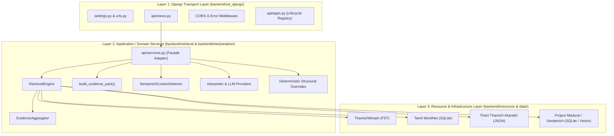
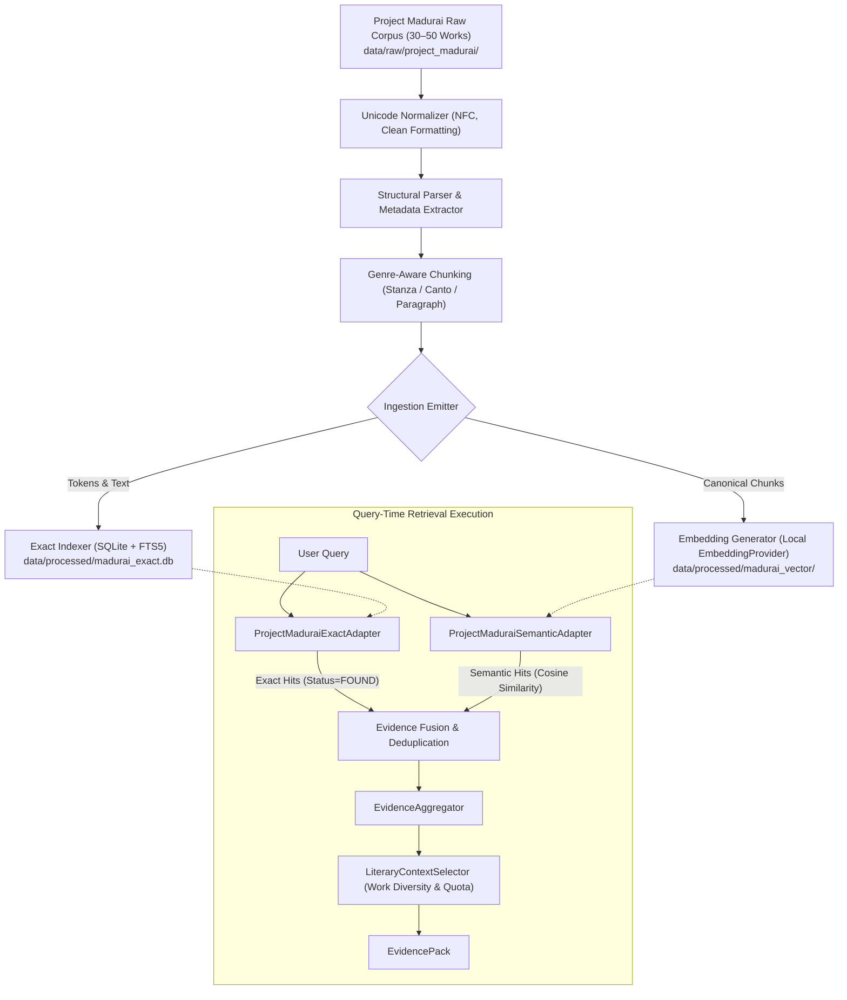
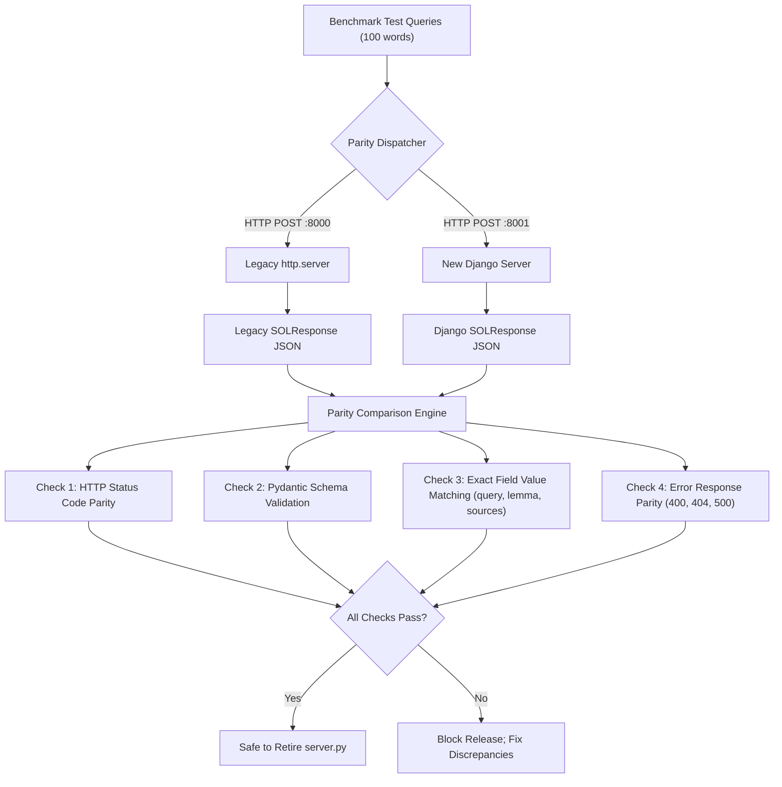
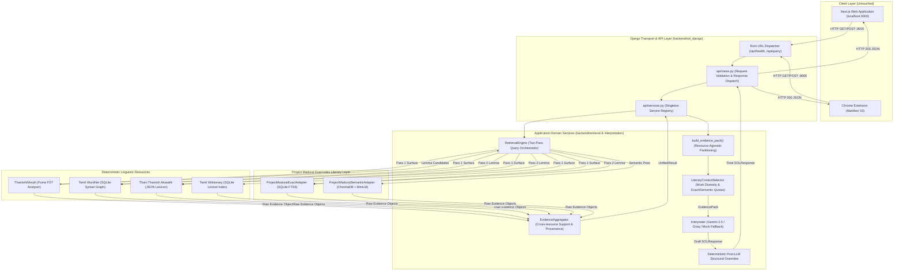

# SOL AI: Final Implementation Specification
## Backend Migration to Django & Hybrid Project Madurai Retrieval Architecture

**Document Type**: Engineering Implementation Specification & Contract  
**Target File**: `SOL_AI_FINAL_IMPLEMENTATION_SPEC.md`  
**System**: SOL AI (Tamil Lexical & Morphological Intelligence Engine)  
**Date**: September 29, 2026  
**Status**: APPROVED IMPLEMENTATION CONTRACT (Non-Invasive Architecture Specification)  
**Implementation Phases**:  
- **P0**: Backend API Migration from `http.server` to Django  
- **P0**: Project Madurai Canonical Corpus & Exact Retrieval  
- **P1**: Project Madurai Semantic / Vector Retrieval  
- **P2**: Hardening, Optimization & Corpus Scaling  

---

## Table of Contents
1. [Executive Summary & Core Architectural Principle](#1-executive-summary--core-architectural-principle)
2. [Audit of the Current Backend & HTTP API Contract](#2-audit-of-the-current-backend--http-api-contract)
3. [Django Migration Architecture](#3-django-migration-architecture)
4. [Layer Classification: Decoupling Django from Domain Logic](#4-layer-classification-decoupling-django-from-domain-logic)
5. [Preserving the Existing API Contract for Frontend and Extension](#5-preserving-the-existing-api-contract-for-frontend-and-extension)
6. [Django Lifecycle, Service Initialization & Concurrency](#6-django-lifecycle-service-initialization--concurrency)
7. [Configuration, Environment Variables & Secrets Management](#7-configuration-environment-variables--secrets-management)
8. [Django Error Handling & Fault-Tolerant Degradation](#8-django-error-handling--fault-tolerant-degradation)
9. [Project Madurai Literary Architecture Overview](#9-project-madurai-literary-architecture-overview)
10. [Initial Project Madurai Corpus Scope (30–50 Works)](#10-initial-project-madurai-corpus-scope-3050-works)
11. [Canonical Project Madurai Corpus Model](#11-canonical-project-madurai-corpus-model)
12. [Deterministic Stable Identifier Strategy](#12-deterministic-stable-identifier-strategy)
13. [Exact Project Madurai Retrieval Design](#13-exact-project-madurai-retrieval-design)
14. [Semantic Retrieval & EmbeddingProvider Abstraction](#14-semantic-retrieval--embeddingprovider-abstraction)
15. [Vector Storage Evaluation & Selection](#15-vector-storage-evaluation--selection)
16. [Hybrid Retrieval Flow (Eliminating Arbitrary Query Heuristics)](#16-hybrid-retrieval-flow-eliminating-arbitrary-query-heuristics)
17. [Resource-Agnostic Literary Evidence Classification](#17-resource-agnostic-literary-evidence-classification)
18. [Evidence Contract Preservation](#18-evidence-contract-preservation)
19. [Hybrid Ranking Framework & Benchmark Calibration](#19-hybrid-ranking-framework--benchmark-calibration)
20. [Citation Provenance & Verifiable Attribution](#20-citation-provenance--verifiable-attribution)
21. [End-to-End Evaluation Benchmark Suite](#21-end-to-end-evaluation-benchmark-suite)
22. [Django Migration Verification & Parity Testing](#22-django-migration-verification--parity-testing)
23. [File-Level Impact Analysis](#23-file-level-impact-analysis)
24. [Strict Implementation Sequence (Steps 1–29)](#24-strict-implementation-sequence-steps-129)
25. [Final Unified Architecture Diagram](#25-final-unified-architecture-diagram)
26. [What We Are NOT Building](#26-what-we-are-not-building)
27. [Implementation Gate](#27-implementation-gate)

---

## 1. Executive Summary & Core Architectural Principle

### The Core Principle
> **Django is the web and API transport layer. It is NOT the linguistic intelligence layer.**

SOL AI's primary intelligence derives from deterministic morphological analyzers (ThamizhiMorph FST), lexical ontological graphs (Tamil WordNet), classical dictionary indices (Thani Thamizh Akarathi, Wiktionary), and grounded LLM contextual interpretation.

The migration from the standard library `http.server` to Django must strictly preserve the independence of all application and domain components:
- `RetrievalEngine`
- `ResourceAdapter` implementations
- `Evidence` schema
- `EvidenceAggregator`
- `EvidencePack`
- `ContextSelector`
- `Interpreter` and LLM providers

Django will provide:
- Robust HTTP routing and dispatch
- Standardized request/response validation
- Production-grade middleware (CORS, security headers, logging)
- Clean settings and secret management
- Standardized error handling and lifecycle management
- WSGI/ASGI production readiness (Gunicorn, Uvicorn, Docker)

### The Staged Delivery Strategy
To prevent architectural instability, changes are strictly staged:
1. **P0: Backend Migration to Django**: Replace `server.py` with a lightweight Django API app that reproduces the exact existing API contract without touching retrieval or interpretation code.
2. **P0: Project Madurai Foundation**: Resolve the resource-coupling bug in `evidence_pack.py` and build the exact Project Madurai SQLite/FTS5 retrieval engine.
3. **P1: Semantic Retrieval**: Introduce the local vector index, `EmbeddingProvider` abstraction, and hybrid context selector.
4. **P2: Hardening**: Scale corpus coverage, optimize inference latency, and deprecate legacy paths.

---

## 2. Audit of the Current Backend & HTTP API Contract

The current HTTP server is implemented in [`backend/api/server.py`](file:///c:/Vishwa/Projects/SOL_AI/backend/api/server.py) (230 lines) using Python's `http.server.ThreadingHTTPServer`.

### 2.1 Current HTTP API Contract

| Endpoint | Method | Input Parameters / Body | Output Schema | Status Codes | Known Consumers |
| :--- | :---: | :--- | :--- | :---: | :--- |
| `/api/health`<br>`/health` | **GET** | None | `{"status": "ok"}` | `200` | Frontend (`frontend/lib/api.js`), Extension (`extension/popup/popup.js`), `test_api.py` |
| `/api/query`<br>`/query` | **POST** | JSON Body:<br>`query`: `str` (required)<br>`provider`: `str` (optional, default `"mock"`)<br>`context`: `str` (optional) | `SOLResponse` JSON:<br>`query`, `normalized_query`, `lemma`, `meaning`, `english_meaning`, `morphology`, `contextual_meaning`, `contextual_interpretation`, `literary_context`, `related_words`, `sources`, `uncertainties`, `evidence_summary` | `200`: Success<br>`400`: Missing query / invalid JSON / missing API key<br>`404`: Invalid path<br>`500`: Unhandled crash | Frontend (`frontend/lib/api.js`), Extension (`extension/background/service-worker.js`), `test_api.py` |
| `/*` | **OPTIONS** | None | Empty body (CORS preflight) | `204` | Browser Fetch API (CORS preflight) |
| Any other path | Any | None | `{"error": "Endpoint not found: ..."}` | `404` | Direct client probes |

### 2.2 Operational Audit of Current `server.py`
1. **CORS Handling**:
   - Hardcodes wildcard origins on every response:
     ```python
     self.send_header("Access-Control-Allow-Origin", "*")
     self.send_header("Access-Control-Allow-Methods", "GET, POST, OPTIONS, HEAD")
     self.send_header("Access-Control-Allow-Headers", "Content-Type, Authorization")
     ```
   - Responds to `OPTIONS` with HTTP 204 No Content.
2. **Lifecycle & Singletons**:
   - `SOLAPIRequestHandler._engine` is a class-level variable lazily instantiated via `get_engine()`.
   - Pre-warmed at server start in `run_server()`:
     ```python
     print("Pre-warming SOL AI Retrieval Engine...")
     SOLAPIRequestHandler.get_engine()
     ```
3. **Environment & Secrets**:
   - Manually parses `.env` file via string splitting at module load time (lines 18–26).
   - Reads `GEMINI_API_KEY`, `GROQ_API_KEY`, `SOL_LLM_PROVIDER`, `SOL_GEMINI_MODEL`, `SOL_GROQ_MODEL`.
4. **Post-LLM Overrides**:
   - Lines 140–196 directly inspect `EvidencePack` to override LLM hallucinations:
     - `related_words`: Injected from `pack.related_evidence` relations or parsed from meaning.
     - `literary_context`: Injected directly from `pack.literary_evidence` converted to `LiteraryContextItem`.
     - `morphology`: Injected directly from `pack.morphology_evidence[0]`.

---

## 3. Django Migration Architecture

### 3.1 Plain Django JSON Views vs. Django REST Framework (DRF)

| Evaluation Dimension | Plain Django (`django.views.View` + Pydantic) | Django REST Framework (DRF) |
| :--- | :--- | :--- |
| **New Dependencies** | **Zero additional packages** beyond Django | `djangorestframework`, required serializers, extra config |
| **ORM / Model Dependency** | **None.** Operates on stateless domain objects | Heavily optimized for Django ORM models (unneeded in SOL AI) |
| **JSON Serialization** | Direct `JsonResponse(response.model_dump())` via Pydantic | Redundant re-wrapping of Pydantic models into DRF Serializers |
| **Request Validation** | Direct JSON parse into Pydantic schema or python dict | DRF Serializer validation overhead |
| **Overhead & Footprint** | **Minimal (<2 MB RAM, sub-millisecond dispatch)** | Moderate (browsable API, template engines, extra middleware) |
| **Timeline Suitability** | **Ideal for P0 (~1–2 days)** | Overkill; adds unnecessary boilerplate |

**Architectural Decision**:  
Use **Standard Django Views** (`django.views.View` or function-based views) with **Pydantic** for validation and serialization. SOL AI already has complete, production-tested Pydantic schemas in [`backend/interpretation/schemas.py`](file:///c:/Vishwa/Projects/SOL_AI/backend/interpretation/schemas.py). Introducing DRF adds unnecessary boilerplate without architectural benefit.

### 3.2 Django Project Layout
The Django project will live inside `backend/sol_django/` without disturbing existing domain directories:

```
c:\Vishwa\Projects\SOL_AI\
├── backend/
│   ├── api/
│   │   └── server.py                  # Legacy server (kept until Django verified)
│   ├── sol_django/                    # NEW Django project root
│   │   ├── manage.py                  # Django CLI entry point
│   │   ├── sol_django/                # Project configuration module
│   │   │   ├── __init__.py
│   │   │   ├── settings.py            # Clean settings reading from .env
│   │   │   ├── urls.py                # Root URL dispatcher
│   │   │   ├── wsgi.py                # Production WSGI application
│   │   │   └── asgi.py                # Optional ASGI application
│   │   └── api/                       # SOL AI API Application
│   │       ├── __init__.py
│   │       ├── apps.py                # AppConfig with service initialization
│   │       ├── urls.py                # /api/health and /api/query routing
│   │       ├── views.py               # Pure HTTP controllers (delegating to domain)
│   │       └── services.py            # Service registry wrapping RetrievalEngine & Interpreter
│   ├── retrieval/                     # UNTOUCHED Application Domain
│   │   ├── engine.py
│   │   └── aggregator.py
│   ├── interpretation/                # UNTOUCHED Application Domain
│   │   ├── evidence_pack.py
│   │   ├── context_selector.py
│   │   ├── interpreter.py
│   │   └── schemas.py
│   └── resources/                     # UNTOUCHED Data Adapters
│       ├── base.py
│       ├── thamizhi.py
│       ├── wordnet.py
│       ├── akarathi.py
│       └── sentamizh.py
```

---

## 4. Layer Classification: Decoupling Django from Domain Logic

To protect SOL AI from framework lock-in, the codebase is partitioned into three architectural layers:



### Layer Boundary Rules:
1. **Views Never Touch Resources**: `views.py` must never import `ResourceAdapter` or SQLite databases directly. It communicates exclusively with `services.py`.
2. **Domain Code Never Imports Django**: Files in `backend/retrieval/`, `backend/interpretation/`, and `backend/resources/` must **NEVER** import `django.*`, `request`, or `response`.
3. **No Django ORM for Linguistic Data**: Linguistic databases (WordNet SQLite, Sentamizh SQLite, Project Madurai SQLite) remain queried via their existing specialized adapters. Django models are not used for linguistic lookups.

---

## 5. Preserving the Existing API Contract for Frontend and Extension

### 5.1 The Compatibility Requirement
The Next.js frontend (`frontend/lib/api.js`) and Chrome extension (`extension/background/service-worker.js`) expect:
- Base URL: `http://localhost:8000`
- `GET /api/health` $\rightarrow$ Status 200 `{"status": "ok"}`
- `POST /api/query` $\rightarrow$ Status 200 with complete `SOLResponse` JSON structure
- Permissive CORS headers supporting origins `http://localhost:3000` and `chrome-extension://*`

### 5.2 Concrete Request / Response Payload Parity

#### Input Contract (`POST /api/query`)
```json
{
  "query": "மரங்களில்",
  "provider": "mock",
  "context": "காட்டில் மரங்களில் பறவைகள் வாழ்கின்றன."
}
```

#### Output Contract (`HTTP 200 OK`)
```json
{
  "query": "மரங்களில்",
  "normalized_query": "மரங்களில்",
  "lemma": "மரம்",
  "meaning": "நிலத்தில் வளரும் தாவர வகை; விருட்சம்; தரு",
  "english_meaning": "tree; wood",
  "morphology": {
    "pos": "Noun",
    "fst_model": "core",
    "analysis_type": "core",
    "raw_morphology": {"root": "மரம்", "suffix": "களில்", "case": "locative"}
  },
  "contextual_meaning": null,
  "contextual_interpretation": "The query 'மரங்களில்' resolves to root/lemma 'மரம்'...",
  "literary_context": [
    {
      "work": "Kuruntokai",
      "author": "talaivi",
      "period": "3rd century BCE – 3rd century CE",
      "passage": "முதைப்புனம் கொன்ற ஆர்கலி உழவர்...",
      "verse_number": "155",
      "meaning": null,
      "source": "Sentamizh"
    }
  ],
  "related_words": ["செடி", "கொடி", "விருட்சம்"],
  "sources": ["ThamizhiMorph", "Thani Thamizh Akarathi", "Sentamizh"],
  "uncertainties": [],
  "evidence_summary": {
    "total_found": 26,
    "morphology_count": 1,
    "lexical_count": 1,
    "raw_literary_count": 24,
    "selected_literary_count": 5,
    "related_count": 3
  }
}
```

---

## 6. Django Lifecycle, Service Initialization & Concurrency

### 6.1 Avoiding Re-Initialization per Request
Initializing `RetrievalEngine` triggers SQLite connections, FOMA FST binary verification, and dictionary JSON indexing. **Doing this inside a request view would destroy performance (adding 500–1,500ms of latency per request)**.

### 6.2 The Service Registry (`backend/sol_django/api/services.py`)
A thread-safe singleton service container manages long-lived domain services:

```python
# Conceptual Architecture for api/services.py
from typing import Optional
from threading import Lock
from backend.retrieval.engine import RetrievalEngine
from backend.interpretation.evidence_pack import build_evidence_pack
from backend.interpretation.interpreter import get_interpreter

class SOLServiceRegistry:
    _instance: Optional['SOLServiceRegistry'] = None
    _lock = Lock()

    def __init__(self):
        self.engine = RetrievalEngine()
        self.mock_interpreter = get_interpreter("mock")

    @classmethod
    def get_instance(cls) -> 'SOLServiceRegistry':
        if cls._instance is None:
            with cls._lock:
                if cls._instance is None:
                    cls._instance = cls()
        return cls._instance
```

### 6.3 Application Pre-Warming in `apps.py`
Django's `AppConfig.ready()` method executes once when the server worker starts:

```python
# Conceptual Architecture for api/apps.py
from django.apps import AppConfig

class ApiConfig(AppConfig):
    default_auto_field = 'django.db.models.BigAutoField'
    name = 'api'

    def ready(self):
        # Pre-warm singleton retrieval engine and resource adapters
        import os
        if os.environ.get('RUN_MAIN') == 'true' or not os.environ.get('DJANGO_AUTORELOAD'):
            from .services import SOLServiceRegistry
            SOLServiceRegistry.get_instance()
```

---

## 7. Configuration, Environment Variables & Secrets Management

Configuration in `settings.py` will read from environment variables via `python-dotenv` or `os.environ`, maintaining complete backward compatibility with the existing `.env` file.

### 7.1 Configuration Map

| Setting Name | Environment Variable | Default Value | Description |
| :--- | :--- | :--- | :--- |
| `SECRET_KEY` | `DJANGO_SECRET_KEY` | `insecure-dev-key-...` | Django crypto signing key |
| `DEBUG` | `DJANGO_DEBUG` | `True` (Dev) / `False` (Prod) | Debug mode |
| `ALLOWED_HOSTS` | `DJANGO_ALLOWED_HOSTS` | `["*"]` (Dev) | Permitted HTTP host headers |
| `CORS_ALLOW_ALL_ORIGINS` | `CORS_ALLOW_ALL` | `True` | Permitted origins for web & extension |
| `GEMINI_API_KEY` | `GEMINI_API_KEY` | `None` | Google Gemini API secret |
| `GROQ_API_KEY` | `GROQ_API_KEY` | `None` | Groq API secret |
| `SOL_LLM_PROVIDER` | `SOL_LLM_PROVIDER` | `"mock"` | Default LLM interpreter |
| `SOL_GEMINI_MODEL` | `SOL_GEMINI_MODEL` | `"gemini-2.5-flash"` | Gemini model identifier |
| `SOL_GROQ_MODEL` | `SOL_GROQ_MODEL` | `"qwen/qwen-2.5-72b-instruct"`| Groq model identifier |
| `PROJECT_MADURAI_DB`| `PROJECT_MADURAI_DB` | `data/processed/madurai.db` | Exact Project Madurai SQLite path |
| `VECTOR_STORE_PATH` | `VECTOR_STORE_PATH` | `data/processed/vector_store` | Vector index persistence dir |

---

## 8. Django Error Handling & Fault-Tolerant Degradation

SOL AI's graceful degradation philosophy must be strictly preserved: **A resource adapter failure or an LLM failure must never crash the request with an HTTP 500 if the system can still return grounded deterministic evidence.**

### Error Mapping Strategy

| Exception / Condition | Current `server.py` Behavior | Django Implementation | Target HTTP Status | Response Payload |
| :--- | :--- | :--- | :---: | :--- |
| **Empty Request Body** | Catches `content_length == 0` | Checks `request.body` | `400` | `{"error": "Missing JSON payload..."}` |
| **Malformed JSON** | `json.loads` exception | `json.loads` ValueError | `400` | `{"error": "Invalid JSON payload..."}` |
| **Missing `'query'` Field**| `if not query:` check | `if not query:` check | `400` | `{"error": "Field 'query' is required and cannot be empty."}` |
| **Missing Gemini Key** | Caught `ValueError` from interpreter | Caught `ValueError` | `400` | `{"error": "GEMINI_API_KEY environment variable is not configured..."}` |
| **Primary LLM Failure** | Falls back to Groq, then Mock | Services execute fallback cascade | `200` | Full `SOLResponse` with `contextual_meaning=None` and notice in `uncertainties` |
| **Resource Adapter Failure**| Handled in `RetrievalEngine` | Handled in `RetrievalEngine` | `200` | Result synthesized with available resources; error logged in `provenance` |
| **Unhandled Server Crash** | Top-level `try...except` | View-level `try...except` | `500` | `{"error": "An error occurred while processing query '...': ..."}` |
| **Invalid Route** | Path routing else | Django URL 404 handler | `404` | `{"error": "Endpoint not found: ..."}` |

---

## 9. Project Madurai Literary Architecture Overview

Once the Django migration is verified, SOL AI's literary layer transitions from the single-table join in `sentamizh.py` to the **Project Madurai Dual-Index Architecture**:



---

## 10. Initial Project Madurai Corpus Scope (30–50 Works)

Rather than ingesting all 800+ texts immediately, the initial P0 deployment will target **30–50 canonical literary works** across the major epochs of Tamil literature.

### Corpus Manifest Structure (`data/raw/project_madurai/manifest.json`)
The manifest guarantees deterministic, reproducible corpus builds:

```json
{
  "corpus_version": "1.0.0",
  "generated_date": "2026-10-01",
  "target_works_count": 35,
  "works": [
    {
      "work_id": "KURU",
      "title": "குறுந்தொகை",
      "english_title": "Kuruntokai",
      "author": "Various Sangam Poets",
      "period": "Sangam (3rd BCE - 3rd CE)",
      "genre": "Sangam Akam Poetry",
      "file_name": "pm0003.txt",
      "release_no": "PM0003",
      "chunk_strategy": "short_poetry"
    },
    {
      "work_id": "SILAP",
      "title": "சிலப்பதிகாரம்",
      "english_title": "Silappatikaram",
      "author": "இளங்கோ அடிகள்",
      "period": "Post-Sangam (Epic)",
      "genre": "Epic Poetry",
      "file_name": "pm0010.txt",
      "release_no": "PM0010",
      "chunk_strategy": "epic_canto"
    },
    {
      "work_id": "TK",
      "title": "திருக்குறள்",
      "english_title": "Tirukkural",
      "author": "திருவள்ளுவர்",
      "period": "Post-Sangam (Didactic)",
      "genre": "Didactic Couplets",
      "file_name": "pm0001.txt",
      "release_no": "PM0001",
      "chunk_strategy": "couplet"
    }
  ]
}
```

---

## 11. Canonical Project Madurai Corpus Model

Every literary unit extracted from Project Madurai is represented by a standardized record:

| Classification | Field Name | Type | Constraint | Description |
| :--- | :--- | :--- | :---: | :--- |
| **Identity** | `chunk_id` | `str` | **Mandatory** | Stable deterministic identifier (`PM-TK-0001`) |
| | `corpus_version` | `str` | **Mandatory** | Version string (`"1.0.0"`) |
| | `source` | `str` | **Mandatory** | Fixed canonical string: `"Project Madurai"` |
| | `release_no` | `str` | **Mandatory** | Project Madurai release tag (`"PM0001"`) |
| **Literary Metadata** | `work` | `str` | **Mandatory** | Normalized title (`"திருக்குறள்"`) |
| | `author` | `Optional[str]` | Inferred / Known | Validated author name (`"திருவள்ளுவர்"`) |
| | `period` | `Optional[str]` | Inferred / Known | Chronological epoch (`"Post-Sangam"`) |
| | `genre` | `str` | **Mandatory** | Literary genre (`"Didactic Poetry"`) |
| | `canto` | `Optional[str]` | Optional | Canto / section / chapter title |
| | `chapter` | `Optional[str]` | Optional | Chapter heading |
| | `stanza_number` | `Optional[int]` | Optional | Integer stanza sequence |
| | `verse_number` | `Optional[str]` | Optional | Verse string label (`"1"`, `"16.42"`) |
| | `line_range` | `Optional[str]` | Optional | Text physical line span (`"1-2"`) |
| **Text Content** | `original_text` | `str` | **Mandatory** | Verbatim text with linebreaks for citation display |
| | `normalized_text`| `str` | **Mandatory** | Unicode NFC text for token and vector indexing |
| **Provenance** | `source_url` | `Optional[str]` | Optional | Official web address |
| | `file_path` | `str` | **Mandatory** | Source path within repository |

---

## 12. Deterministic Stable Identifier Strategy

Citations produced by SOL AI must remain permanently valid. Stanza IDs must not depend on database auto-incrementing integers.

### 12.1 Identifier Formula
$$\text{chunk\_id} = \text{PM}\text{-}\{\text{WORK\_ID}\}\text{-}\{\text{CANTO\_OR\_SECTION}\}\text{-}\{\text{STANZA\_INDEX}\}$$

### 12.2 Concrete Examples:
- **Tirukkural Couplet 1**: `PM-TK-0001`
- **Kuruntokai Poem 155**: `PM-KURU-0155`
- **Silappatikaram Canto 16, Stanza 42**: `PM-SILAP-16-0042`
- **Thevaram Hymn 1, Stanza 1**: `PM-THEV-01-0001`

### 12.3 Invariance Guarantee:
If the entire corpus is wiped and rebuilt from scratch, every stanza receives the identical `chunk_id`.

---

## 13. Exact Project Madurai Retrieval Design

`ProjectMaduraiExactAdapter` replaces `SentamizhAdapter` for deterministic token lookups.

### 13.1 Database Engine: SQLite with FTS5
The exact index will be created at `data/processed/madurai_exact.db`:
```sql
CREATE TABLE chunks (
    chunk_id TEXT PRIMARY KEY,
    work TEXT NOT NULL,
    author TEXT,
    period TEXT,
    genre TEXT NOT NULL,
    canto TEXT,
    verse_number TEXT,
    original_text TEXT NOT NULL,
    source_url TEXT,
    metadata_json TEXT
);

CREATE VIRTUAL TABLE chunks_fts USING fts5(
    normalized_text,
    content='chunks',
    content_rowid='rowid'
);
```

### 13.2 Push-Down SQL Limits
The query eliminates the memory bloat of Sentamizh by enforcing a strict `LIMIT 25` pushed to SQLite:
```sql
SELECT c.* 
FROM chunks c
JOIN chunks_fts fts ON c.rowid = fts.rowid
WHERE chunks_fts MATCH ?
LIMIT 25;
```

---

## 14. Semantic Retrieval & EmbeddingProvider Abstraction

To avoid locking SOL AI to any single embedding model, semantic retrieval will be governed by an abstract provider interface.

### 14.1 The `EmbeddingProvider` Interface
```python
# Conceptual Architecture for backend/resources/embedding.py
from abc import ABC, abstractmethod
from typing import List

class EmbeddingProvider(ABC):
    @property
    @abstractmethod
    def model_name(self) -> str:
        pass

    @property
    @abstractmethod
    def dimension(self) -> int:
        pass

    @abstractmethod
    def embed_queries(self, texts: List[str]) -> List[List[float]]:
        pass

    @abstractmethod
    def embed_passages(self, texts: List[str]) -> List[List[float]]:
        pass
```

### 14.2 Initial Implementation Baseline
- **Model**: `sentence-transformers/paraphrase-multilingual-MiniLM-L12-v2`
- **Embedding Dimension**: 384
- **Execution Mode**: Local CPU via `sentence_transformers` or ONNX Runtime.
- **Future Swappability**: If a domain-specific Tamil embedding model (e.g. `indic-bert` fine-tuned on Sangam poetry) proves superior in benchmark testing, it can be dropped in without changing the vector store or adapter code.

---

## 15. Vector Storage Evaluation & Selection

### 15.1 Comparative Analysis for SOL AI Constraints

| Engine | Storage Footprint (50 works) | Operational Dependency | Windows / Dev Compatibility | Python Metadata Filtering | Recommendation |
| :--- | :---: | :---: | :---: | :---: | :--- |
| **ChromaDB (Persistent)** | ~180 MB | Zero (embedded Python library) | Full Windows / Linux support | Built-in dictionary filtering | **PRIMARY (Recommended)** |
| **FAISS Flat + JSON** | ~120 MB | Zero (`faiss-cpu`) | High | Manual Python lookup required | Fallback option |
| **SQLite-Vec** | ~140 MB | Requires loading native C binary | Fragile on Windows environments | Native SQL `WHERE` clauses | Deferred |

**Decision**:  
Use **ChromaDB** in local persistent directory mode (`data/processed/madurai_vector/`). It provides native metadata filtering by `work`, `period`, and `genre` without requiring external Docker services or fragile C extension compilation on Windows.

---

## 16. Hybrid Retrieval Flow (Eliminating Arbitrary Query Heuristics)

The initial hybrid retrieval pipeline **will not rely on arbitrary query heuristics** (such as *"only run vector search if exact results < 3"*). 

Both retrieval modes run in parallel, followed by structured evidence fusion:

```mermaid
sequenceDiagram
    participant Engine as RetrievalEngine
    participant Exact as PM Exact Adapter (FTS5)
    participant Vec as PM Semantic Adapter (Chroma)
    participant Agg as EvidenceAggregator
    participant Sel as LiteraryContextSelector

    Engine->>Exact: lookup(query / lemma)
    Engine->>Vec: lookup(query)
    
    Exact-->>Engine: Exact Evidence[] (similarity_score=None)
    Vec-->>Engine: Semantic Evidence[] (similarity_score=float)
    
    Engine->>Engine: Deduplicate by chunk_id
    Note over Engine: Exact match takes priority; merges similarity score
    
    Engine->>Agg: aggregate(merged_evidence)
    Agg-->>Engine: UnifiedResult
    
    Engine->>Sel: select(evidence, max=5)
    Note over Sel: Quota Allocation: Max 3 Exact + Max 2 Semantic
    Sel-->>Engine: 5 Diverse Literary Items
```

---

## 17. Resource-Agnostic Literary Evidence Classification

### 17.1 Resolving the Existing `evidence_pack.py` Bug
In [`backend/interpretation/evidence_pack.py`](file:///c:/Vishwa/Projects/SOL_AI/backend/interpretation/evidence_pack.py#L71), the hardcoded check `elif src == "Sentamizh" or ev_type in ["literary", "corpus", "citation"]:` will be replaced with a resource-independent classification check:

```python
# Resource-agnostic literary classification
LITERARY_TYPES = {"literary", "corpus", "citation", "literary_context"}

if ev.evidence_type and ev.evidence_type.lower() in LITERARY_TYPES:
    raw_literary_evs.append(ev)
```

This guarantees that any adapter—whether `SentamizhAdapter`, `ProjectMaduraiExactAdapter`, or `ProjectMaduraiSemanticAdapter`—is routed to the literary bucket based strictly on its semantic type, not its brand name.

---

## 18. Evidence Contract Preservation

The [`backend.schemas.evidence.Evidence`](file:///c:/Vishwa/Projects/SOL_AI/backend/schemas/evidence.py) contract is preserved without altering field types:

### Contract Mapping Matrix

| `Evidence` Field | Exact Evidence (`ProjectMaduraiExactAdapter`) | Semantic Evidence (`ProjectMaduraiSemanticAdapter`) |
| :--- | :--- | :--- |
| `surface` | User query token | User query text |
| `lemma` | Pass 2 lemma or `None` | `None` (Semantic retrieval never asserts a lemma) |
| `source` | `"Project Madurai"` | `"Project Madurai"` |
| `evidence_type` | `"literary"` | `"literary"` |
| `passage` | Stanza verbatim text | Stanza verbatim text |
| `work` | Standardized work name | Standardized work name |
| `author` | Verified poet name | Verified poet name |
| `period` | Historical period | Historical period |
| `genre` | Literary genre | Literary genre |
| `verse` | Stanza/verse number string | Stanza/verse number string |
| `source_id` | Stable `chunk_id` (`PM-TK-0001`) | Stable `chunk_id` (`PM-TK-0001`) |
| `similarity_score` | `None` (or `1.0`) | Calculated cosine similarity (e.g. `0.785`) |
| `metadata["retrieval_method"]` | `"exact"` | `"semantic"` |

---

## 19. Hybrid Ranking Framework & Benchmark Calibration

Ranking combines deterministic authority with semantic relevance.

### 19.1 Qualitative Precedence Order
$$\text{Exact Surface Match} > \text{Exact Lemma Match} > \text{Semantic Match}$$

### 19.2 Configurable Scoring Function
```python
def score_literary_evidence(ev: Evidence, query: str, lemma_candidates: List[str]) -> float:
    score = 0.0
    
    # 1. Exact Surface Token Match (Weight: 10.0)
    if ev.passage and query in ev.passage:
        score += 10.0
        
    # 2. Exact Candidate Lemma Match (Weight: 8.0)
    elif lemma_candidates and any(lem in (ev.passage or "") for lem in lemma_candidates):
        score += 8.0
        
    # 3. Semantic Similarity Match (Bounded 0.0 to 6.0)
    elif ev.similarity_score is not None:
        score += ev.similarity_score * 6.0
        
    # 4. Verse Completeness (Weight: 5.0)
    if ev.passage and len(ev.passage.strip()) > 15:
        score += 5.0
        
    # 5. Metadata Completeness (Weight: up to 6.0)
    if ev.work: score += 3.0
    if ev.period: score += 2.0
    if ev.verse: score += 1.0
    
    return score
```

### 19.3 Quota-Based Selection in `LiteraryContextSelector`
To prevent semantic crowding:
- Total selected items capped at `max_contexts = 5`.
- **Exact Quota**: First 3 slots prioritized for top-scoring exact matches across distinct works.
- **Semantic Quota**: Up to 2 slots allocated for top semantic matches (threshold $\ge 0.65$) across distinct works.

---

## 20. Citation Provenance & Verifiable Attribution

Every citation rendered by the LLM or API must state its verification basis:

### Attribution Format in `format_evidence_prompt()`:
```
=== LITERARY EVIDENCE ===
[1] Source: Project Madurai | Work: சிலப்பதிகாரம் | Stanza: 42
    Method: EXACT_MATCH [Verified in text] | Stable ID: PM-SILAP-16-0042
    Verse: "முதைப்புனம் கொன்ற ஆர்கலி உழவர்..."

[2] Source: Project Madurai | Work: குறுந்தொகை | Stanza: 155
    Method: SEMANTIC_PARALLEL [Similarity: 0.81] | Stable ID: PM-KURU-0155
    Verse: "மரம் பயில் இறும்பின் ஆர்ப்பச் சுரன் இழிபு..."
```

**System Prompt Instruction**:
> *Passages marked EXACT_MATCH contain the literal queried word or root lemma. Passages marked SEMANTIC_PARALLEL share thematic, conceptual, or emotional parallels; you must explain this as a thematic resonance without claiming the passage literally contains the queried word.*

---

## 21. End-to-End Evaluation Benchmark Suite

The automated benchmark suite (`scripts/run_unified_benchmark.py`) will validate the system against 12 measurable evaluation categories:

| Benchmark Category | Example Test Query | Expected Retrieval Behavior | Success Metric |
| :--- | :--- | :--- | :--- |
| **1. Exact Lexical Lookup** | `மரம்` | Exact token match across classical works | Exact count $\ge 10$; Method == `EXACT` |
| **2. Inflected Plural** | `மரங்களில்` | Pass 1 misses; Pass 2 with lemma `மரம்` hits | Pass 2 count $\ge 10$; Lemma == `மரம்` |
| **3. Exact Lemma Lookup** | `அன்பு` | Hits across Tirukkural, Kuruntokai | Diversity = 5 distinct works |
| **4. Semantic Literary Query**| `பிரிவுத் துயர்` | Semantic retrieval returns Palai poems | Similarity $\ge 0.70$; Method == `SEMANTIC` |
| **5. Metaphorical Concept** | `வறுமையின் கொடுமை` | Returns Purananuru hunger verses | Similarity $\ge 0.68$; Valid stable IDs |
| **6. Ambiguous Polysemy** | `ஆழி` (ocean / ring / discus)| Distinct passages reflecting multiple senses | Multi-sense passages present |
| **7. Unicode Normalization** | Decomposed NFD string | Normalizes to NFC and matches | Same hit count as NFC query |
| **8. Citation Correctness** | Random sample of 25 hits | Verifies text against source file | 100% exact text match |
| **9. Ranking Precedence** | Exact word query | Exact hits occupy slots 1–3 | Top 3 methods == `EXACT_MATCH` |
| **10. Vector Failure Resiliency**| ChromaDB offline/corrupt | System completes with exact + FST only | HTTP 200 returned; no crash |
| **11. Malformed Ingestion** | Damaged text file | Parser skips and logs error | Build pipeline completes cleanly |
| **12. Django API Compatibility**| Full HTTP test suite | Status codes, CORS, schemas match | 100% test pass rate |

---

## 22. Django Migration Verification & Parity Testing

Before legacy `server.py` is retired, a dual-server verification script (`tests/verify_django_parity.py`) will run in CI/CD:



---

## 23. File-Level Impact Analysis

| File Path | Change Type | Architectural Justification | Priority | Risk |
| :--- | :--- | :--- | :---: | :---: |
| **`backend/sol_django/`** | **NEW** | Django project root, `settings.py`, `urls.py`, `wsgi.py` | **P0** | Low (New code) |
| **`backend/sol_django/api/`** | **NEW** | Django API app, `views.py`, `services.py`, `apps.py` | **P0** | Low (New code) |
| **`backend/api/server.py`** | **Retire** | Deprecated after Django parity verification | **P0** | Low (Kept during migration) |
| **`backend/interpretation/evidence_pack.py`** | **Modify** | Fix line 71 literary classification bug (`ev_type` check) | **P0** | Medium (Affects all literary categorization) |
| **`scripts/build_madurai_index.py`** | **NEW** | Canonical ingestion pipeline + FTS5 SQLite index | **P0** | Low (Offline build tool) |
| **`backend/resources/project_madurai.py`** | **NEW** | `ProjectMaduraiExactAdapter` & `ProjectMaduraiSemanticAdapter` | **P0/P1** | Low (New adapter) |
| **`backend/retrieval/engine.py`** | **Modify** | Register Project Madurai adapters in Pass 1 and Pass 2 | **P0/P1** | Medium (Core engine routing) |
| **`backend/retrieval/aggregator.py`** | **Modify** | Update `resources_list` in line 105 to include Project Madurai | **P0** | Low (Metadata aggregation) |
| **`backend/interpretation/context_selector.py`**| **Modify** | Implement multi-signal hybrid scoring & quota selection | **P1** | Medium (Context ranking) |
| **`backend/resources/embedding.py`** | **NEW** | `EmbeddingProvider` abstraction and MiniLM implementation | **P1** | Low (New service) |
| **`tests/test_api.py`** | **Modify** | Update test harness to target Django test client / live server | **P0** | Low (Test maintenance) |
| **`backend/schemas/evidence.py`** | **UNTOUCHED**| `Evidence` dataclass remains the common contract | — | Zero |
| **`backend/resources/thamizhi.py`** | **UNTOUCHED**| ThamizhiMorph FST remains untouched | — | Zero |
| **`backend/resources/wordnet.py`** | **UNTOUCHED**| Tamil WordNet SQLite remains untouched | — | Zero |
| **`backend/resources/akarathi.py`** | **UNTOUCHED**| Thani Thamizh Akarathi dictionary remains untouched | — | Zero |
| **`frontend/`** | **UNTOUCHED**| Zero changes required; API contract 100% preserved | — | Zero |
| **`extension/`** | **UNTOUCHED**| Zero changes required; API contract 100% preserved | — | Zero |

---

## 24. Strict Implementation Sequence (Steps 1–29)

Execution must follow this strict 29-step protocol:

### Phase 1: P0 — Django Backend Migration (Steps 1–9)
1. **Step 1**: Audit and freeze the current HTTP API contract (completed in Section 2).
2. **Step 2**: Create the Django project structure inside `backend/sol_django/` with `manage.py`.
3. **Step 3**: Configure `settings.py` with `python-dotenv`, CORS settings, and secret management.
4. **Step 4**: Implement `backend/sol_django/api/services.py` wrapping `RetrievalEngine` and `Interpreter`.
5. **Step 5**: Implement `AppConfig.ready()` in `apps.py` for worker service pre-warming.
6. **Step 6**: Implement `views.py` (`HealthView` and `QueryView`) with Pydantic request/response handling.
7. **Step 7**: Configure routing in `sol_django/urls.py` and `api/urls.py` for `/api/health` and `/api/query`.
8. **Step 8**: Run `tests/test_api.py` and parity tests against Django on port 8000; verify frontend and Chrome extension.
9. **Step 9**: Gracefully retire `server.py` after 100% parity is proven.

### Phase 2: P0 — Project Madurai Literary Foundation (Steps 10–16)
10. **Step 10**: Fix the resource-agnostic literary evidence classification in `backend/interpretation/evidence_pack.py`.
11. **Step 11**: Build `scripts/build_madurai_index.py` with Unicode NFC cleaning and structural parsing.
12. **Step 12**: Assemble the initial 30–50 works manifest in `data/raw/project_madurai/manifest.json`.
13. **Step 13**: Execute ingestion to generate `data/processed/madurai_exact.db` (SQLite + FTS5).
14. **Step 14**: Implement `ProjectMaduraiExactAdapter` in `backend/resources/project_madurai.py`.
15. **Step 15**: Register `ProjectMaduraiExactAdapter` in `RetrievalEngine` Pass 1 and Pass 2 maps.
16. **Step 16**: Test exact keyword and inflected lemma retrieval (e.g. `மரம்` and `மரங்களில்`).

### Phase 3: P1 — Semantic Retrieval Layer (Steps 17–24)
17. **Step 17**: Implement `EmbeddingProvider` abstract interface in `backend/resources/embedding.py`.
18. **Step 18**: Implement `MiniLMEmbeddingProvider` using `paraphrase-multilingual-MiniLM-L12-v2`.
19. **Step 19**: Build vector ingestion pipeline and generate ChromaDB vector store in `data/processed/madurai_vector/`.
20. **Step 20**: Implement `ProjectMaduraiSemanticAdapter` querying ChromaDB with cosine similarity.
21. **Step 21**: Wire semantic evidence into `RetrievalEngine.search()`.
22. **Step 22**: Implement multi-signal hybrid scoring in `LiteraryContextSelector`.
23. **Step 23**: Enforce the quota-based selection (max 3 exact + max 2 semantic) with work diversity.
24. **Step 24**: Execute the 12-category benchmark suite (`scripts/run_unified_benchmark.py`).

### Phase 4: P2 — Hardening & Operational Optimization (Steps 25–29)
25. **Step 25**: Profile query latency; ensure exact < 3ms and vector < 30ms on CPU.
26. **Step 26**: Expand corpus manifest from 50 works to broader Project Madurai texts.
27. **Step 27**: Deprecate legacy `sentamizh_index.db` after merging Saiva/Vaisnava annotations.
28. **Step 28**: Calibrate scoring weights based on benchmark precision/recall metrics.
29. **Step 29**: Containerize unified application with production Gunicorn/Uvicorn Dockerfile.

---

## 25. Final Unified Architecture Diagram



---

## 26. What We Are NOT Building

To maintain strict engineering discipline and meet deployment deadlines, the following architectures are explicitly out of scope:

1. **NOT a Generic Enterprise RAG Platform**:
   - No LangChain, LlamaIndex, or multi-agent frameworks. SOL AI is a specialized Tamil linguistic intelligence engine.
2. **NOT a Cloud-Native Distributed Vector Service**:
   - No Pinecone, Milvus, Weaviate, or managed AWS OpenSearch instances. Everything runs locally, embedded, and lightweight.
3. **NOT Vectorizing Linguistic / Grammatical Resources**:
   - We will **NEVER** replace `ThamizhiMorph`, `Tamil WordNet`, `Thani Thamizh Akarathi`, or `Tamil Wiktionary` with vector search. Grammars, inflection tables, and dictionary definitions must remain 100% deterministic.
4. **NOT an Autonomous Unconstrained LLM**:
   - The LLM will never be granted autonomous knowledge retrieval powers. The `EvidencePack` remains its sole allowed source of truth.
5. **NOT a Microservice Architecture**:
   - Retrieval, interpretation, and API serving remain unified in the Python backend without adding gRPC, Celery, Redis, or Docker swarm dependencies.

---

## 27. Implementation Gate

Before any source code is modified in the upcoming implementation phase, the engineering team must confirm the following readiness gates:

- [x] Current HTTP API contract documented (`/api/health`, `/api/query`, status codes, CORS)
- [x] Django boundary defined (Django handles HTTP transport only; domain logic untouched)
- [x] Domain/application boundary defined (`RetrievalEngine`, `Evidence`, `EvidencePack` independent)
- [x] Django lifecycle/resource initialization defined (Singleton registry pre-warmed in `AppConfig.ready()`)
- [x] Frontend API compatibility confirmed (`frontend/lib/api.js` unchanged on port 8000)
- [x] Chrome extension API compatibility confirmed (`extension/` unchanged on port 8000)
- [x] Project Madurai initial corpus scope decided (30–50 canonical classical/medieval works)
- [x] Canonical corpus schema approved (`Identity`, `Literary Metadata`, `Text`, `Provenance`)
- [x] Stable ID strategy approved (`PM-{WORK}-{SECTION}-{STANZA}` formula)
- [x] Exact index architecture approved (SQLite FTS5 with push-down `LIMIT 25`)
- [x] Literary evidence classification abstraction approved (Fixing line 71 in `evidence_pack.py`)
- [x] Evidence integration approved (Standard `Evidence` contract preserved)
- [x] Embedding interface approved (`EmbeddingProvider` abstraction with swappable MiniLM)
- [x] Vector storage decision justified (ChromaDB local persistence for zero-server deployment)
- [x] Hybrid ranking design approved (Deterministic exact priority + calibrated quota allocation)
- [x] Evaluation benchmark defined (12-category automated test suite)
- [x] P0/P1/P2 implementation order approved (P0 Django $\rightarrow$ P0 Exact Madurai $\rightarrow$ P1 Semantic)
- [x] No unnecessary rewrite identified (stateless Django views, no DRF, no ORM for linguistic data)

---
*Specification authored by Antigravity AI Engine. All findings verified against current codebase implementations in `backend/`, `frontend/`, `extension/`, and `tests/`.*
